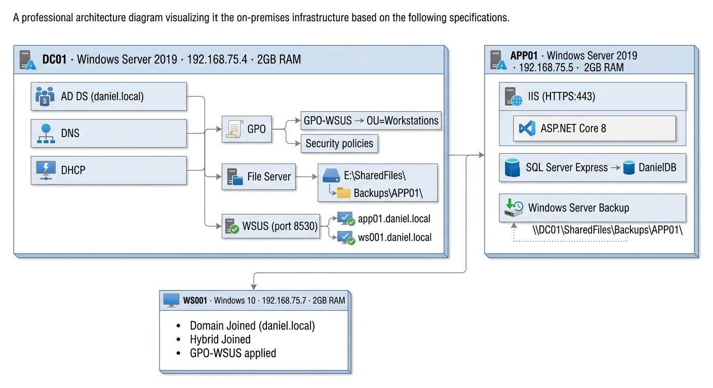
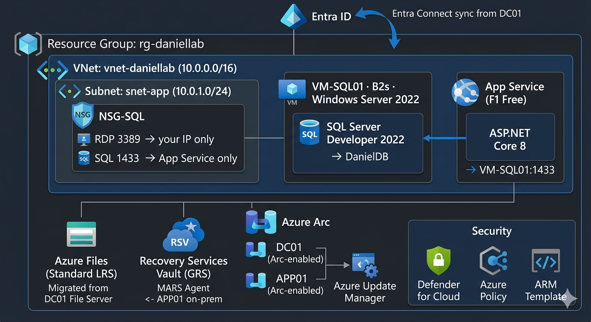
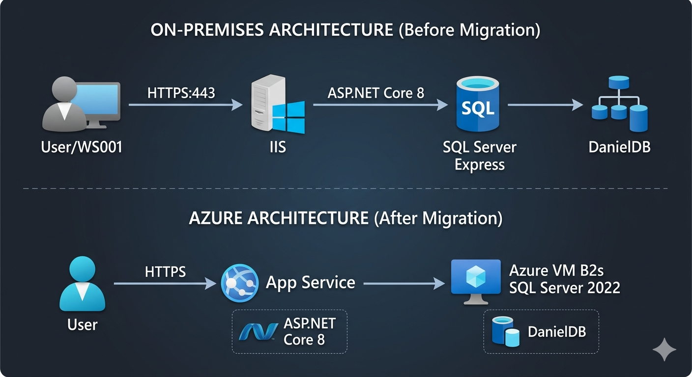

# Arquitectura Completa

## Infraestructura On-Premises

Construida sobre VMware Workstation Pro 17. Tres máquinas virtuales conectadas en la misma red interna (192.168.75.x).

| Servidor | SO | IP | RAM | Roles |
|---|---|---|---|---|
| DC01 | Windows Server 2019 | 192.168.75.4 | 2GB | AD DS · DNS · DHCP · GPO · WSUS · File Server |
| APP01 | Windows Server 2019 | 192.168.75.5 | 2GB | IIS · ASP.NET Core 8 · SQL Server Express · WSB |
| WS001 | Windows 10 | 192.168.75.7 | 2GB | Unido al dominio · GPO-WSUS · Cliente |

## Infraestructura Azure

| Servicio | SKU | Propósito |
|---|---|---|
| Entra ID | Free | Sincronización de identidad desde daniel.local via Entra Connect |
| VNet + NSG | Standard | Red para Azure VM |
| Azure Arc | Free | Gestión híbrida de DC01 + APP01 |
| Azure Update Manager | Free | Sustituye WSUS on-prem |
| App Service | F1 Free | Aloja IIS + ASP.NET migrado |
| Azure VM B2s + SQL Server | Pay-as-you-go | Aloja SQL Server Express migrado (IaaS) |
| Azure Files | Standard LRS | Migrado desde File Server de DC01 |
| Recovery Services Vault | GRS | Backup en nube via Agente MARS |
| Defender for Cloud | Free | Postura de seguridad y cumplimiento |
| Azure Policy | Free | Gobernanza cloud (≈ GPO on-prem) |
| ARM Template | — | Exportación IaC del entorno Azure completo |

## Arquitectura de la Aplicación Web (3 Capas)

## Mapa de Migración

## Decisiones de Diseño

**¿Por qué App Service en vez de Azure VM para IIS?**
La aplicación web es una app ASP.NET Core estándar sin dependencias a nivel de sistema operativo. App Service (PaaS) elimina la gestión del SO, ofrece escalado integrado y tiene coste $0 en el tier F1 — lo que lo convierte en la opción correcta para esta carga de trabajo.

**¿Por qué Azure VM para SQL Server en vez de Azure SQL Database?**
Elegir IaaS para SQL demuestra un escenario realista de lift & shift donde se requiere compatibilidad total con SQL Server. Además justifica la configuración de VNet y NSG, y demuestra comprensión del proceso de decisión entre IaaS y PaaS.

**¿Por qué Azure Arc?**
Arc permite gestionar los servidores on-premises (DC01, APP01) directamente desde Azure Portal sin necesidad de migrarlos. Es la base para Azure Update Manager, la cobertura de Defender for Cloud en servidores híbridos y la aplicación de Azure Policy tanto en recursos on-prem como en la nube.

**¿Por qué GPOs separadas para Servidores y Puestos de Trabajo?**
Los servidores requieren ventanas de mantenimiento controladas — un reinicio no planificado de APP01 dejaría fuera de servicio IIS, SQL Server y la aplicación web. Los puestos de trabajo pueden parchearse automáticamente sin impacto en el negocio.

**¿Por qué la OU Admin_NoSync?**
Las cuentas privilegiadas se excluyen de la sincronización con Entra Connect siguiendo el principio de seguridad del Modelo de Niveles — evitando que un compromiso en la nube se convierta en una brecha on-premises.