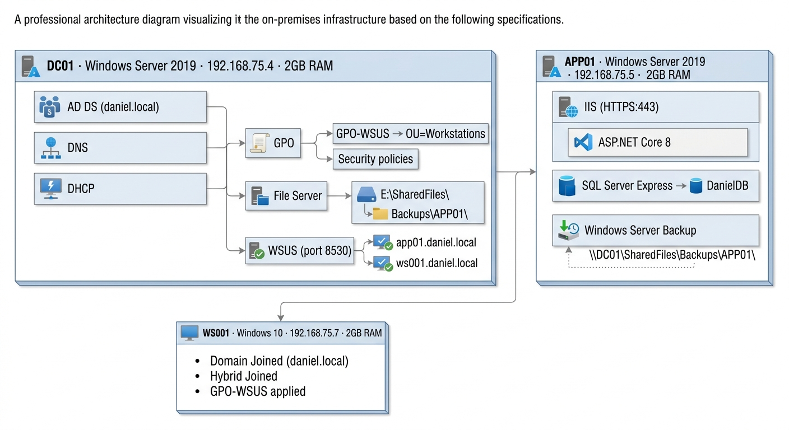
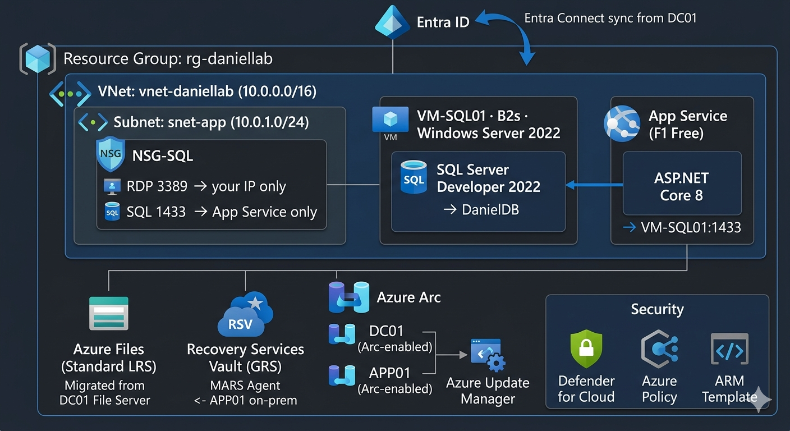
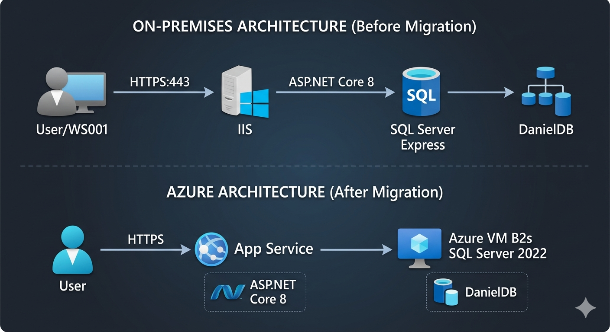

# Visión General de la Arquitectura

## Infraestructura On-Premises

Construida sobre VMware Workstation Pro 17. Tres máquinas virtuales conectadas en la misma red interna (192.168.75.x).

| Servidor | SO                  | IP           | RAM | Roles                                                  |
| -------- | ------------------- | ------------ | --- | ------------------------------------------------------ |
| DC01     | Windows Server 2019 | 192.168.75.4 | 2GB | AD DS · DNS · DHCP · GPO · WSUS · Servidor de Archivos |
| APP01    | Windows Server 2019 | 192.168.75.5 | 2GB | IIS · ASP.NET Core 8 · SQL Server Express · WSB        |
| WS001    | Windows 10          | 192.168.75.7 | 2GB | Unido al dominio · GPO-WSUS · Cliente                  |

## Infraestructura en Azure

| Servicio                          | SKU          | Propósito                                                               |
| --------------------------------- | ------------ | ----------------------------------------------------------------------- |
| Entra ID                          | Free         | Sincronización de identidades desde daniel.local mediante Entra Connect |
| VNet + NSG                        | Standard     | Red para la máquina virtual de Azure                                    |
| Azure Arc                         | Free         | Gestión híbrida de DC01 + APP01                                         |
| Azure Update Manager              | Free         | Sustituye WSUS on-prem                                                  |
| App Service                       | B1           | Aloja la app web migrada de IIS + ASP.NET                               |
| Azure VM D2s_v3 + SQL Server 2022 | Pago por uso | Aloja SQL Server migrado (IaaS lift & shift)                            |
| Key Vault                         | Standard     | Almacena la cadena de conexión de la BBDD — sin secretos en código      |
| Azure Files                       | Standard LRS | Migrado desde el File Server de DC01                                    |
| Recovery Services Vault           | GRS          | Backup en la nube para SQL Server y App Service                         |
| Azure Policy                      | Free         | Gobernanza cloud (≈ GPO on-prem)                                        |
| Log Analytics + App Insights      | Pago por uso | Monitorización y observabilidad                                         |
| Bicep                             | —            | IaC — infraestructura reproducible desde código                         |
| GitHub Actions                    | Free         | CI/CD — despliegue automático al hacer push en git                      |

## Arquitectura de la Aplicación Web (3 Capas)

## Mapa de Migración

---

## Decisiones de Arquitectura

### Identidad

**¿Por qué Admin_NoSync OU?**
Las cuentas privilegiadas se excluyen de la sincronización con Entra Connect siguiendo el principio de seguridad del modelo por niveles (Tier Model). Mantener las cuentas de administrador fuera de Entra ID evita que un compromiso en la nube se propague al dominio on-premises.

**¿Por qué GPOs separadas para servidores y estaciones de trabajo?**
Los servidores requieren ventanas de mantenimiento controladas — un reinicio no planificado de APP01 tumbaría IIS, SQL Server y la aplicación web simultáneamente. Las estaciones de trabajo pueden actualizarse automáticamente sin impacto en el negocio.

---

### Cómputo y datos

**¿Por qué App Service en lugar de una VM de Azure para IIS?**
La aplicación web es una app estándar de ASP.NET Core sin dependencias a nivel de sistema operativo. App Service elimina la gestión del SO, proporciona escalado integrado y se integra de forma nativa con Key Vault mediante Managed Identity — siendo la opción PaaS correcta para la capa de presentación.

**¿Por qué Azure VM para SQL Server en lugar de Azure SQL Database?**
Se trata de un lift & shift intencionado en IaaS para demostrar una migración realista de una carga SQL. También justifica la configuración de VNet, NSG y Bastion, y demuestra el entendimiento del trade-off entre IaaS y PaaS. En producción, con una base de datos pequeña, Azure SQL Database (PaaS) sería la opción preferida.

**¿Por qué exportar en JSON en lugar de usar .bak para la migración de SQL?**
SQL Server 2025 Express (APP01 on-prem) no es compatible con una restauración en SQL Server 2022 (Azure VM) — los backups no son portables hacia versiones inferiores. La exportación/importación en JSON es agnóstica de versión y suficiente para un laboratorio. En producción, se usarían herramientas como BACPAC o Azure Database Migration Service.

---

### Red y seguridad

**¿Por qué Azure Bastion en lugar de una IP pública en vm-sql01?**
La VM de SQL no tiene IP pública. El acceso RDP solo está disponible a través de Bastion dentro de la VNet, eliminando la exposición directa a internet. Las reglas NSG restringen el puerto 1433 solo al tráfico interno de la VNet.

**¿Por qué Bastion en la Fase 5 y no en la Fase 2?**
Sin una VM activa en la Fase 2, Bastion no aportaba valor. Desplegarlo junto a vm-sql01 en la Fase 5 evita costes innecesarios en fases anteriores.

**¿Por qué no VPN Site-to-Site?**
Entorno de laboratorio doméstico sin gateway VPN hardware on-prem. En producción, sería necesario una VPN S2S o ExpressRoute para tráfico híbrido seguro entre on-premises y Azure.

**¿Por qué Managed Identity en lugar de cadenas de conexión?**
App Service accede a Key Vault usando su Managed Identity asignada por sistema — sin credenciales en código ni en archivos de configuración. Esto elimina la rotación manual de secretos y reduce la superficie de ataque.

---

### Almacenamiento y despliegue

**¿Por qué usar una Storage Account como intermediario para deploy y AzCopy?**
APP01 no tiene acceso directo a internet para subir archivos a Azure. La Storage Account actúa como zona intermedia segura — el mismo patrón se reutiliza en la Fase 6 (subida de deploy.zip) y Fase 7 (migración con AzCopy), manteniendo consistencia.

**¿Por qué ZIP Deploy antes de GitHub Actions?**
ZIP Deploy se realizó primero para entender el flujo de despliegue manual de principio a fin. GitHub Actions (Fase 10) automatiza ese mismo proceso. En producción, CI/CD sería el punto de partida, pero entender lo que automatiza aporta valor.

---

### IaC

**¿Por qué exportar primero un ARM Template?**
La exportación ARM sirvió como backup completo de la infraestructura y como forma de entender qué despliega realmente Azure por debajo. También sirvió como referencia al reescribir la infraestructura en Bicep y Terraform.

**¿Por qué Bicep para IaC?**
Bicep es nativo de Azure — no requiere gestionar state file, tiene integración directa con Azure Resource Manager y tipado fuerte. Es la mejor opción cuando el alcance es solo Azure.

**¿Por qué también Terraform?**
Terraform se implementó junto a Bicep para demostrar portabilidad multi-cloud y conocimiento del ecosistema IaC. Ambas herramientas logran el mismo resultado — la diferencia es portabilidad vs integración nativa.

---

### FinOps

**Decisiones de coste en este laboratorio:**

* `D2s_v3` elegido para vm-sql01 por disponibilidad en la zona francecentral 2. En producción, una Reserved Instance a 1 año reduce el coste ~40%.
* `App Service B1` necesario para integración con VNet — el tier gratuito F1 no lo soporta.
* Resource group eliminado tras completar todas las fases → $0.00/día. Terraform y Bicep recrean toda la infraestructura bajo demanda.
* En producción, sustituir la VM de SQL por Azure SQL Database (PaaS) eliminaría completamente el coste de la VM para cargas pequeñas.
