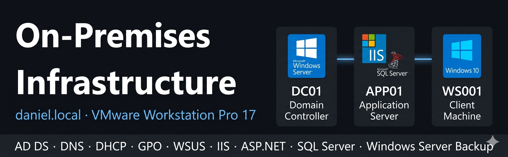

# 01 — Infraestructura On-Premises

## Visión general

Infraestructura on-premises completa construida sobre **VMware Workstation Pro 17**, simulando un entorno empresarial real con un Controlador de Dominio, un Servidor de Aplicaciones y una máquina cliente Windows 10 — todos unidos al dominio **daniel.local**.

Este entorno sirve como origen de migración para la fase de Azure del laboratorio.

## Servidores

| Servidor | SO                  | IP           | RAM | Rol                      |
| -------- | ------------------- | ------------ | --- | ------------------------ |
| DC01     | Windows Server 2019 | 192.168.75.4 | 2GB | Controlador de Dominio   |
| APP01    | Windows Server 2019 | 192.168.75.5 | 2GB | Servidor de Aplicaciones |
| WS001    | Windows 10          | 192.168.75.7 | 2GB | Máquina Cliente          |

## Servicios desplegados

| Servicio              | Servidor | Migra a                           |
| --------------------- | -------- | --------------------------------- |
| AD DS (daniel.local)  | DC01     | Entra ID                          |
| DNS                   | DC01     | Entra ID Private DNS              |
| DHCP                  | DC01     | —                                 |
| GPO                   | DC01     | Azure Policy + Intune             |
| File Server           | DC01     | Azure Files                       |
| WSUS                  | DC01     | Azure Update Manager              |
| IIS + ASP.NET Core 8  | APP01    | App Service (B1)                  |
| SQL Server Express    | APP01    | Azure VM D2s_v3 + SQL Server 2022 |
| Windows Server Backup | APP01    | Recovery Services Vault           |

## Estructura de AD

| OU                    | Contenido                    | Sincroniza con Entra ID   |
| --------------------- | ---------------------------- | ------------------------- |
| Departamentos/Admin   | user3_admin                  | ❌ (Admin_NoSync)          |
| Departamentos/HR      | user2_hr                     | ✅                         |
| Departamentos/IT      | user1_it                     | ✅                         |
| Departamentos/General | user4_general                | ✅                         |
| Grupos                | Sec_Admins · Sec_HR · Sec_IT | ✅                         |
| Servers               | APP01                        | ❌ (equipos excluidos)     |
| Workstations          | WS001                        | ✅                         |
| Admin_NoSync          | user3_admin · App01Admin     | ❌ (cuentas privilegiadas) |
| Service_Accounts      | —                            | ❌ (reservado)             |

## Mapeo RBAC (On-Prem → Azure)

| Grupo AD   | Rol en Azure | Alcance      |
| ---------- | ------------ | ------------ |
| Sec_Admins | Contributor  | rg-daniellab |
| Sec_IT     | Reader       | rg-daniellab |
| Sec_HR     | Reader       | rg-daniellab |

## Decisiones de diseño de seguridad

**Modelo por niveles — OU Admin_NoSync**
Las cuentas privilegiadas están aisladas de la sincronización con la nube siguiendo el principio de seguridad del modelo por niveles (Tier Model). Un compromiso en la nube no puede utilizarse para escalar privilegios en el entorno on-premises.

**Principio de mínimo privilegio — mapeo RBAC**
Los grupos de seguridad de AD se asignan a roles RBAC de Azure siguiendo el principio de mínimo privilegio — ningún usuario tiene más permisos de los estrictamente necesarios para su rol.

**GPOs separadas para servidores y estaciones de trabajo**
APP01 (OU=Servers) recibe la GPO-WSUS-Servers con comportamiento de notificación únicamente y sin reinicio automático. WS001 (OU=Workstations) recibe GPO-WSUS con instalación automática. Esto evita interrupciones inesperadas del servicio en el servidor de aplicaciones.

**Puerto 80 cerrado en APP01**
IIS está configurado para servir únicamente por HTTPS (puerto 443). El puerto 80 está cerrado para reducir la superficie de ataque — no se acepta tráfico sin cifrar.

## Documentación

| Carpeta           | Contenido                                                                  |
| ----------------- | -------------------------------------------------------------------------- |
| [dc01](./dc01/)   | Controlador de Dominio — AD DS, DNS, DHCP, GPO, WSUS, Servidor de Archivos |
| [app01](./app01/) | Servidor de Aplicaciones — IIS, ASP.NET Core 8, SQL Server, WSB            |
| [ws001](./ws001/) | Máquina Cliente — Unión al dominio, GPO, WSUS, Hybrid Join, Intune         |

## Estado

* [x] DC01 — completamente configurado y documentado
* [x] APP01 — completamente configurado y documentado
* [x] WS001 — completamente configurado y documentado
* [x] Hybrid Azure AD Join (WS001) — completado en la fase de Azure
* [x] Inscripción en Intune (WS001) — completado en la fase de Azure
