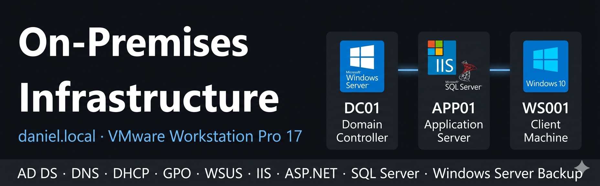

# 01 — On-Premises Infrastructure

## Overview

Complete on-premises infrastructure built on **VMware Workstation Pro 17**, simulating a real enterprise environment with a Domain Controller, an Application Server and a Windows 10 client machine — all joined to the **daniel.local** domain.

This environment serves as the migration source for the Azure phase of the lab.

## Infrastructure Summary
```
ON-PREMISES (192.168.75.x)
──────────────────────────────────────────────────────────────────
DC01 · Windows Server 2019 · 192.168.75.4 · 2GB RAM
├─ AD DS (daniel.local) · DNS · DHCP · GPO
├─ File Server → E:\SharedFiles\Backups\APP01\
└─ WSUS (port 8530) → Servers + Workstations groups

APP01 · Windows Server 2019 · 192.168.75.5 · 2GB RAM
├─ IIS (HTTPS:443) + ASP.NET Core 8
├─ SQL Server Express → DanielDB
└─ Windows Server Backup → DC01 File Share (daily 02:00)

WS001 · Windows 10 · 192.168.75.7 · 2GB RAM
└─ Domain Joined · GPO-WSUS · Acceso IIS + File Share
```

## Servers

| Server | OS | IP | Role |
|---|---|---|---|
| DC01 | Windows Server 2019 | 192.168.75.4 | Domain Controller |
| APP01 | Windows Server 2019 | 192.168.75.5 | Application Server |
| WS001 | Windows 10 | 192.168.75.7 | Client Machine |

## Services Deployed

| Service | Server | Migrates To |
|---|---|---|
| AD DS (daniel.local) | DC01 | Entra ID |
| DNS | DC01 | Entra ID Private DNS |
| DHCP | DC01 | — |
| GPO | DC01 | Azure Policy |
| File Server | DC01 | Azure Files |
| WSUS | DC01 | Azure Update Manager |
| IIS + ASP.NET Core 8 | APP01 | App Service (F1 Free) |
| SQL Server Express | APP01 | Azure VM + SQL Server |
| Windows Server Backup | APP01 | Recovery Services Vault |

## AD Structure
```
daniel.local
└─ DANIEL (root OU — synced to Entra ID)
    ├─ Departamentos
    │   ├─ Admin      → user3_admin
    │   ├─ HR         → user2_hr
    │   ├─ IT         → user1_it
    │   └─ General    → user4_general
    ├─ Grupos
    │   ├─ Sec_Admins → Contributor (Azure)
    │   ├─ Sec_HR     → Reader (Azure)
    │   └─ Sec_IT     → Reader (Azure)
    ├─ Servers        → APP01 (excluded from sync)
    ├─ Workstations   → WS001
    ├─ Admin_NoSync   → privileged accounts (excluded from sync)
    └─ Service_Accounts (reserved, excluded from sync)
```

## Security Design Decisions

**Tier Model — Admin_NoSync OU**
Privileged accounts are isolated from cloud sync following the Tier Model security principle. A cloud compromise cannot be used to attack on-premises privileged accounts.

**Least Privilege — RBAC mapping**
AD security groups are mapped to Azure RBAC roles following least privilege:
- Sec_Admins → Contributor on rg-daniellab
- Sec_IT → Reader on rg-daniellab
- Sec_HR → Reader on rg-daniellab

**Separate GPOs for Servers and Workstations**
APP01 (OU=Servers) receives GPO-WSUS-Servers with notify-only update behavior and no auto-restart. WS001 (OU=Workstations) receives GPO-WSUS with automatic install. This prevents unplanned service outages on the application server.

**Port 80 closed on APP01**
IIS is configured to serve only over HTTPS (port 443). Port 80 is closed to reduce the attack surface — no unencrypted traffic is accepted.

## Documentation

| Folder | Contents |
|---|---|
| [dc01](./dc01/) | Domain Controller — AD DS, DNS, DHCP, GPO, WSUS, File Server |
| [app01](./app01/) | Application Server — IIS, ASP.NET Core 8, SQL Server, WSB |
| [ws001](./ws001/) | Client Machine — Domain Join, GPO, WSUS, resource access |

## Status

- [x] DC01 — fully configured and documented
- [x] APP01 — fully configured and documented
- [x] WS001 — fully configured and documented
- [ ] Hybrid Azure AD Join (WS001) — pending Azure phase