# APP01 — Application Server

## Overview

APP01 is the application server of the **daniel.local** domain, running **Windows Server 2019** with 2GB RAM on VMware Workstation Pro 17. It hosts the web application, database and backup services for the lab environment.

## Server Roles

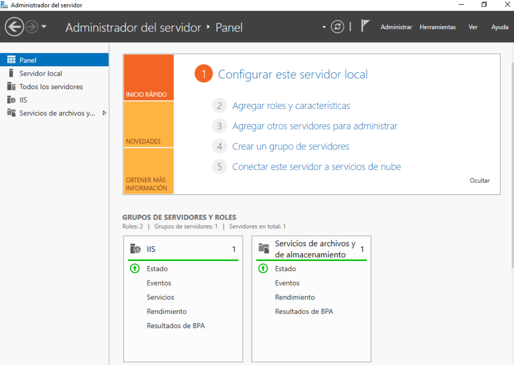

- Internet Information Services (IIS)
- ASP.NET Core 8
- SQL Server Express 2022
- Windows Server Backup (wbadmin)

## Web Application — IIS

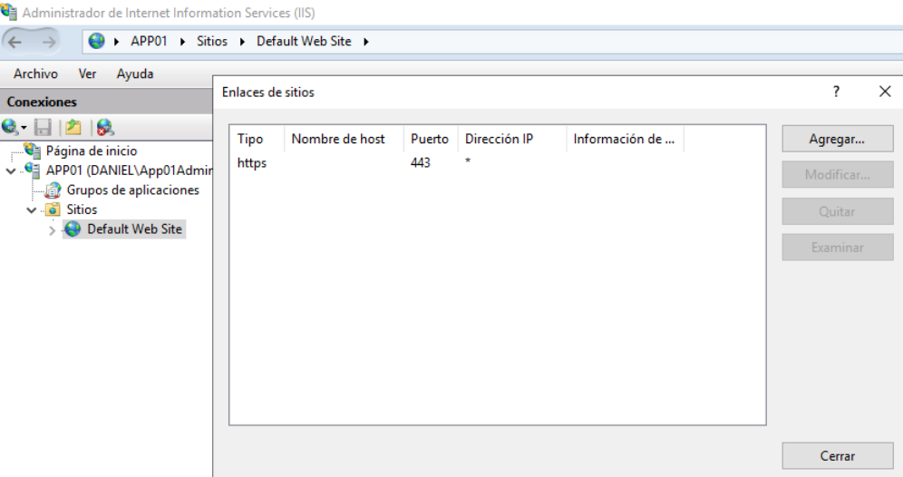
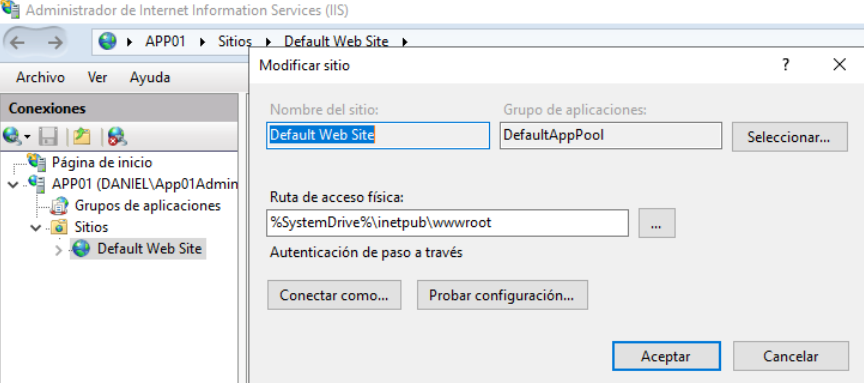
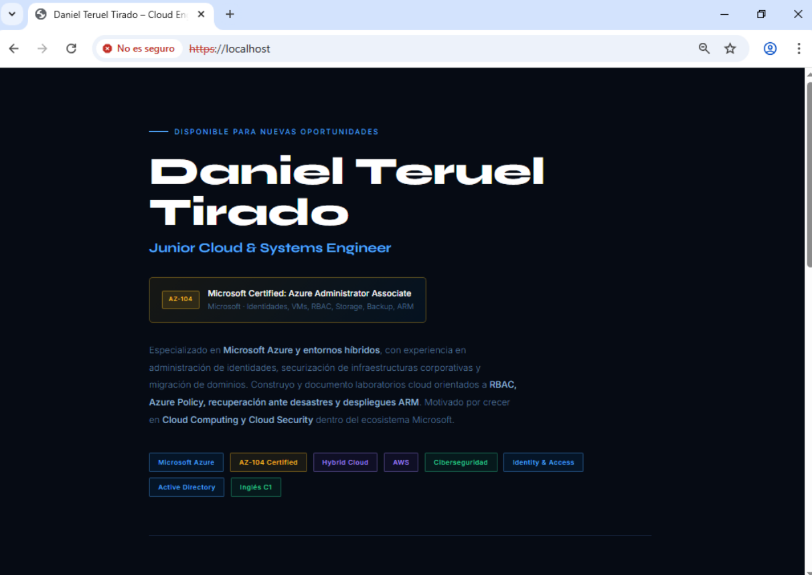

IIS serves the personal portfolio web application over **HTTPS on port 443**. Port 80 is closed following hardening best practices — reducing the attack surface by not exposing an unencrypted endpoint.

| Setting | Value |
|---|---|
| Protocol | HTTPS |
| Port | 443 |
| Physical Path | C:\inetpub\wwwroot |
| Port 80 | Closed |

**Migration target:** Azure App Service (F1 Free)

## Web Application — ASP.NET Core 8

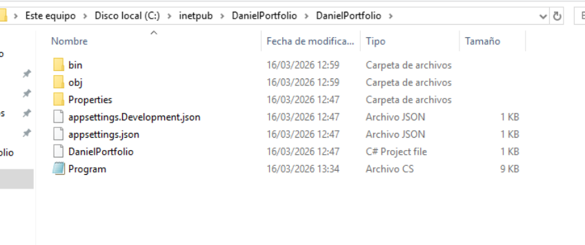
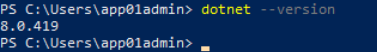

The web application is built on **ASP.NET Core 8**, connecting IIS to SQL Server Express through a 3-tier architecture. The application dynamically renders portfolio content (projects and certifications) from the database instead of hardcoding it in HTML.
```
User / WS001
    │
    │ HTTPS:443
    ▼
┌─────────┐     ┌──────────────┐     ┌─────────────────┐
│   IIS   │────►│  ASP.NET 8   │────►│  SQL Server     │
│  :443   │     │  Program.cs  │     │  Express        │
└─────────┘     └──────────────┘     │  └─ DanielDB    │
                                      └─────────────────┘
```

**Why ASP.NET Core instead of static HTML?**
A static HTML page cannot demonstrate a realistic migration scenario. By adding a backend connected to SQL Server, the application becomes a genuine 3-tier workload — the same architecture found in enterprise environments — making the migration to Azure App Service + Azure VM SQL Server meaningful and defensible in an interview.

**Migration target:** Azure App Service (F1 Free)

## Database — SQL Server Express

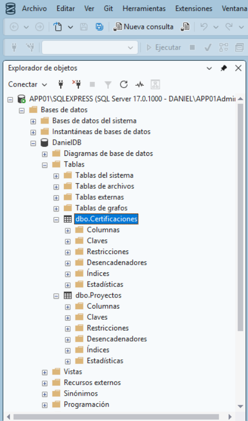
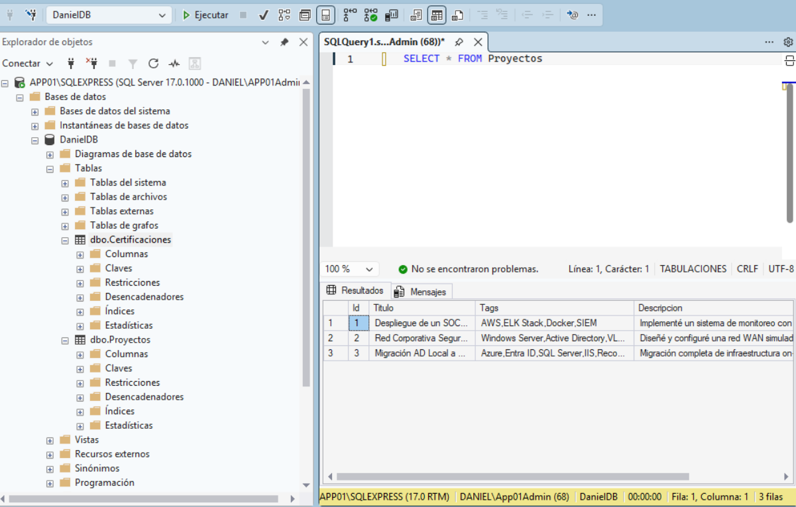
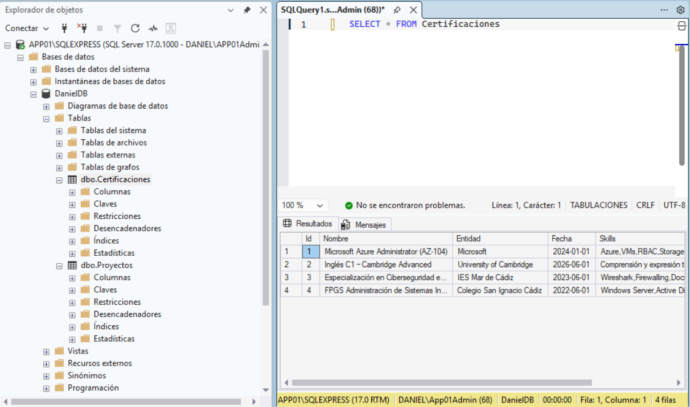

**SQL Server Express 2022** hosts the **DanielDB** database, which stores the portfolio content served by the ASP.NET application.

### Database Structure

| Table | Rows | Content |
|---|---|---|
| Proyectos | 3 | Portfolio projects |
| Certificaciones | 4 | Certifications and education |

### Connection Details

| Setting | Value |
|---|---|
| Instance | APP01\SQLEXPRESS |
| Database | DanielDB |
| Authentication | Windows Authentication |
| IIS App Pool | IIS APPPOOL\DefaultAppPool (db_datareader) |

**Why SQL Server Express and not Azure SQL Database directly?**
Running SQL Server on-premises simulates a realistic lift & shift scenario. Migrating the database to an Azure VM with SQL Server (IaaS) demonstrates the decision-making process between IaaS and PaaS approaches — a key topic in enterprise migrations and Azure administrator interviews.

**Migration target:** Azure VM B2s + SQL Server Developer 2022

## Windows Server Backup

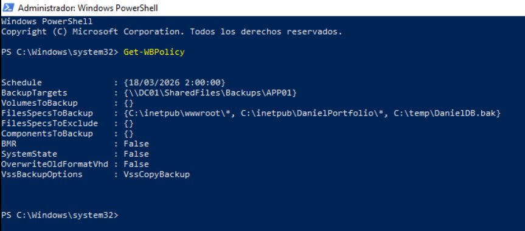
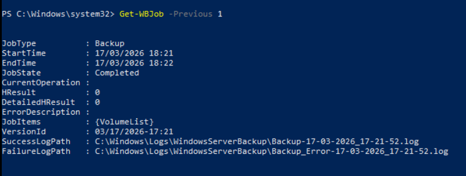
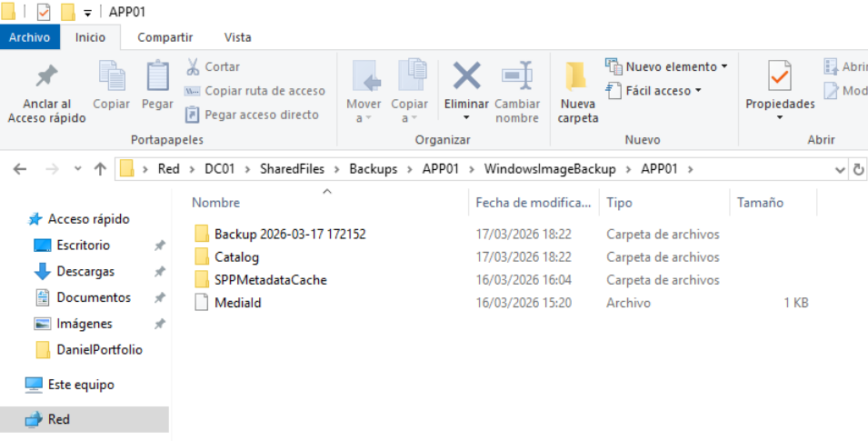

Windows Server Backup (wbadmin) is configured to back up all application components daily at **02:00**, storing the backup on the DC01 File Share over the network.

### Backup Scope

| Component | Path |
|---|---|
| Web application | C:\inetpub\wwwroot |
| ASP.NET source code | C:\inetpub\DanielPortfolio |
| SQL database export | C:\temp\DanielDB.bak |

### Backup Policy

| Setting | Value |
|---|---|
| Schedule | Daily at 02:00 |
| Target | \\DC01\SharedFiles\Backups\APP01\ |
| System State | No (lightweight backup) |
| Last job result | HResult = 0 ✅ |

### Backup Path on DC01
```
E:\SharedFiles\
└─ Backups\
    └─ APP01\
        └─ WindowsImageBackup\
            └─ APP01\
                └─ Backup YYYY-MM-DD\ (daily)
```

**Why exclude System State?**
The goal is a lightweight application backup — web files, code and database. A full System State backup would include the entire Windows OS configuration, significantly increasing backup size and time without adding value for this specific recovery scenario.

**Migration target:** Recovery Services Vault + MARS Agent

## Running Services

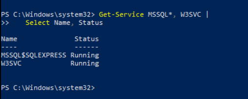

| Service | Status | Start Type |
|---|---|---|
| W3SVC (IIS) | Running | Automatic |
| MSSQL$SQLEXPRESS | Running | Automatic (Delayed) |

## Migration Targets

| Service | Migration Tool | Azure Service |
|---|---|---|
| IIS + ASP.NET | ZIP Deploy | App Service (F1 Free) |
| SQL Server Express | Backup/Restore .bak | Azure VM B2s + SQL Server |
| Windows Server Backup | MARS Agent | Recovery Services Vault |