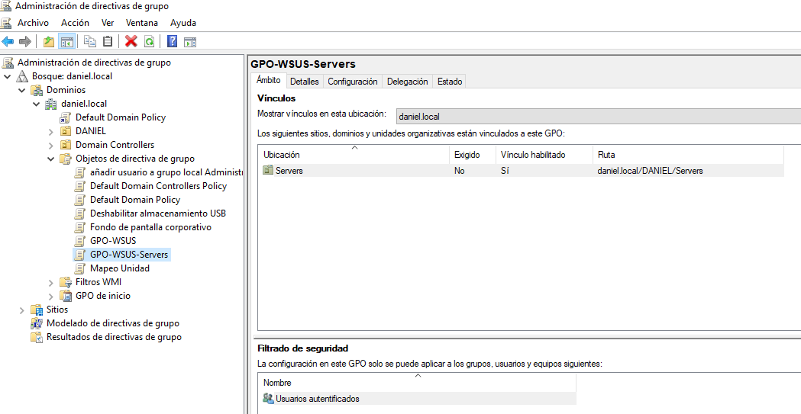
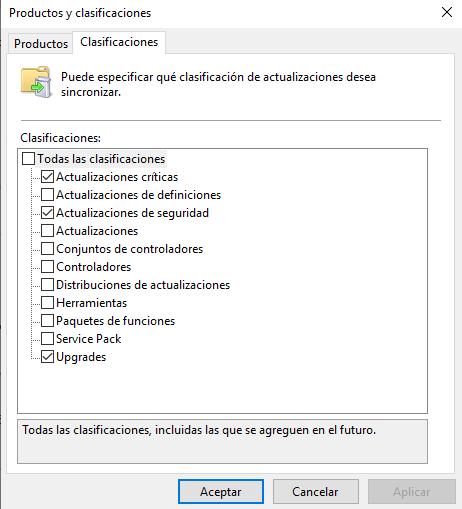

# DC01 — Controlador de Dominio

## Descripción General

DC01 es el Controlador de Dominio principal del dominio **daniel.local**, ejecutándose sobre **Windows Server 2019** con 2GB de RAM en VMware Workstation Pro 17. Aloja todos los servicios principales de identidad e infraestructura del entorno de laboratorio.

## Roles del Servidor


- Active Directory Domain Services (AD DS)
- Servidor DNS
- Servidor DHCP
- Servicios de Archivo y Almacenamiento
- Windows Server Update Services (WSUS)

## Estructura de Active Directory


El dominio **daniel.local** está organizado bajo una OU dedicada llamada **DANIEL**, siguiendo las mejores prácticas empresariales para el ámbito de sincronización de Entra Connect.
```
DANIEL (OU raíz)
├─ Departamentos
│   ├─ Admin      → user3_admin (Sec_Admins)
│   ├─ HR         → user2_hr (Sec_HR)
│   ├─ IT         → user1_it (Sec_IT)
│   └─ General    → user4_general
├─ Grupos
│   ├─ Sec_Admins
│   ├─ Sec_HR
│   └─ Sec_IT
├─ Servers        → APP01 (excluida de la sync con Entra)
├─ Workstations   → WS001
├─ Admin_NoSync   → user3_admin, App01Admin (excluida de la sync)
└─ Service_Accounts (reservada para cuentas de servicio)
```

### Decisiones de Diseño

**¿Por qué la OU Admin_NoSync?**
Las cuentas privilegiadas (administradores de dominio, administradores de servidores) están aisladas en una OU dedicada excluida de la sincronización con Entra Connect. Esto sigue el principio de seguridad del **Modelo de Niveles (Tier Model)** — evitando que un compromiso en la nube se convierta en una brecha en la infraestructura on-premises.

**¿Por qué la OU Service_Accounts?**
Reservada para cuentas de servicio que ejecutan servicios locales (SQL Server, IIS, trabajos de backup). Estas cuentas no requieren licencias de Microsoft 365 ni acceso a Azure, y se excluyen de la sincronización para mantener el tenant de Entra ID limpio.

**¿Por qué separar Servers de Workstations?**
Los servidores y los puestos de trabajo tienen requisitos de Directiva de Grupo completamente diferentes — especialmente en lo relativo al comportamiento de Windows Update. Separarlos en OUs dedicadas permite aplicar GPOs específicas a cada uno, siguiendo las mejores prácticas empresariales de parcheo.

### Atributos de Usuarios


Todos los usuarios sincronizables tienen los siguientes atributos rellenos antes de la sincronización con Entra Connect:

| Usuario | Departamento | Puesto | Email |
|---|---|---|---|
| user1_it | IT | IT Technician | user1_it@daniel.local |
| user2_hr | HR | HR Specialist | user2_hr@daniel.local |
| user4_general | General | General User | user4_general@daniel.local |

### Pertenencia a Grupos


| Grupo | Miembros | RBAC en Azure (tras migración) |
|---|---|---|
| Sec_Admins | user3_admin | Contributor — rg-daniellab |
| Sec_IT | user1_it | Reader — rg-daniellab |
| Sec_HR | user2_hr | Reader — rg-daniellab |

### Propiedades de Usuario


## DNS


La zona DNS interna **daniel.local** resuelve todos los recursos del laboratorio:

| Hostname | Dirección IP |
|---|---|
| DC01 | 192.168.75.4 |
| APP01 | 192.168.75.5 |
| WS001 | 192.168.75.7 |

## DHCP


Ámbito DHCP configurado para la red 192.168.75.x. Concesiones activas confirmadas para APP01 y WS001.

## Directiva de Grupo (GPO)

### GPO-WSUS (Workstations)


Aplicada a **OU=Workstations**. Configura WS001 para recibir actualizaciones de WSUS automáticamente.

| Configuración | Valor |
|---|---|
| WUServer | http://DC01:8530 |
| AUOptions | 4 (Descargar e instalar automáticamente) |
| TargetGroup | Workstations |

### GPO-WSUS-Servers



Aplicada a **OU=Servers**. Configura APP01 para recibir actualizaciones de WSUS con instalación controlada por el administrador — sin reinicios automáticos.

| Configuración | Valor |
|---|---|
| WUServer | http://DC01:8530 |
| AUOptions | 3 (Descargar y notificar — sin instalación automática) |
| NoAutoRebootWithLoggedOnUsers | 1 |
| TargetGroup | Servers |

**¿Por qué GPOs diferentes para servidores y puestos de trabajo?**
Los servidores requieren ventanas de mantenimiento controladas — un reinicio no planificado de APP01 dejaría fuera de servicio IIS, SQL Server y la aplicación web. Los puestos de trabajo pueden parchearse y reiniciarse automáticamente sin impacto en el negocio.

## File Server


La carpeta compartida **E:\SharedFiles** sirve como destino de backup para el trabajo de Windows Server Backup de APP01.
```
E:\SharedFiles\
└─ Backups\
    └─ APP01\
        └─ WindowsImageBackup\
            └─ APP01\
                └─ Backup YYYY-MM-DD\ (diario)
```

**Destino de migración:** Azure Files (Standard LRS)

## WSUS — Windows Server Update Services




WSUS ejecutándose en el puerto **8530**, gestionando las actualizaciones de todas las máquinas del laboratorio separadas en grupos dedicados:

| Grupo WSUS | Miembros | GPO Aplicada |
|---|---|---|
| Servers | app01.daniel.local | GPO-WSUS-Servers |
| Workstations | ws001.daniel.local | GPO-WSUS |

**Productos configurados:** Windows 10, Windows 11, Windows Server 2019
**Clasificaciones:** Actualizaciones Críticas, Actualizaciones de Seguridad

**Destino de migración:** Azure Update Manager (vía Azure Arc)

## Destinos de Migración

| Servicio | Herramienta | Servicio Azure |
|---|---|---|
| AD DS | Entra Connect | Entra ID |
| DNS | Incluido | DNS Privado de Entra ID |
| File Server | AzCopy | Azure Files |
| WSUS | Azure Arc | Azure Update Manager |
