# DC01 — Domain Controller

## Overview

DC01 is the primary Domain Controller of the **daniel.local** domain, running **Windows Server 2019** with 2GB RAM on VMware Workstation Pro 17. It hosts all core identity and infrastructure services for the lab environment.

## Server Roles

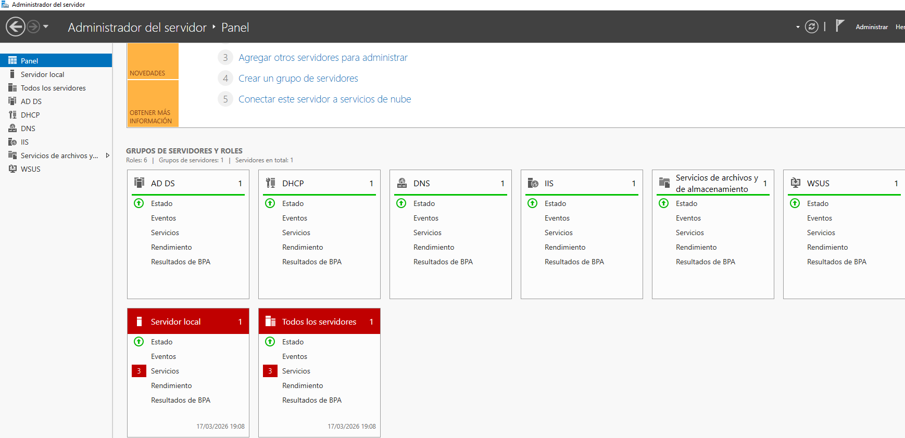

- Active Directory Domain Services (AD DS)
- DNS Server
- DHCP Server
- File and Storage Services
- Windows Server Update Services (WSUS)

## Active Directory Structure

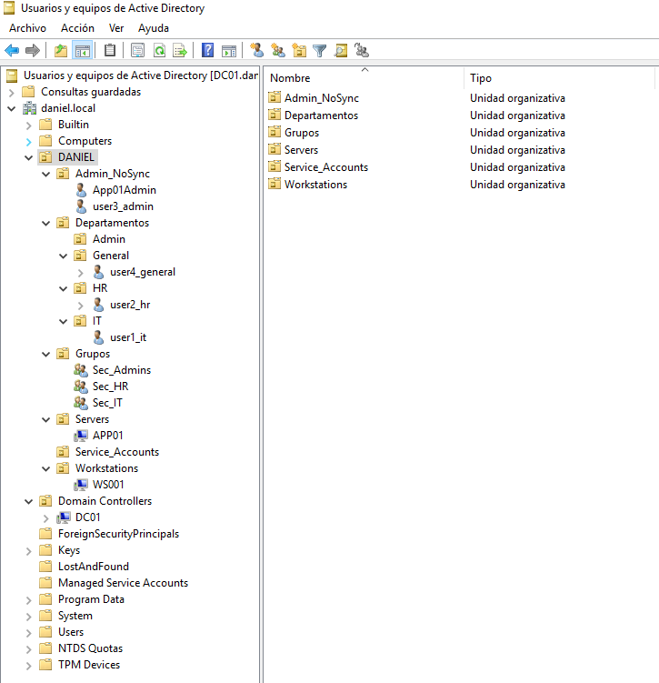

The domain **daniel.local** is organized under a dedicated OU called **DANIEL**, following enterprise best practices for Entra Connect synchronization scope.
```
DANIEL (root OU)
├─ Departamentos
│   ├─ Admin      → user3_admin (Sec_Admins)
│   ├─ HR         → user2_hr (Sec_HR)
│   ├─ IT         → user1_it (Sec_IT)
│   └─ General    → user4_general
├─ Grupos
│   ├─ Sec_Admins
│   ├─ Sec_HR
│   └─ Sec_IT
├─ Servers        → APP01 (excluded from Entra sync)
├─ Workstations   → WS001
├─ Admin_NoSync   → user3_admin, App01Admin (excluded from Entra sync)
└─ Service_Accounts (reserved for service accounts)
```

### Design Decisions

**Why Admin_NoSync OU?**
Privileged accounts (domain admins, server admins) are isolated in a dedicated OU excluded from Entra Connect synchronization. This follows the **Tier Model** security principle — preventing a cloud compromise from becoming an on-premises breach.

**Why Service_Accounts OU?**
Reserved for service accounts that run local services (SQL Server, IIS, backup jobs). These accounts do not require cloud licenses or Azure access and are excluded from sync to keep the Entra ID tenant clean.

**Why Servers OU separate from Workstations?**
Servers and workstations have completely different Group Policy requirements — especially around Windows Update behavior. Separating them into dedicated OUs allows applying tailored GPOs to each, following enterprise patching best practices.

### User Attributes

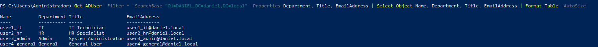

All synchronizable users have the following attributes populated before Entra Connect sync:

| User | Department | Title | Email |
|---|---|---|---|
| user1_it | IT | IT Technician | user1_it@daniel.local |
| user2_hr | HR | HR Specialist | user2_hr@daniel.local |
| user4_general | General | General User | user4_general@daniel.local |

### User Group Membership

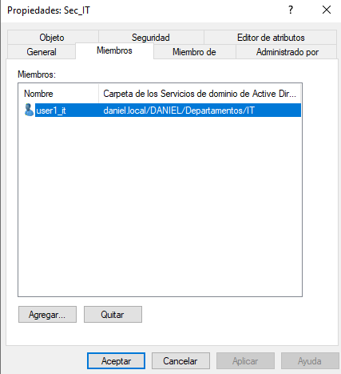

| Group | Members | Azure RBAC (after migration) |
|---|---|---|
| Sec_Admins | user3_admin | Contributor — rg-daniellab |
| Sec_IT | user1_it | Reader — rg-daniellab |
| Sec_HR | user2_hr | Reader — rg-daniellab |

### User Properties

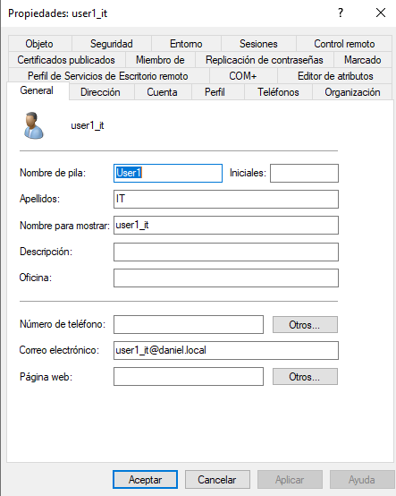

## DNS

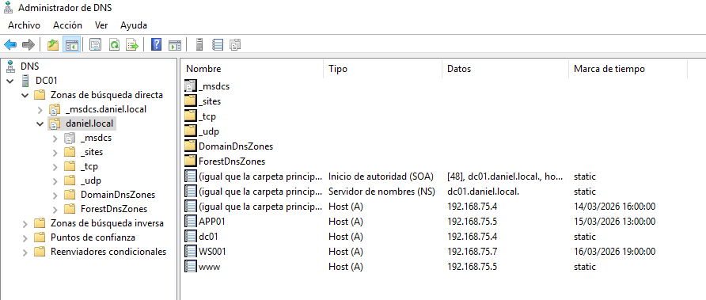

Internal DNS zone **daniel.local** resolves all lab resources:

| Hostname | IP Address |
|---|---|
| DC01 | 192.168.75.4 |
| APP01 | 192.168.75.5 |
| WS001 | 192.168.75.7 |

## DHCP

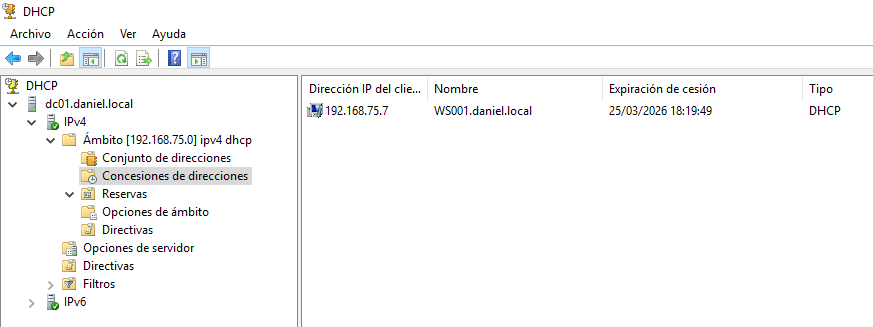

DHCP scope configured for the 192.168.75.x network. Active leases confirmed for APP01 and WS001.

## Group Policy

### GPO-WSUS (Workstations)

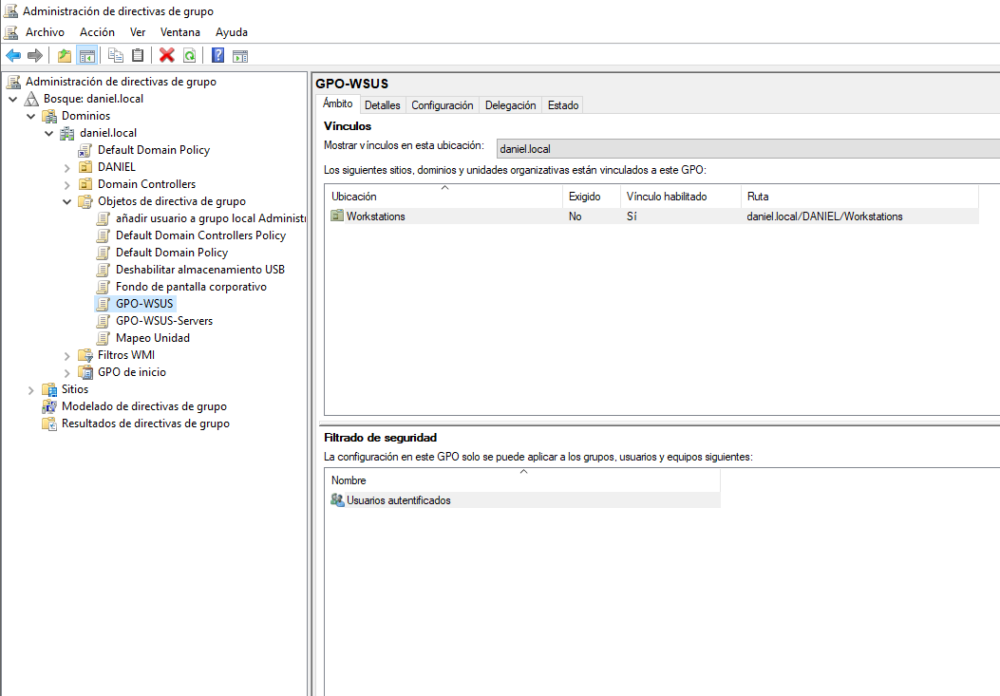
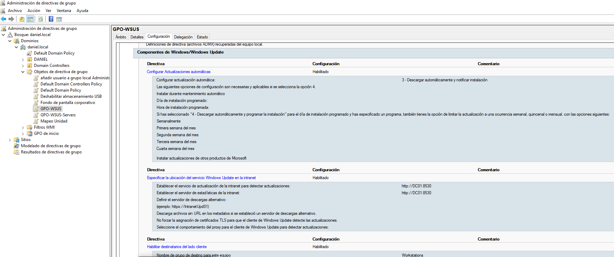

Applied to **OU=Workstations**. Configures WS001 to receive updates from WSUS automatically.

| Setting | Value |
|---|---|
| WUServer | http://DC01:8530 |
| AUOptions | 4 (Auto download and schedule install) |
| TargetGroup | Workstations |

### GPO-WSUS-Servers

Applied to **OU=Servers**. Configures APP01 to receive updates from WSUS with admin-controlled installation — no automatic restarts.

| Setting | Value |
|---|---|
| WUServer | http://DC01:8530 |
| AUOptions | 3 (Download and notify — no auto install) |
| NoAutoRebootWithLoggedOnUsers | 1 |
| TargetGroup | Servers |

**Why different GPOs for servers and workstations?**
Servers require controlled maintenance windows — an unplanned restart of APP01 would take down IIS, SQL Server and the web application. Workstations can be patched and restarted automatically without business impact.

## File Server


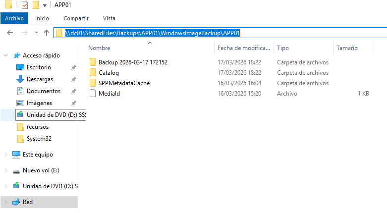

Shared folder **E:\SharedFiles** serves as the backup destination for APP01's Windows Server Backup job.
```
E:\SharedFiles\
└─ Backups\
    └─ APP01\
        └─ WindowsImageBackup\
            └─ Backup YYYY-MM-DD\ (daily)
```

**Migration target:** Azure Files (Standard LRS)

## WSUS — Windows Server Update Services


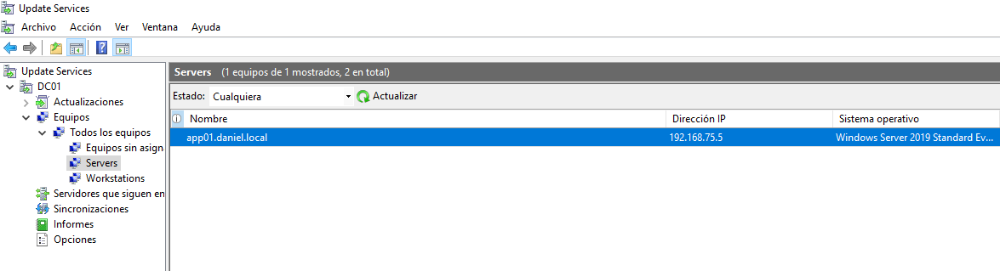
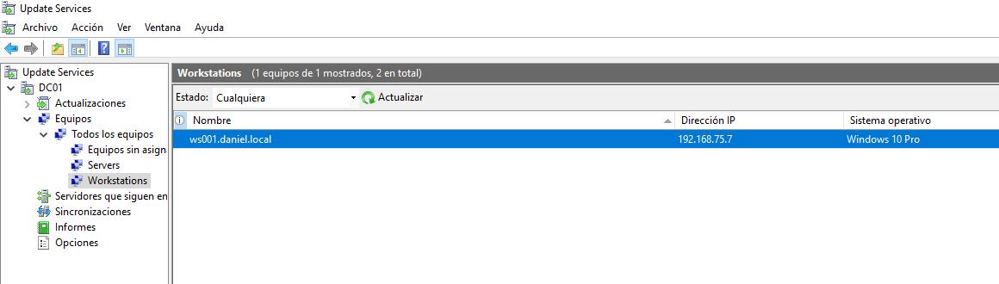
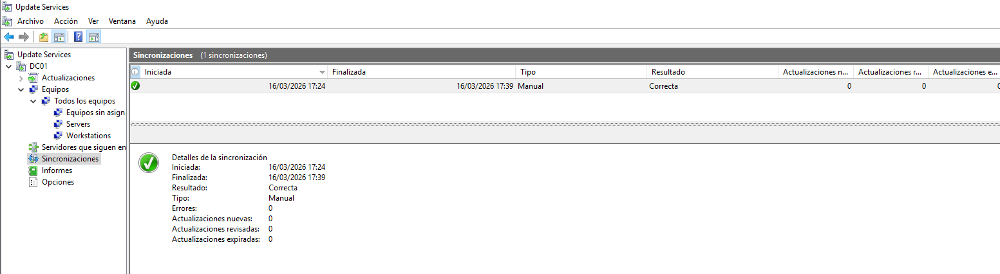
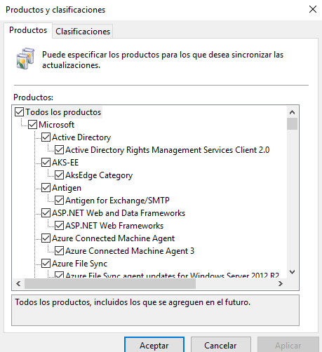

WSUS running on port **8530**, managing updates for all lab machines separated into dedicated groups:

| WSUS Group | Members | GPO Applied |
|---|---|---|
| Servers | app01.daniel.local | GPO-WSUS-Servers |
| Workstations | ws001.daniel.local | GPO-WSUS |

**Products configured:** Windows 10, Windows 11, Windows Server 2019
**Classifications:** Critical Updates, Security Updates

**Migration target:** Azure Update Manager (via Azure Arc)

## Migration Targets

| Service | Migration Tool | Azure Service |
|---|---|---|
| AD DS | Entra Connect | Entra ID |
| DNS | Included | Entra ID Private DNS |
| File Server | AzCopy | Azure Files |
| WSUS | Azure Arc | Azure Update Manager |
