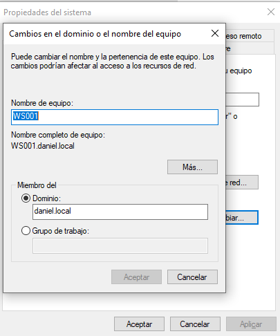
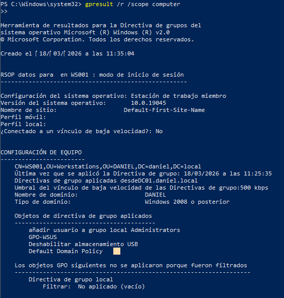
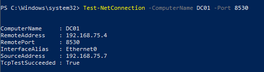
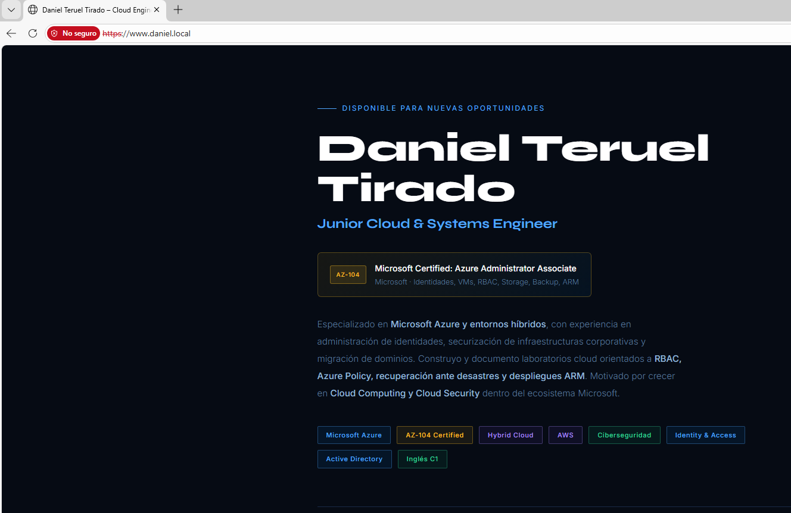
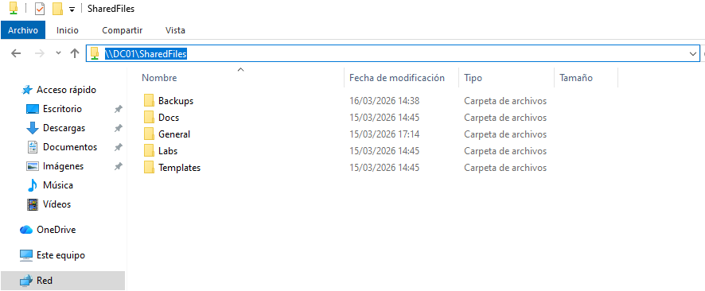

# WS001 — Equipo Cliente

## Descripción General

WS001 es el equipo cliente unido al dominio **daniel.local**, ejecutándose sobre **Windows 10** con 2GB de RAM en VMware Workstation Pro 17. Simula un puesto de trabajo de usuario final utilizado para verificar las directivas de dominio, el acceso a recursos compartidos y la conectividad con la aplicación web.

## Unión al Dominio

WS001 está unido al dominio **daniel.local**, gestionado por DC01.

| Configuración | Valor |
|---|---|
| Nombre del equipo | WS001 |
| Dominio | daniel.local |
| Controlador de Dominio | DC01 |
| OU | OU=Workstations,OU=DANIEL,DC=daniel,DC=local |

> **Nota:** La unión híbrida a Azure AD (Hybrid Azure AD Join) se configurará durante la fase de migración a Azure, una vez establecida la sincronización con Entra Connect.

## Directiva de Grupo

Las siguientes GPOs se aplican a WS001 a través del ámbito **OU=Workstations**:

| GPO | Aplicada | Efecto |
|---|---|---|
| Default Domain Policy | ✅ | Configuración base del dominio |
| GPO-WSUS | ✅ | Apunta WS001 a WSUS en DC01:8530 |
| Deshabilitar almacenamiento USB | ✅ | Deshabilita dispositivos de almacenamiento USB |
| Añadir usuario a grupo local Administrators | ✅ | Añade usuario de dominio a administradores locales |

## WSUS — Windows Update

WS001 recibe las actualizaciones de Windows desde WSUS en DC01, puerto 8530. Conectividad y reporte al grupo **Workstations** de la consola WSUS confirmados.

| Configuración | Valor |
|---|---|
| Servidor WSUS | http://DC01:8530 |
| Grupo WSUS | Workstations |
| AUOptions | 4 (Descargar e instalar automáticamente) |
| Puerto accesible | TcpTestSucceeded: True ✅ |

## Acceso a Recursos

### Aplicación Web

WS001 accede correctamente a la aplicación web de portfolio alojada en APP01 mediante HTTPS.

| Configuración | Valor |
|---|---|
| URL | https://192.168.75.5 |
| Protocolo | HTTPS |
| Resultado | Página de portfolio cargada correctamente ✅ |

### Carpeta Compartida

WS001 accede correctamente a la carpeta compartida en DC01.

| Configuración | Valor |
|---|---|
| Ruta | \\DC01\SharedFiles |
| Resultado | Contenido visible ✅ |

## Pendiente — Fase Azure

Lo siguiente se configurará durante la fase de migración a Azure:

- **Hybrid Azure AD Join** → WS001 unido tanto a daniel.local como a Entra ID
- **Enrollment en Intune** (opcional) → gestión del dispositivo desde Azure
- **SSO con Entra ID** → inicio de sesión único con credenciales sincronizadas