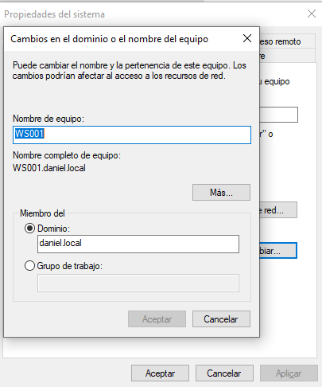
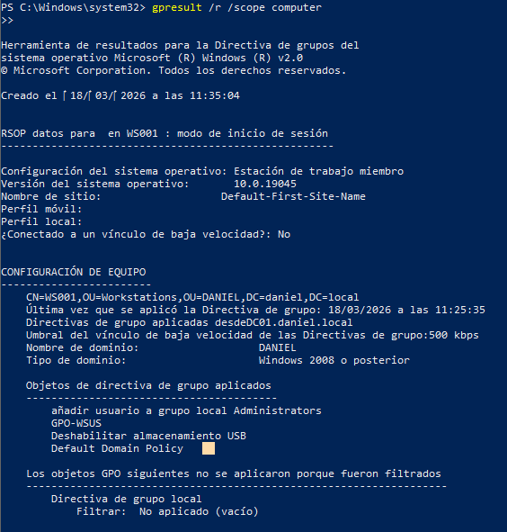
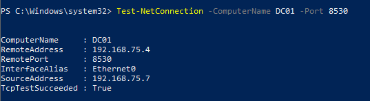
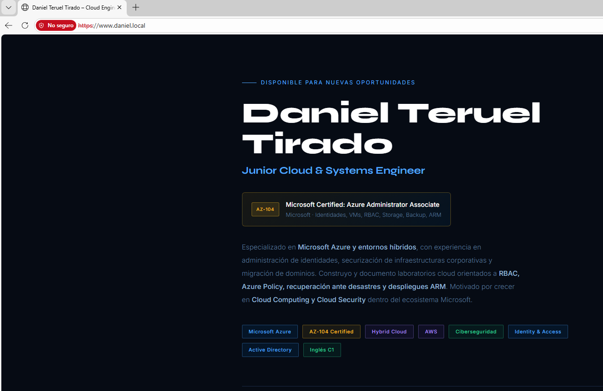
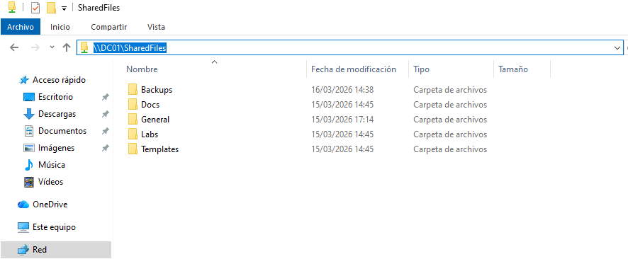

# WS001 — Client Machine

## Overview

WS001 is the domain-joined client machine of the **daniel.local** domain, running **Windows 10** with 2GB RAM on VMware Workstation Pro 17. It simulates an end-user workstation used to verify domain policies, access to shared resources, web application connectivity, and modern device management via Intune.

## Domain Join

WS001 is joined to the **daniel.local** domain, managed by DC01.

| Setting | Value |
|---|---|
| Computer name | WS001 |
| Domain | daniel.local |
| Domain Controller | DC01 |
| OU | OU=Workstations,OU=DANIEL,DC=daniel,DC=local |

## Group Policy

The following GPOs are applied to WS001 via the **OU=Workstations** scope:

| GPO | Applied | Effect |
|---|---|---|
| Default Domain Policy | ✅ | Base domain settings |
| GPO-WSUS | ✅ | Points WS001 to WSUS on DC01:8530 |
| Deshabilitar almacenamiento USB | ✅ | Disables USB storage devices |
| Añadir usuario a grupo local Administrators | ✅ | Adds domain user to local admins |

## WSUS — Windows Update

WS001 receives Windows updates from WSUS running on DC01, port 8530. Confirmed connectivity and reporting to the **Workstations** group in WSUS console.

| Setting | Value |
|---|---|
| WSUS Server | http://DC01:8530 |
| WSUS Group | Workstations |
| AUOptions | 4 (Auto download and schedule install) |
| Port reachable | TcpTestSucceeded: True ✅ |

## Access to Resources

### Web Application

WS001 successfully accesses the portfolio web application hosted on APP01 over HTTPS.

| Setting | Value |
|---|---|
| URL | https://192.168.75.5 |
| Protocol | HTTPS |
| Result | Portfolio page loads correctly ✅ |

### File Share

WS001 successfully accesses the shared folder on DC01.

| Setting | Value |
|---|---|
| Path | \\DC01\SharedFiles |
| Result | Contents visible ✅ |

---

## Azure Phase — Modern Management

The following was completed during the Azure migration phase.

### Hybrid Azure AD Join

WS001 is joined to both **daniel.local** (on-premises) and **Entra ID** (cloud), enabling hybrid identity management from a single device.

| Setting | Value |
|---|---|
| AzureAdJoined | YES ✅ |
| DomainJoined | YES ✅ |
| DeviceAuthStatus | SUCCESS ✅ |

**How it works:** Entra Connect sync establishes a Service Connection Point (SCP) in AD. When WS001 authenticates against the domain, it also registers automatically in Entra ID — no manual steps on the device.

### Intune Enrollment (MDM)

WS001 is enrolled in Microsoft Intune via automatic MDM enrollment triggered by GPO. Device management is handled from Intune portal without requiring a manual enrollment from the user.

| Setting | Value |
|---|---|
| Enrollment method | Automatic via GPO |
| MDM authority | Microsoft Intune |
| Enrollment status | Enrolled ✅ |

### Compliance Policy

A compliance policy is enforced on WS001 via Intune, verifying minimum security requirements:

| Requirement | Status |
|---|---|
| Firewall enabled | ✅ |
| Antivirus enabled | ✅ |
| Minimum OS build (19045) | ✅ |
| Overall compliance | Compliant 🟢 |

### Microsoft 365 Apps

Word, Excel, PowerPoint, and Teams were deployed to WS001 via an Intune app deployment policy — no manual installation required.

| App | Deployed via | Status |
|---|---|---|
| Microsoft Word | Intune | Installed ✅ |
| Microsoft Excel | Intune | Installed ✅ |
| Microsoft PowerPoint | Intune | Installed ✅ |
| Microsoft Teams | Intune | Installed ✅ |

### Endpoint Security — Legal Notice

An Interactive Logon Message (legal notice) is enforced on WS001 via an Intune endpoint security policy, displayed at login before the user session starts.

| Setting | Value |
|---|---|
| Policy type | Endpoint Security (Intune) |
| Target | All devices |
| Status | Applied ✅ |

## Migration Summary

| On-Prem Service | Migration Tool | Azure Service | Status |
|---|---|---|---|
| Domain Join (daniel.local) | Entra Connect | Entra ID Hybrid Join | ✅ |
| WSUS | Azure Arc + Azure Update Manager | Azure Update Manager | ✅ |
| Device management | Intune GPO enrollment | Microsoft Intune (MDM) | ✅ |
| App deployment | Intune app policy | M365 Apps | ✅ |
