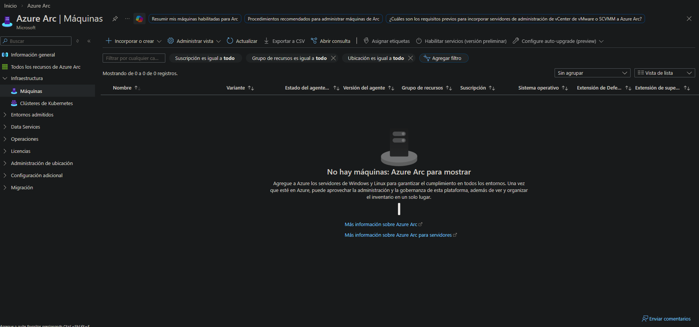
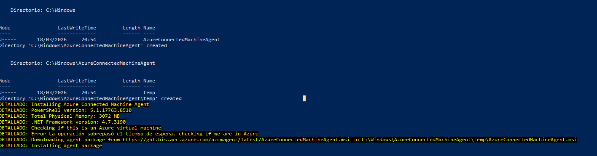
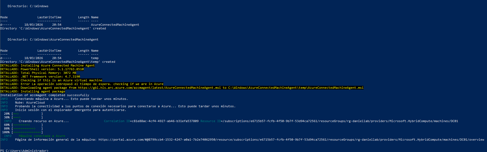
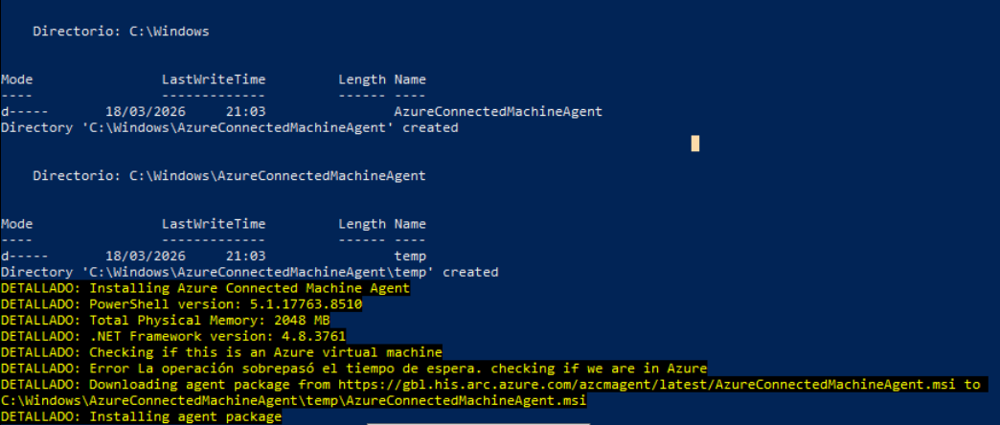
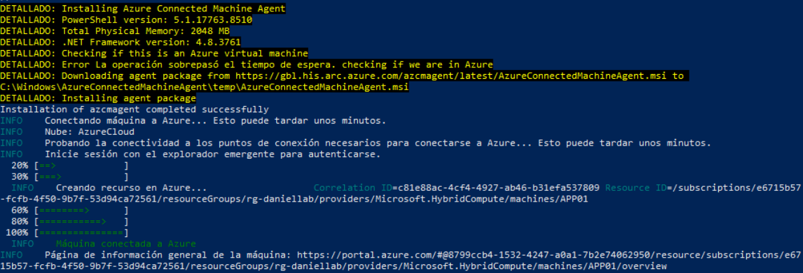
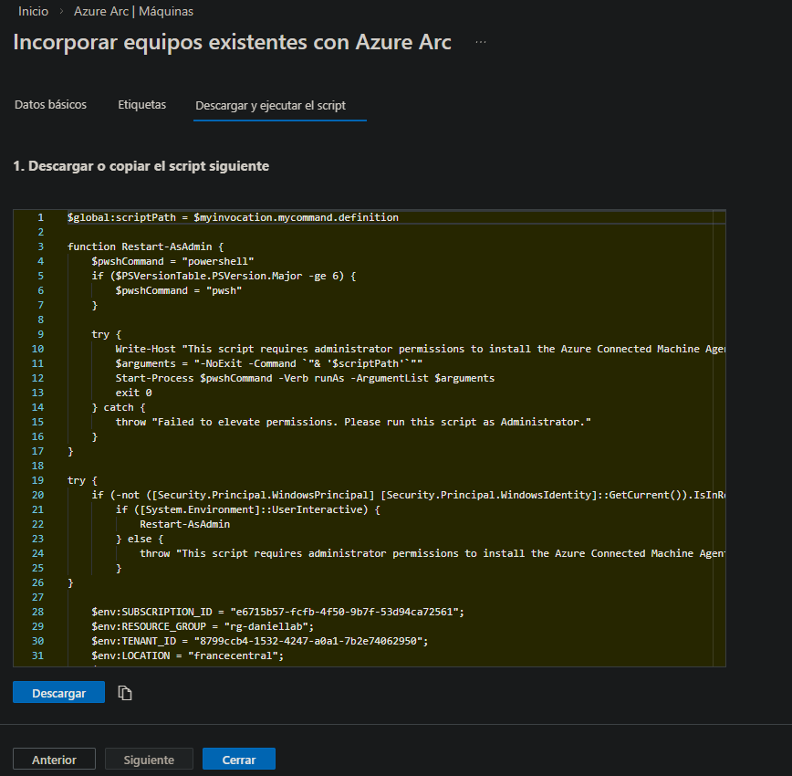
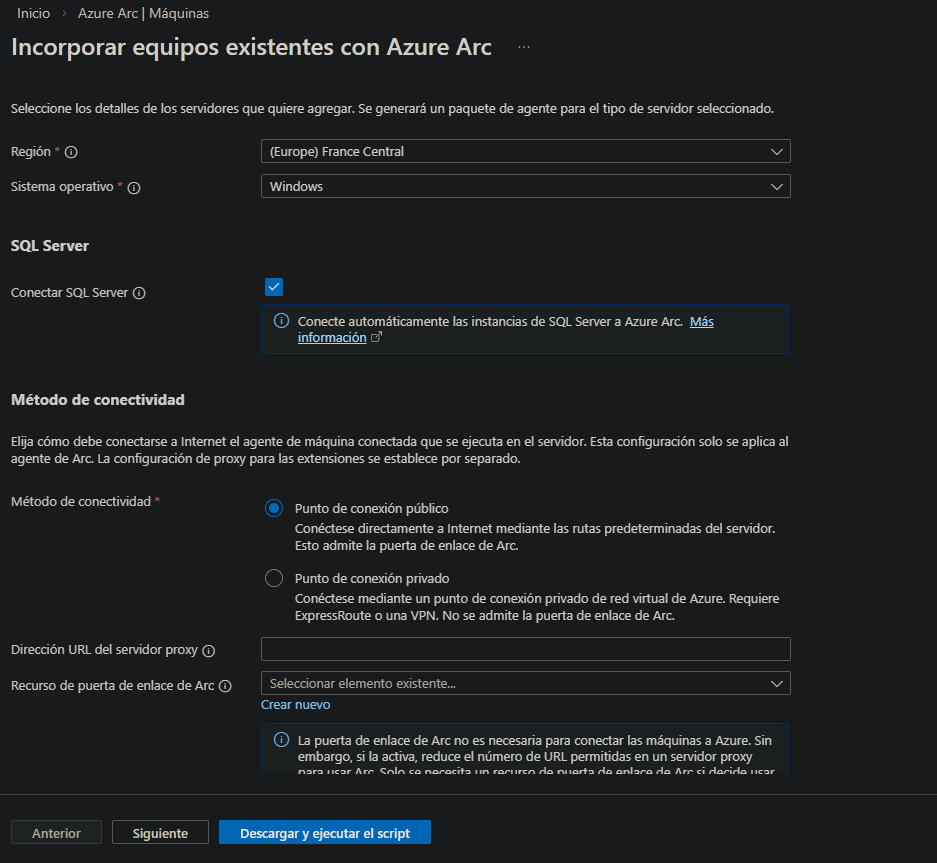
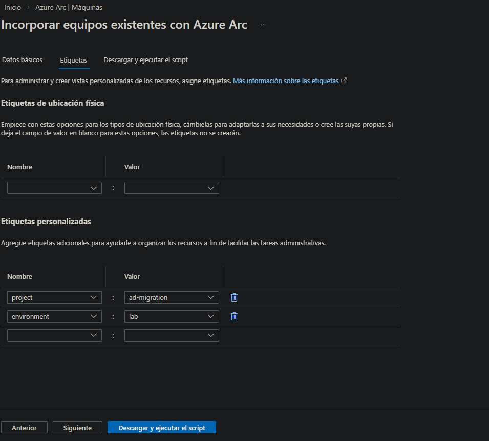

# 01-arc — Azure Arc Onboarding

## Overview

Azure Arc onboarding projects **DC01** and **APP01** into Azure Resource Manager without moving them to the cloud. Both servers remain running on-premises on VMware Workstation Pro 17 and appear in the Azure Portal as native Azure resources — enabling unified management, policy enforcement, Update Manager and Defender for Cloud across the hybrid environment.

## Servers Onboarded

| Server | OS | IP | Role | Arc Status |
|---|---|---|---|---|
| DC01 | Windows Server 2019 | 192.168.75.4 | Domain Controller | Connected |
| APP01 | Windows Server 2019 | 192.168.75.5 | Application Server | Connected |

## Why Arc Instead of Full VM Migration?

| Criteria | Full VM Migration | Azure Arc (chosen) |
|---|---|---|
| Workload movement | Lift & shift to Azure IaaS | Stays on-prem, managed from Azure |
| Cost | VM compute billed 24/7 | Free for Arc management plane |
| DC01 impact | Requires dcpromo and DNS reconfiguration | DC01 stays as authoritative DC |
| APP01 impact | SQL and IIS move together | Services managed independently |
| Management | Azure-native only | Unified: on-prem + Azure in one pane |

Moving DC01 to Azure IaaS would break Kerberos authentication and DNS resolution for WS001 and APP01 without deep reconfiguration. Arc provides full Azure management coverage with zero workload disruption.

## What Arc Enables on These Servers

| Capability | Tool | Replaces |
|---|---|---|
| Unified inventory | Azure Arc — Servers blade | Manual asset tracking |
| Patch management | Azure Update Manager | WSUS on DC01 |
| Security posture | Defender for Cloud | — |
| Policy enforcement | Azure Policy via Arc | GPO (partial) |
| Log collection | Log Analytics Agent (MMA) | — |

## Onboarding Process



The onboarding script is generated from **Azure Arc → Servers → Add → Add a single server**. A unique PowerShell script is generated per server containing the subscription, resource group, region and a one-time registration token.

### DC01




The script is executed on DC01 in an elevated PowerShell session. The agent installs the `himds` service (Hybrid Instance Metadata Service) and registers the machine in Azure Resource Manager.

### APP01




Same procedure on APP01. A separate script is generated — registration tokens are single-use per generated script.

### Script Download



### Onboarding Configuration




Tags applied during onboarding match the rest of the lab resources:

| Tag | Value |
|---|---|
| Environment | Lab |
| Proyecto | Fase10 |

## Verification


Both servers visible in **Azure Arc → Servers** with:

| Field | DC01 | APP01 |
|---|---|---|
| Status | Connected | Connected |
| OS | Windows Server 2019 | Windows Server 2019 |
| Resource Group | rg-daniellab | rg-daniellab |
| Region | francecentral | francecentral |

## Agent Details

| Component | Value |
|---|---|
| Agent name | Azure Connected Machine Agent |
| Install path | C:\Program Files\AzureConnectedMachineAgent\ |
| Service | himds (Hybrid Instance Metadata Service) |
| Required outbound ports | 443 |

### Required Outbound Endpoints

```
*.his.arc.azure.com
*.guestconfiguration.azure.com
guestnotificationservice.azure.com
*.servicebus.windows.net
login.microsoftonline.com
management.azure.com
dc.services.visualstudio.com
```

## Next Steps Enabled by Arc

| Phase | What Arc Unlocks |
|---|---|
| 02-update-manager | Azure Update Manager manages DC01 and APP01 |
| 03-azure/07-security | Defender for Cloud covers hybrid servers |
| 03-azure/07-security | Azure Policy enforced on Arc-enabled servers |
