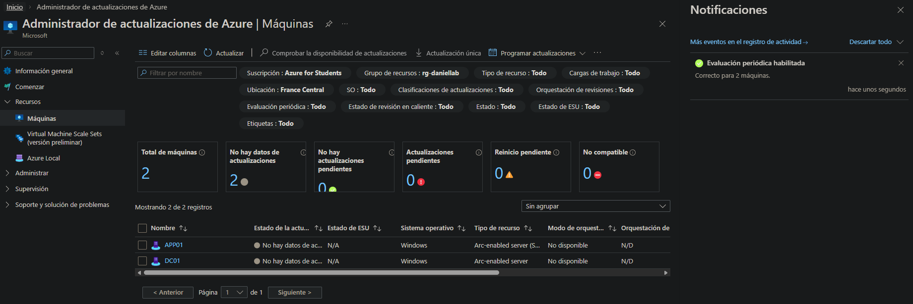
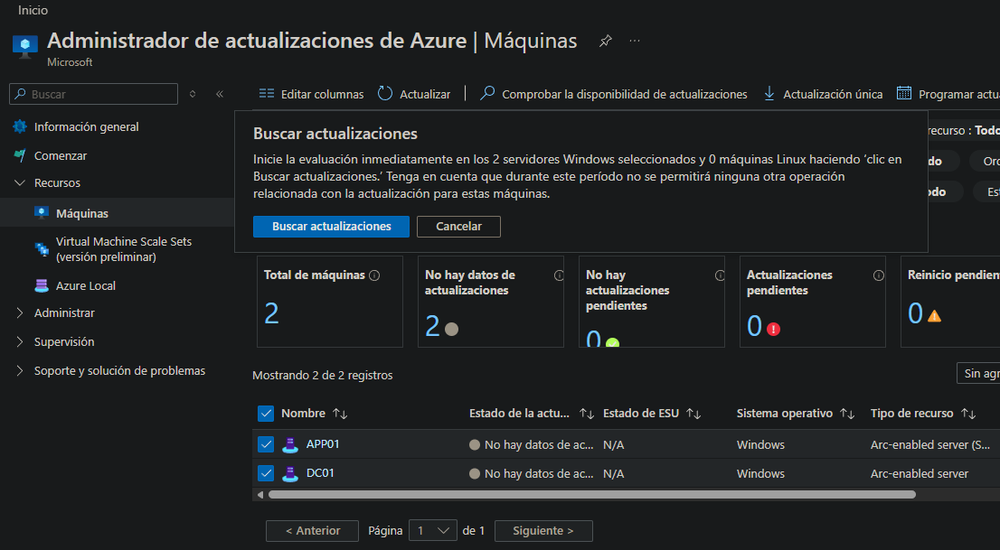
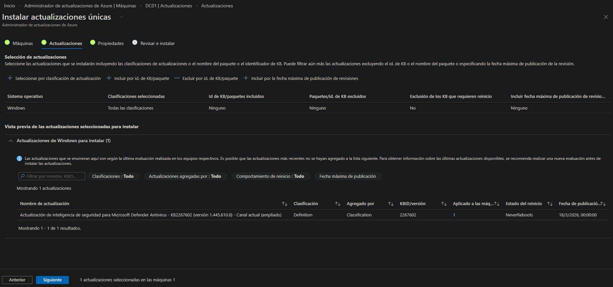
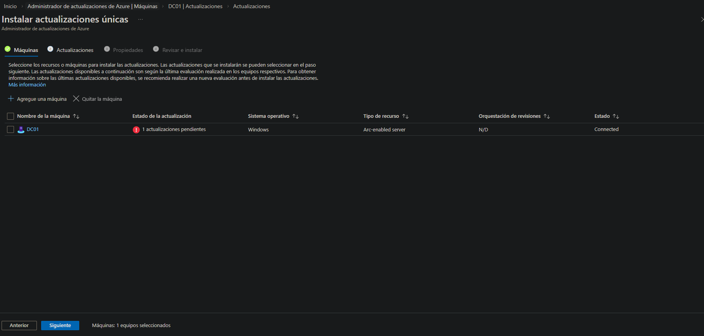
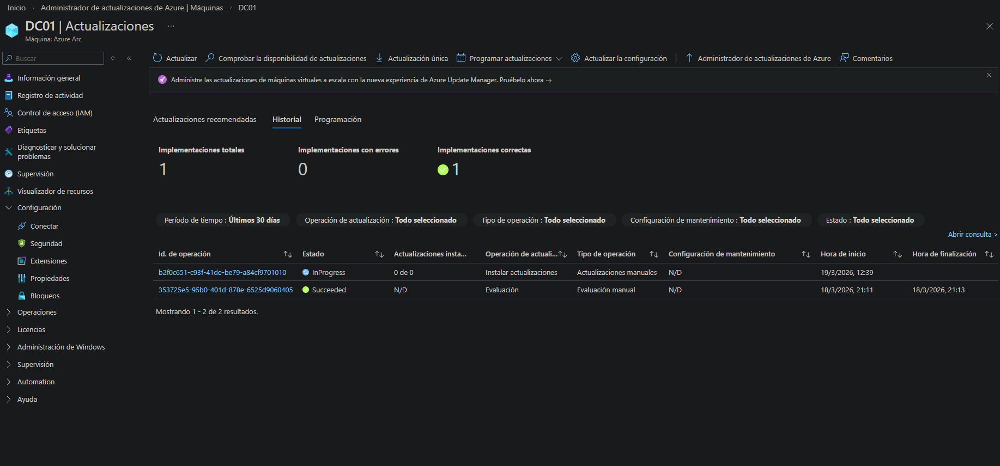
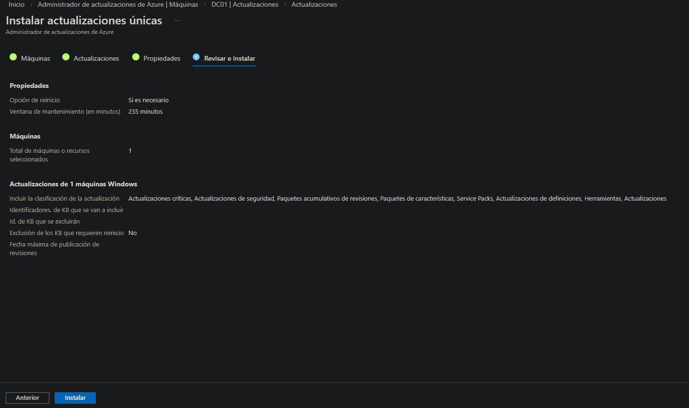
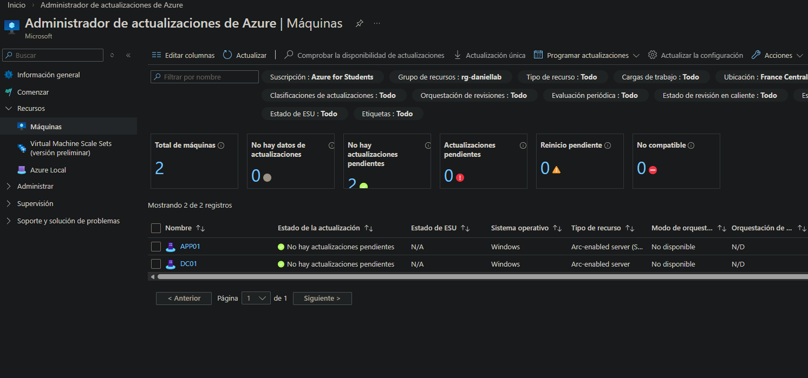

# 02-update-manager — Azure Update Manager

## Overview

Azure Update Manager replaces the on-premises **WSUS** service running on DC01. Once DC01 and APP01 are registered as Arc-enabled servers, Update Manager can assess and patch both machines directly from the Azure Portal — with no additional infrastructure required.

**Migration source:** WSUS on DC01 (port 8530)
**Migration target:** Azure Update Manager (SaaS, free for Arc-enabled servers)

## Why Update Manager Replaces WSUS

| Criteria | WSUS | Azure Update Manager |
|---|---|---|
| Infrastructure | Windows Server role + SQL database | None — fully SaaS |
| Maintenance | Sync schedule, disk management, approval | Zero maintenance |
| Coverage | Domain-joined machines only | Arc + Azure VMs |
| Reporting | Limited built-in dashboard | Unified portal dashboard |
| Cost | Windows Server license overhead | Free for Arc servers |
| Compliance view | Per-machine only | Cross-subscription view |

WSUS required manual approval of updates, regular database maintenance and dedicated disk space on DC01. Update Manager provides the same patching capability with none of that overhead.

## Machines Managed

| Machine | Type | Arc Status | Update Manager |
|---|---|---|---|
| DC01 | On-prem — Windows Server 2019 | Connected | Enabled |
| APP01 | On-prem — Windows Server 2019 | Connected | Enabled |

## Assessment

Assessment is triggered from **Azure Update Manager → Machines → select DC01 → Check for updates**. This performs a one-time inventory of all pending patches classified by severity.

| Classification | Description |
|---|---|
| Critical | Must be applied immediately |
| Security | Address known vulnerabilities |
| Other | Feature updates, drivers, optional |

## Patch Cycle — DC01

### 1 — Updates Selected

All pending updates selected for immediate installation via **one-time update** run.

### 2 — Installation Started

Update Manager pushes the installation job to the Arc agent on DC01. The agent applies patches locally without requiring RDP access or a maintenance window configuration.

### 3 — Installation Confirmed

### 4 — Post-Patch Status

Post-patching dashboard confirms DC01 compliance status. One update remained pending at time of screenshot due to a reboot requirement — resolved after scheduled restart.

## Comparison with Previous WSUS Setup

| Setting | WSUS (DC01) | Update Manager |
|---|---|---|
| DC01 target group | Servers | Arc-enabled server |
| APP01 target group | Servers | Arc-enabled server |
| WS001 | Workstations | Not in scope (on-prem only) |
| Approval required | Yes (manual) | No |
| Auto-restart | Disabled (Servers GPO) | Configurable per machine |
| Reporting | WSUS console | Azure Portal dashboard |

## Maintenance Window Design

No scheduled maintenance window is configured in this lab — updates are applied via one-time runs triggered manually. In a production environment, a **maintenance schedule** would be attached to each machine to control patching windows and avoid unplanned restarts during business hours.
