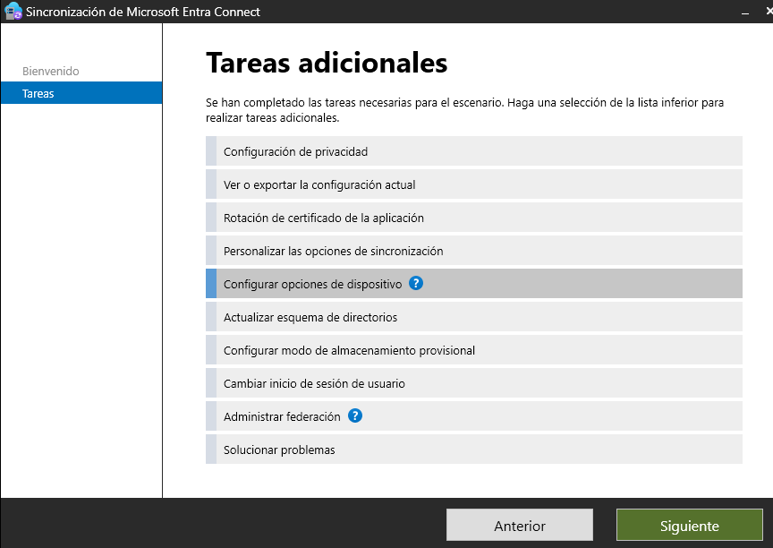
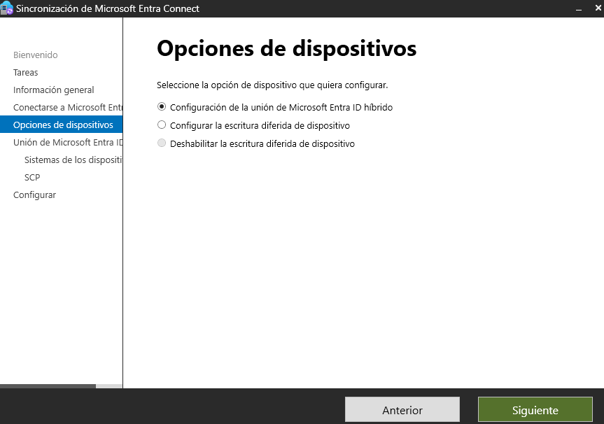
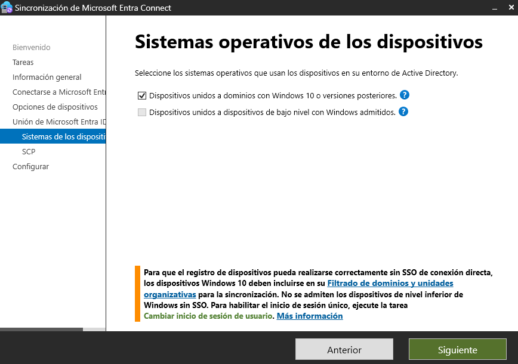
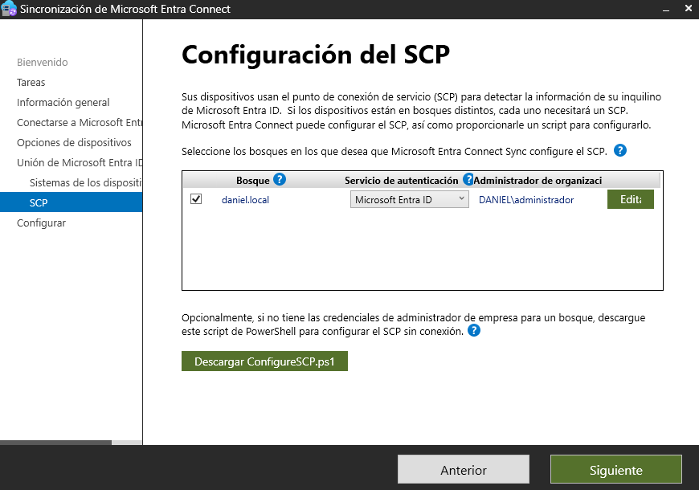
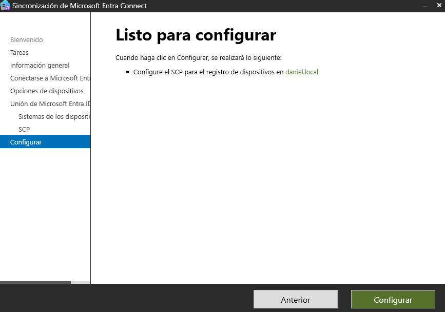
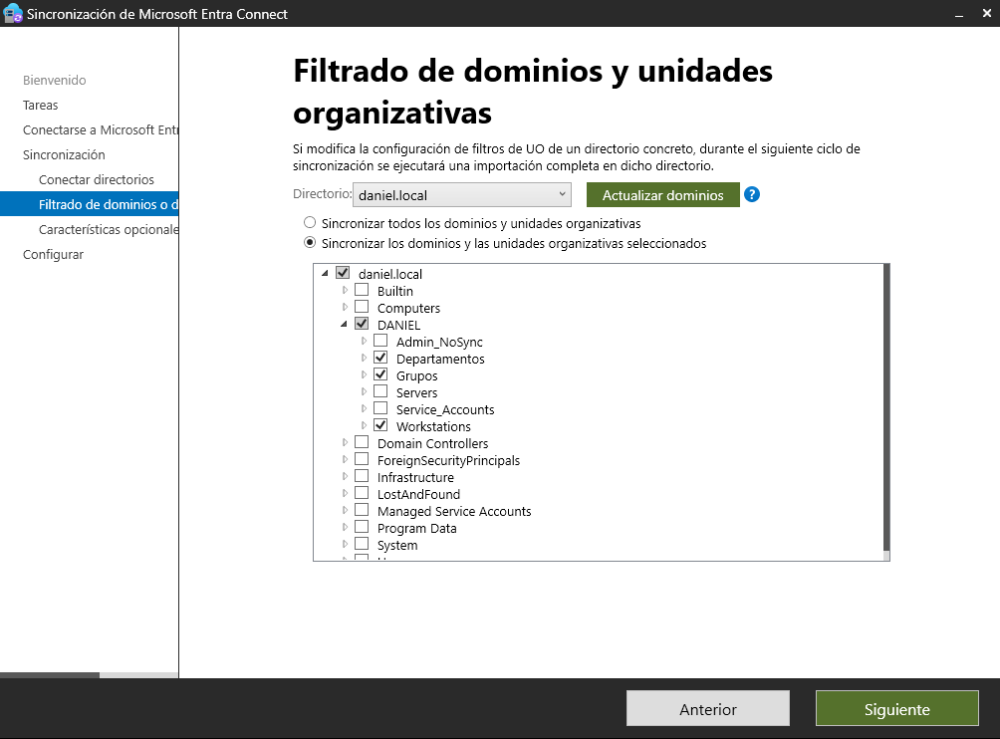
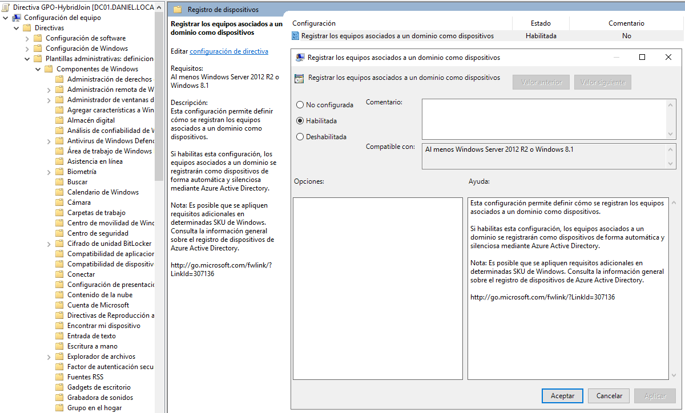
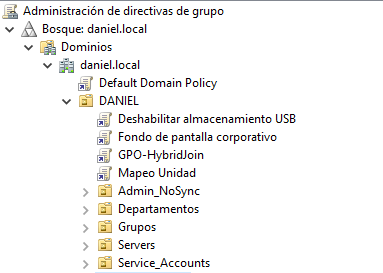
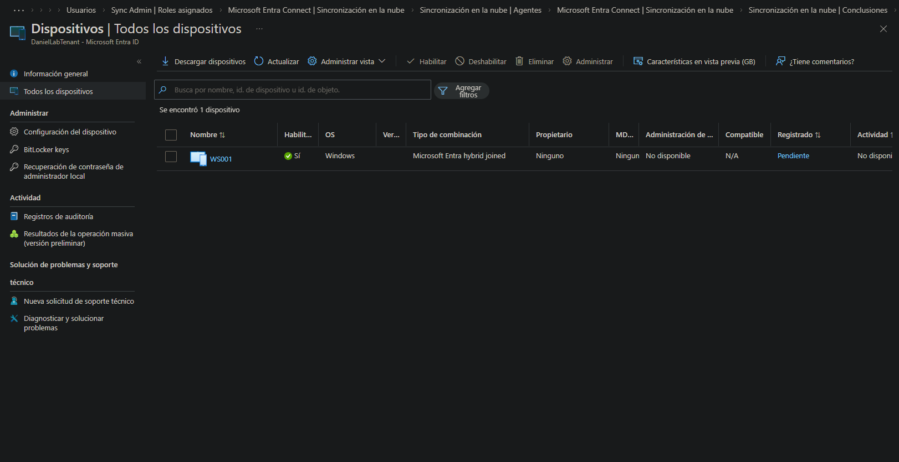

# 03-hybrid-join — Hybrid Azure AD Join

## Overview

**WS001** is a Windows 10 machine joined to the **daniel.local** domain. Hybrid Azure AD Join bridges the on-premises identity with Entra ID — the machine registers in both AD DS and Entra ID simultaneously, enabling Conditional Access policies, device compliance evaluation and a unified identity across on-prem and cloud.

## Machine

| Machine | OS | IP | Domain | Join Type |
|---|---|---|---|---|
| WS001 | Windows 10 | 192.168.75.7 | daniel.local | Hybrid Azure AD Joined |

## How Hybrid Join Works

```
WS001 (Windows 10)
    │
    ├─ Domain joined ──────────────► AD DS on DC01 (daniel.local)
    │                                      │
    │                                      │ Entra Connect sync
    │                                      ▼
    └─ Azure AD registered ────────► Entra ID (cloud)
                                           │
                                           ▼
                                    Device visible in
                                    Entra ID → Devices
                                    (Hybrid Azure AD joined)
```

The machine uses the **Service Connection Point (SCP)** published in AD DS to discover the Entra ID tenant. On logon, Windows registers the device automatically — no user interaction required.

## Prerequisites

| Requirement | Status |
|---|---|
| Entra Connect installed and syncing users | ✅ (03-azure/01-identity) |
| WS001 domain-joined to daniel.local | ✅ |
| SCP published in AD DS | ✅ |
| Workstations OU included in Entra Connect device sync | ✅ |
| GPO-HybridJoin linked to Workstations OU | ✅ |

## Configuration Steps

### 1 — Entra Connect Device Options




In Entra Connect wizard, **Configure device options** is selected to enable Hybrid Azure AD Join for the `daniel.local` domain.

### 2 — OS Selection



Windows 10 / Windows 11 selected as the target OS type for the hybrid join configuration.

### 3 — SCP Configuration



The **Service Connection Point** is published in AD DS under:
```
CN=62a0ff2e-97b9-4513-943f-0d221bd30080,
CN=Device Registration Configuration,
CN=Services,
CN=Configuration,
DC=daniel,DC=local
```

The SCP tells Windows clients which Entra ID tenant to register with on domain logon.

### 4 — Ready to Configure



Entra Connect confirms the configuration before applying.

### 5 — OU Filter for Device Sync



The **Workstations** OU is included in the Entra Connect synchronization scope so that computer objects (WS001) are synced to Entra ID alongside user objects.

### 6 — GPO Configuration




**GPO-HybridJoin** is created and linked to the **Workstations** OU:

| GPO Setting | Path | Value |
|---|---|---|
| Register domain computers as devices | Computer Config → Admin Templates → Windows Components → Device Registration | Enabled |

This GPO instructs WS001 to register with Entra ID automatically on the next logon after the SCP is detected.

## Verification

### dsregcmd on WS001


```cmd
dsregcmd /status
```

| Field | Expected Value | Result |
|---|---|---|
| AzureAdJoined | YES | ✅ |
| DomainJoined | YES | ✅ |
| AzureAdPrt | YES | ✅ |

### Entra ID — Device Pending



WS001 appears as **Pending** in Entra ID immediately after the join — this is expected. The device moves to **Registered** after Entra Connect completes the next sync cycle.

### Entra ID — Device Verified


WS001 confirmed in **Entra ID → Devices** with:

| Field | Value |
|---|---|
| Join type | Hybrid Azure AD joined |
| OS | Windows 10 |
| Compliant | Evaluating |
| Registered | ✅ |

## What Hybrid Join Enables

| Capability | Requires Hybrid Join |
|---|---|
| Conditional Access based on device compliance | ✅ |
| Single Sign-On to Azure resources from WS001 | ✅ |
| Intune enrollment (if configured) | ✅ |
| Device visible in Entra ID portal | ✅ |
| On-prem GPO still applies | ✅ (domain join preserved) |
