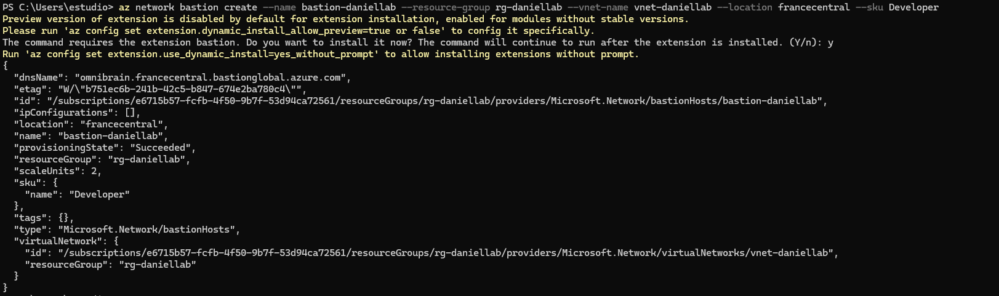
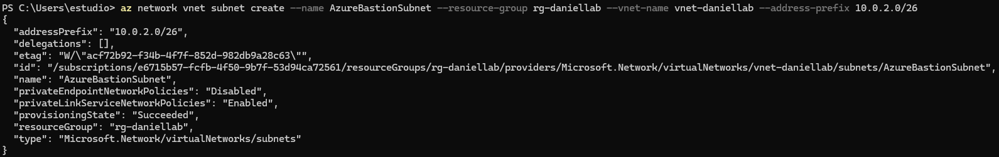
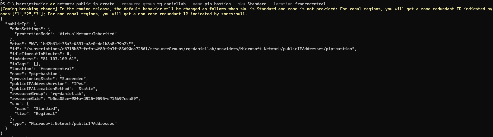
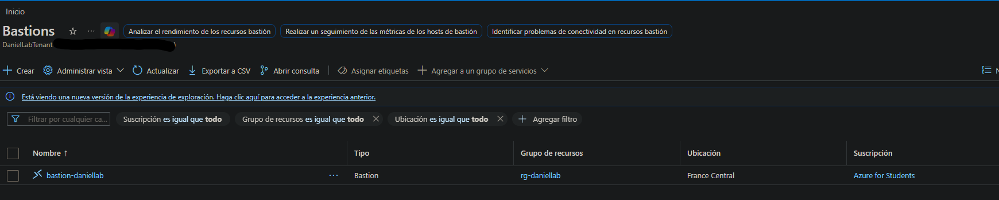

# 04-bastion — Azure Bastion

## Overview

Azure Bastion provides secure RDP access to **vm-sql01** directly from the Azure Portal browser — without exposing port 3389 on the NSG, without a public IP on the VM and without installing any client software. It is the only remote access method used for the Azure VM in this lab.

**Target VM:** vm-sql01 (Windows Server 2022, private IP 10.0.1.10)

## Tier Comparison

| Tier | Public IP | Dedicated Subnet | Cost | Access Method |
|---|---|---|---|---|
| **Developer** ✅ | No | No | Free | Azure Portal only |
| Basic | Yes (Standard) | AzureBastionSubnet /27 | ~0.19€/h | Portal + native client |
| Standard | Yes (Standard) | AzureBastionSubnet /27 | ~0.35€/h | All options |

**Developer tier chosen** — the lab only requires administrative access to vm-sql01 via the portal. No native RDP client or file transfer is needed, making Developer the right choice at zero cost.

## Design Decision — Why Not Open RDP on the NSG?

| Approach | Port 3389 Exposed | Public IP on VM | Bastion Required |
|---|---|---|---|
| Direct RDP | Yes | Yes | No |
| NSG + IP restriction | Yes (restricted) | Yes | No |
| Azure Bastion ✅ | **No** | **No** | Yes |

Opening port 3389 exposes the VM to brute-force and credential stuffing attacks even with IP restrictions. Bastion eliminates the attack surface entirely — RDP traffic flows encrypted over HTTPS through the Azure backbone, never touching the public internet.

## Deployment

Bastion Developer tier is deployed via the ARM template in `04-iac/arm/template.json`, linked directly to the VNet. No public IP or dedicated subnet is required.

```json
"sku": { "name": "Developer" },
"properties": {
  "virtualNetwork": {
    "id": "[resourceId('Microsoft.Network/virtualNetworks', variables('vnetName'))]"
  }
}
```



## Network Configuration




| Resource | Value | Notes |
|---|---|---|
| VNet | vnet-daniellab | Shared with vm-sql01 |
| AzureBastionSubnet | 10.0.2.0/27 | Present in VNet — not used by Developer tier |
| Public IP | pip-bastion | Present in ARM template — not used by Developer tier |
| vm-sql01 public IP | None | No public IP on the VM |
| NSG rule for RDP | None | Port 3389 never opened |

> **Note:** `AzureBastionSubnet` and `pip-bastion` are defined in the ARM template for forward compatibility — upgrading to Basic tier requires no network changes.

## Connectivity Test



Access flow from **Azure Portal → vm-sql01 → Connect → Bastion**:

```
Browser (HTTPS:443)
    │
    ▼
Azure Portal
    │
    │ Bastion service (Azure backbone)
    ▼
vm-sql01 (RDP over private IP 10.0.1.10)
    │
    ▼
Windows Server 2022 desktop in browser tab
```

Full RDP session established inside the browser with no client install, no public IP on the VM and no open ports on the NSG.

## NSG Rules Confirmed

| Direction | Port | Protocol | Action | Purpose |
|---|---|---|---|---|
| Inbound | 3389 | TCP | **Not present** | RDP blocked — Bastion handles access |
| Inbound | 1433 | TCP | Allow (restricted) | SQL Server from App Service VNet |
