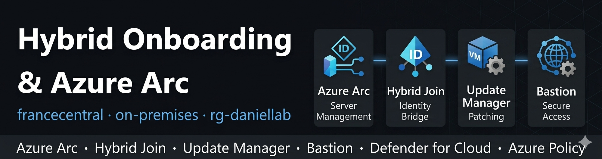
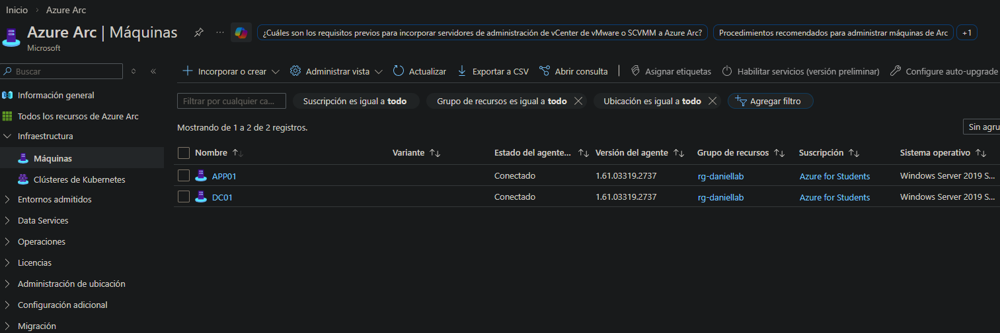
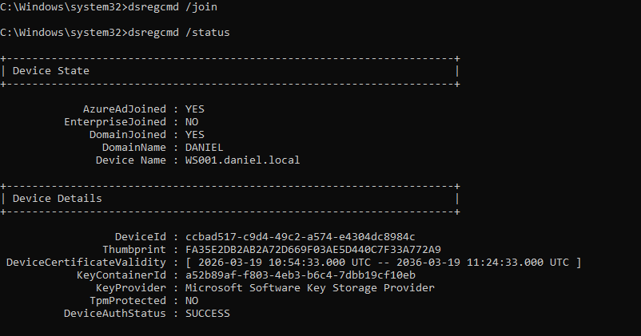
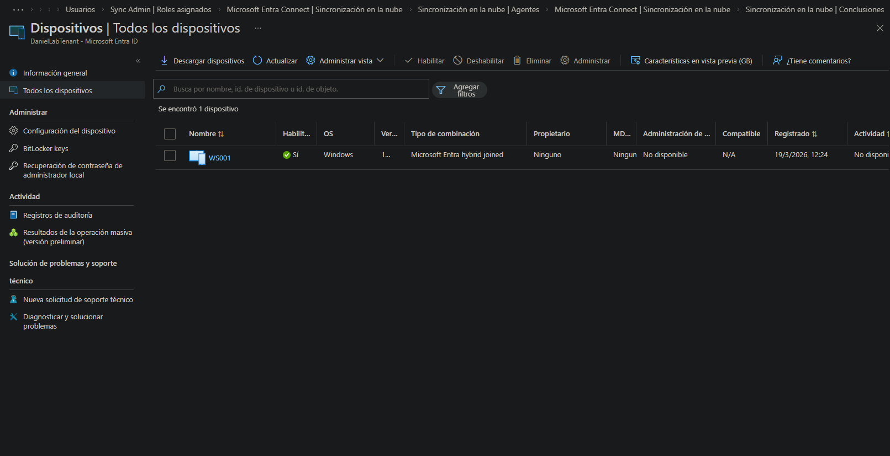

# 02 — Azure Migrate & Hybrid Onboarding

## Overview

This phase covers the **hybrid onboarding** of the on-premises environment into Azure without a full lift-and-shift migration. Rather than replicating VMs to Azure IaaS, the chosen approach uses **Azure Arc** to project on-premises servers into Azure Resource Manager — enabling unified management, policy enforcement, update management, and security posture from the Azure Portal.

Both **DC01** and **APP01** remain running on-premises (VMware Workstation Pro 17) and are registered as Arc-enabled servers. **WS001** completes Hybrid Azure AD Join and Intune enrollment, bridging on-premises Group Policy with cloud-based device management.

## Design Decision: Why Arc instead of full VM migration?

| Criteria | Azure VM Migration | Azure Arc (chosen) |
|---|---|---|
| Workload movement | Full lift & shift to IaaS | Stays on-prem, managed from Azure |
| Cost | VM compute billed 24/7 | Free for Arc management plane |
| SQL Server | Requires SQL on Azure VM | APP01 continues serving SQL on-prem |
| AD DS | DC01 would need dcpromo | DC01 stays as authoritative DC |
| Management | Azure-native only | Unified: on-prem + Azure in one pane |
| Use case fit | Decommission on-prem | Hybrid extension of on-prem |

The SQL Server workload and the web application are migrated separately as PaaS/IaaS resources in `03-azure`. Arc handles the **management plane** while the on-prem servers continue running.

**Why no formal Azure Migrate Assessment?**
Azure Migrate Assessment is the right tool for production migrations — it provides discovery, dependency mapping, and TCO analysis. For this lab, the migration scope and targets were already defined, making a formal assessment unnecessary. The Arc-first approach was chosen to demonstrate hybrid management rather than a one-way move to the cloud.

---

## Arc-Enabled Servers

| Server | OS | Arc Status |
|---|---|---|
| DC01 | Windows Server 2019 | Connected ✅ |
| APP01 | Windows Server 2019 | Connected ✅ |

Both servers were onboarded by generating a registration script from the Azure Portal and executing it locally on each machine. Once connected, both servers appear in Azure Resource Manager and are visible in the Arc — Servers blade.

---

## Azure Update Manager

Azure Update Manager replaces WSUS as the patch management solution for DC01 and APP01 once they are Arc-enabled.

| Server | Assessment | Patch Cycle | Status |
|---|---|---|---|
| DC01 | Periodic (enabled) | One-time update run | No pending updates 🟢 |
| APP01 | Periodic (enabled) | Assessed | No pending updates 🟢 |

---

## Hybrid Azure AD Join — WS001

WS001 is joined to both **daniel.local** (on-premises) and **Entra ID** (cloud), enabling a hybrid identity managed from a single device.

| Setting | Value |
|---|---|
| AzureAdJoined | YES ✅ |
| DomainJoined | YES ✅ |
| DeviceAuthStatus | SUCCESS ✅ |

**How it works:** Entra Connect establishes a Service Connection Point (SCP) in AD DS. When WS001 authenticates against the domain, it automatically registers with Entra ID — no manual enrollment steps required on the device.

---

## Azure Bastion

Azure Bastion provides browser-based RDP access to Azure VMs without exposing a public IP. Deployed in this phase to enable secure access to **vm-sql01** in subsequent phases.

| Setting | Value |
|---|---|
| SKU | Developer |
| Subnet | AzureBastionSubnet (10.0.2.0/26) |
| Resource | bastion-daniellab |
| Public IP | Assigned |

**Why Bastion here and not in the networking phase?**
Without an active VM to connect to, deploying Bastion in Phase 2 would incur unnecessary cost. It is deployed alongside the first VM that requires remote access — vm-sql01 in Phase 5.

---

## Intune — Modern Device Management

WS001 is enrolled in Microsoft Intune via automatic MDM enrollment triggered by GPO, enabling cloud-based device management alongside on-premises Group Policy.

### Compliance Policy

| Requirement | Status |
|---|---|
| Firewall enabled | ✅ |
| Antivirus enabled | ✅ |
| Minimum OS build (19045) | ✅ |
| Overall compliance | Compliant 🟢 |

### Microsoft 365 Apps Deployment

Word, Excel, PowerPoint, and Teams deployed to WS001 via Intune app policy — no manual installation required on the device.

| App | Status |
|---|---|
| Microsoft Word | Installed ✅ |
| Microsoft Excel | Installed ✅ |
| Microsoft PowerPoint | Installed ✅ |
| Microsoft Teams | Installed ✅ |

### Endpoint Security

An Interactive Logon Message (legal notice) is enforced on WS001 via an Intune endpoint security policy, displayed at login before the user session starts.

---

## What This Phase Enables

| Capability | Tool | Replaces |
|---|---|---|
| Unified server inventory | Azure Arc | Manual asset tracking |
| Patch management | Azure Update Manager | WSUS on DC01 |
| Policy enforcement | Azure Policy (via Arc) | GPO (partial) |
| Identity bridge | Hybrid Azure AD Join | Domain-only identity |
| Device management | Microsoft Intune | On-prem GPO only |
| App deployment | Intune app policy | Manual installation |
| Remote access | Azure Bastion | Direct RDP exposure |

---

## Status

- [x] DC01 — Arc onboarded and connected
- [x] APP01 — Arc onboarded and connected
- [x] Azure Update Manager — patch cycle completed on both servers
- [x] WS001 — Hybrid Azure AD Join completed
- [x] Azure Bastion — deployed and verified
- [x] WS001 — Intune enrolled and compliant
- [x] Microsoft 365 Apps — deployed via Intune
- [x] Endpoint security policy — applied
