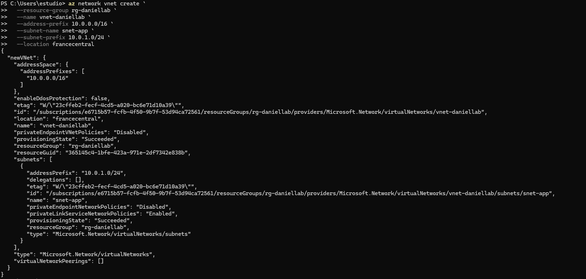
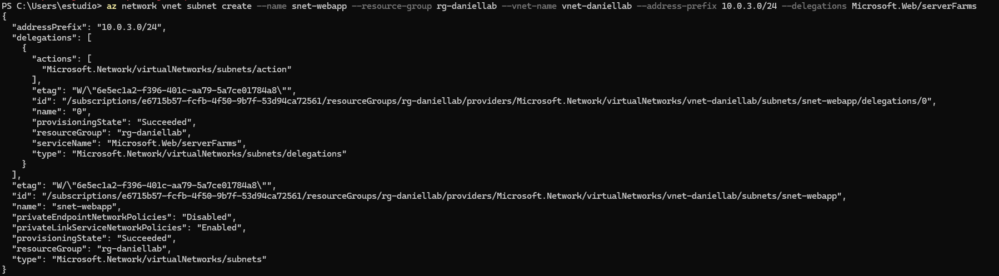
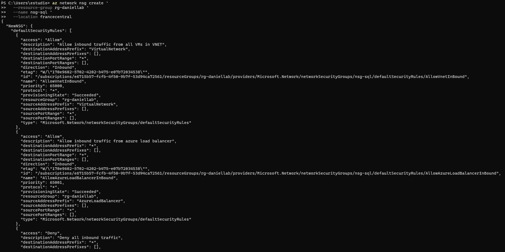
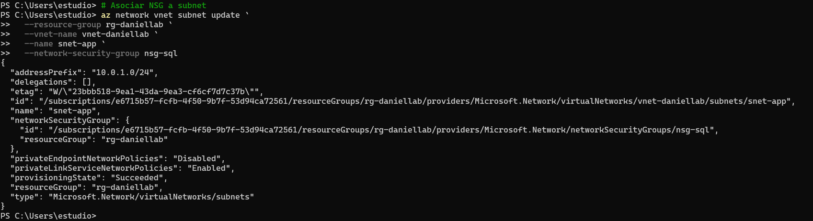
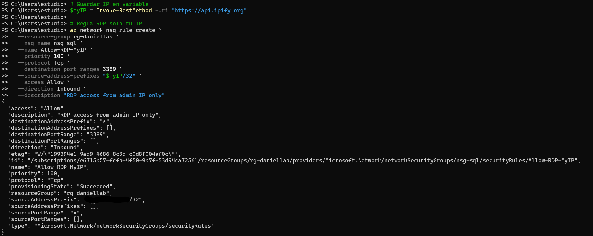
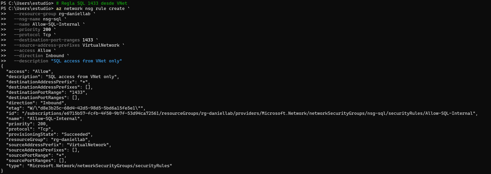
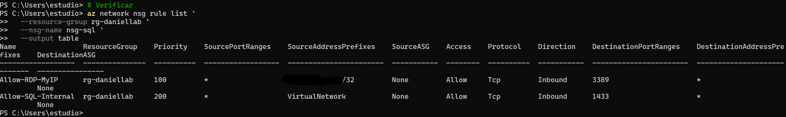

# 02-networking — Virtual Network & NSG

## Overview

Core Azure networking for the lab — a single VNet with dedicated subnets for the SQL VM, App Service VNet integration and Azure Bastion. A Network Security Group controls inbound traffic to the SQL VM, allowing only the minimum required ports.

## Resources Deployed

| Resource | Name | Purpose |
|---|---|---|
| Virtual Network | vnet-daniellab | Main network — 10.0.0.0/16 |
| NSG | nsg-sql | Controls traffic to vm-sql01 |
| Subnet | snet-default (10.0.1.0/24) | vm-sql01 |
| Subnet | snet-webapp (10.0.3.0/24) | App Service VNet integration |
| Subnet | AzureBastionSubnet (10.0.2.0/26) | Azure Bastion (deployed in 02-azure-migrate/04-bastion) |

## Virtual Network

| Parameter | Value |
|---|---|
| Name | vnet-daniellab |
| Address space | 10.0.0.0/16 |
| Region | francecentral |
| Resource Group | rg-daniellab |

## Subnets

| Subnet | Address Prefix | Used By |
|---|---|---|
| snet-default | 10.0.1.0/24 | vm-sql01 (private IP 10.0.1.10) |
| AzureBastionSubnet | 10.0.2.0/26 | Azure Bastion Developer |
| snet-webapp | 10.0.3.0/24 | App Service VNet Integration |

`snet-webapp` is created specifically to enable **VNet Integration** on the App Service — allowing App Service to reach vm-sql01 on its private IP without exposing SQL Server to the public internet.

## Network Security Group

`nsg-sql` is associated with `snet-default`, protecting vm-sql01.

### Inbound Security Rules

| Rule | Priority | Port | Protocol | Source | Action | Purpose |
|---|---|---|---|---|---|---|
| AllowRDP | 310 | 3389 | TCP | My IP | Allow | RDP access (restricted to admin IP) |
| AllowSQL | 320 | 1433 | TCP | snet-webapp | Allow | SQL Server from App Service |

**Why restrict RDP to a specific IP?**
Port 3389 is a high-value target. Restricting to the admin IP reduces exposure to brute-force attacks. In production this would be replaced entirely by Bastion — which is also deployed in this lab.

**Why allow port 1433 from snet-webapp only?**
App Service connects to SQL Server via VNet Integration through `snet-webapp`. Scoping the rule to the subnet means SQL Server is never reachable from the public internet — only from the App Service within the VNet.

## Verification

End-to-end connectivity confirmed:
- vm-sql01 reachable from App Service via private IP 10.0.1.10:1433
- Bastion RDP access working (documented in `02-azure-migrate/04-bastion`)
- No public IP on vm-sql01
