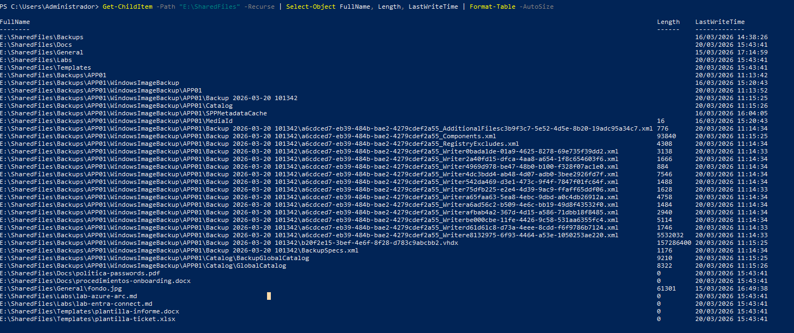
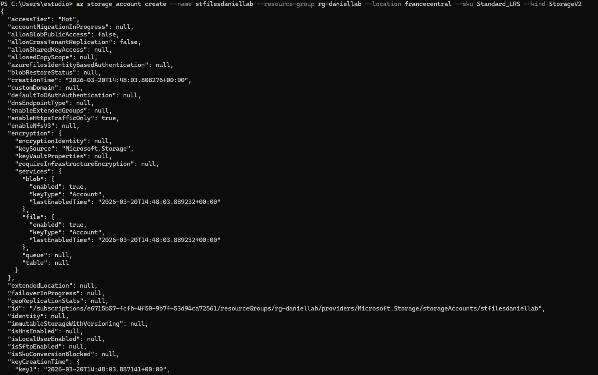
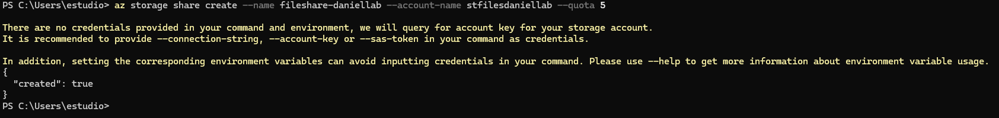
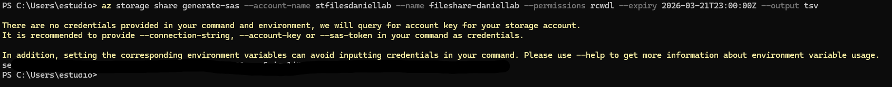
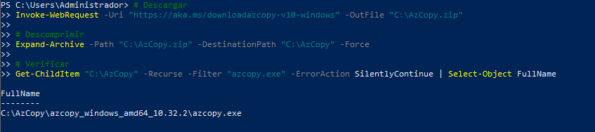
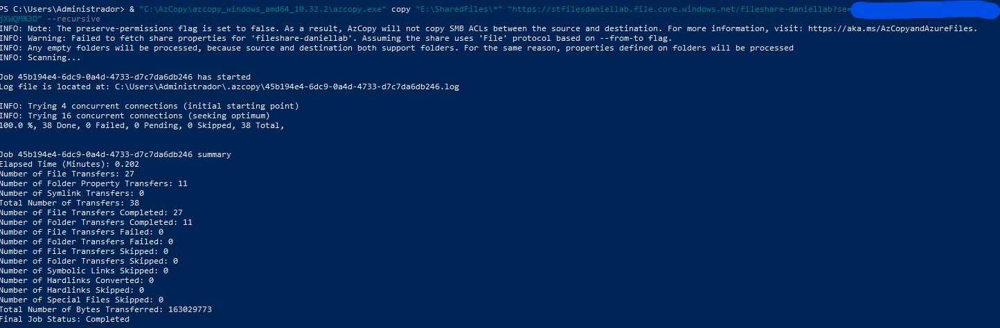
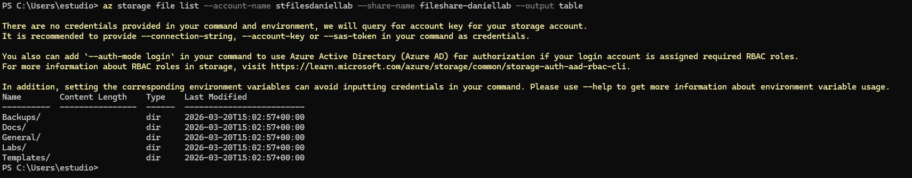
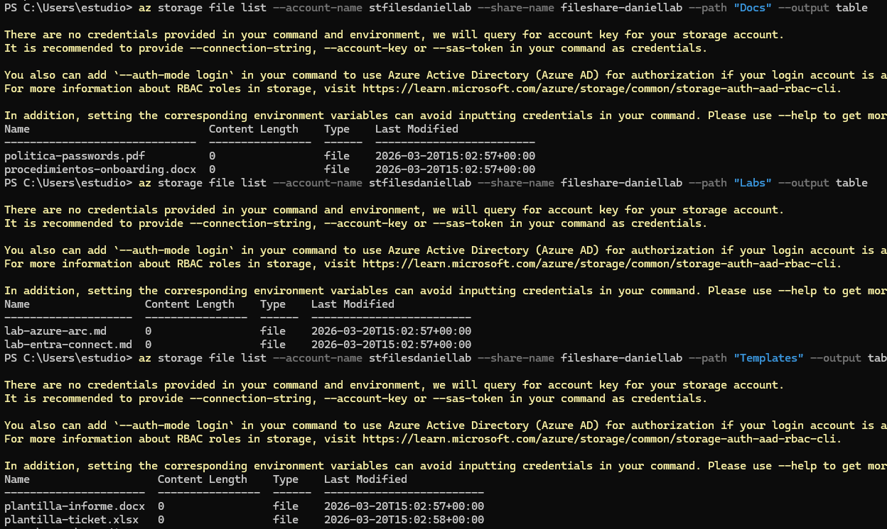
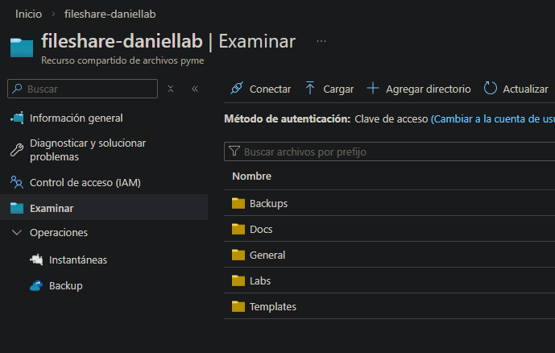

# 03-fileshare — Azure Files Migration

## Overview

This section covers the migration of the **DC01 File Server** to **Azure Files**. The on-premises shared folder (`E:\SharedFiles`) is migrated to an Azure Files share using **AzCopy** from DC01 directly — no third-party tool required.

**Migration source:** DC01 — `E:\SharedFiles` (SMB share over LAN)
**Migration target:** Azure Files — Standard LRS — `stfilesdaniellab`

## On-Premises File Server



The source is the `SharedFiles` share on DC01, which contains the APP01 backup destination folder used by Windows Server Backup.

```
E:\SharedFiles\
└─ Backups\
    └─ APP01\
        └─ WindowsImageBackup\
```

## Storage Account



| Parameter | Value |
|---|---|
| Name | stfilesdaniellab |
| SKU | Standard LRS |
| Kind | StorageV2 |
| Region | francecentral |
| Resource Group | rg-daniellab |

## Azure File Share



| Parameter | Value |
|---|---|
| Share name | danielfiles |
| Quota | 5 GiB |
| Tier | Transaction Optimised |

## SAS Token



A **Shared Access Signature (SAS)** token generated on the Storage Account with the minimum permissions required for AzCopy:

| Permission | Value |
|---|---|
| Allowed services | File |
| Allowed resource types | Container, Object |
| Permissions | Read, Write, List |
| Expiry | Short-lived (lab use) |

## Migration — AzCopy from DC01

### Step 1 — Install AzCopy on DC01



AzCopy downloaded and installed on DC01. No additional configuration required — AzCopy authenticates via SAS token in the command.

### Step 2 — Copy Files to Azure Files

```powershell
azcopy copy "E:\SharedFiles\*" `
  "https://stfilesdaniellab.file.core.windows.net/danielfiles?<SAS>" `
  --recursive
```



AzCopy completes the transfer — all files and subdirectories copied from the on-premises share to Azure Files.

## Verification





Azure Files portal confirms all files are present and directory structure preserved.

## Design Decisions

**Why AzCopy instead of Azure File Sync?**
Azure File Sync provides bidirectional continuous sync — appropriate for live environments where on-premises shares remain active. For this lab the migration is a one-time copy with no ongoing sync requirement. AzCopy is simpler, faster to configure, and has no agent installation overhead.

**Why Standard LRS instead of GRS?**
The file share contains backup files and static content — not primary business data requiring geo-redundancy. LRS provides sufficient durability at lower cost for this workload.

## Comparison with On-Premises

| Aspect | DC01 File Server | Azure Files |
|---|---|---|
| Protocol | SMB over LAN | SMB / HTTPS |
| Access | Domain-joined machines only | Authenticated from anywhere |
| Redundancy | Single server | LRS (3 copies in region) |
| Management | Windows Server role | Fully managed |
| Backup | Not backed up separately | Storage Account redundancy |
