# 04-sql-vm — Azure VM + SQL Server

## Overview

This section covers the deployment of **vm-sql01** — a Windows Server 2022 Azure VM that hosts SQL Server Developer 2022, and the migration of the **DanielDB** database from APP01 on-premises.

The migration attempted a `.bak` restore first but was blocked by SQL Server version incompatibility between on-prem (SQL Express 2022) and the Azure VM install. The final approach used a **JSON export** of the database schema and data, transferred via AzCopy through a Storage Account.

**Migration source:** APP01 — SQL Server Express 2022 — DanielDB
**Migration target:** vm-sql01 — SQL Server Developer 2022 — DanielDB

## VM Deployment

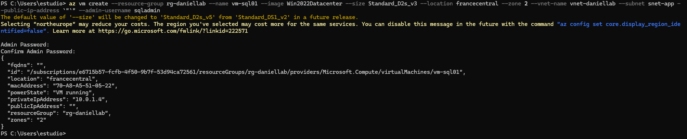
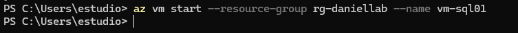

| Parameter | Value |
|---|---|
| Name | vm-sql01 |
| OS | Windows Server 2022 Datacenter |
| Size | Standard_D2s_v3 (2 vCPU, 8GB RAM) |
| Private IP | 10.0.1.10 (static) |
| Public IP | None |
| Subnet | snet-default |
| NSG | nsg-sql |
| Region | francecentral |
| Resource Group | rg-daniellab |

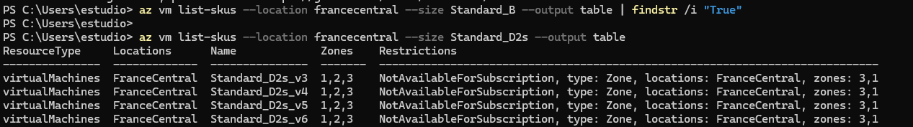
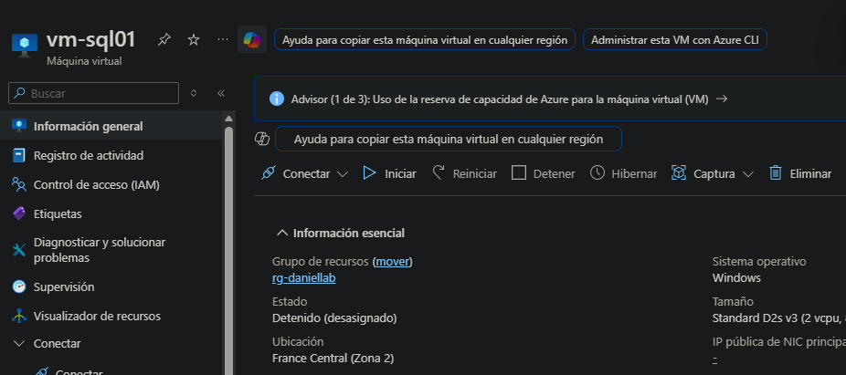

The VM was deallocated when not in use to avoid unnecessary compute costs during the lab.

## Networking

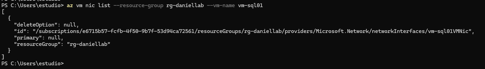
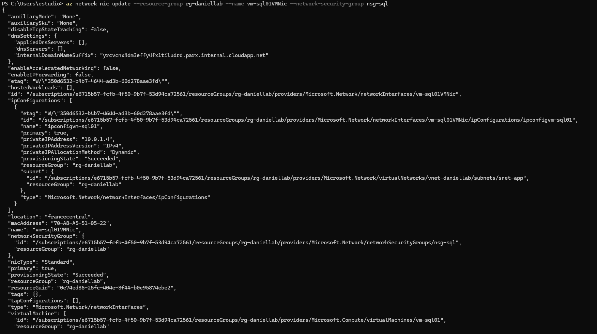
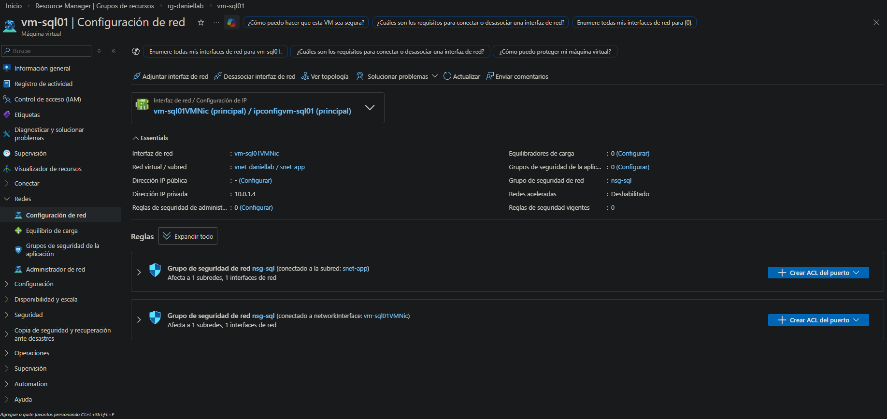

NSG `nsg-sql` associated to the VM NIC — port 1433 open only from `snet-webapp`, port 3389 restricted to admin IP.

## Access via Bastion

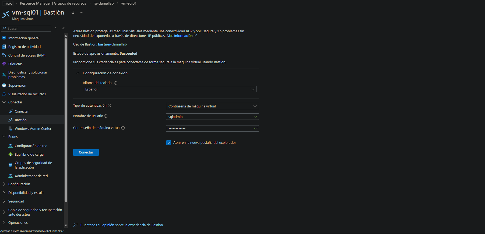
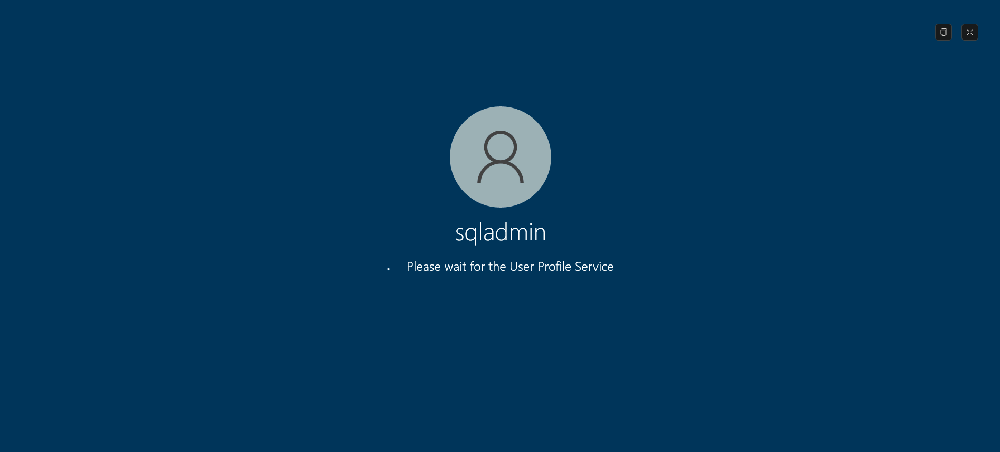

All administrative access to vm-sql01 is via **Azure Bastion Developer** from the portal — no RDP client, no public IP on the VM. See `02-azure-migrate/04-bastion` for Bastion deployment details.

## SQL Server Installation

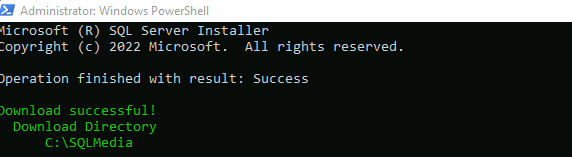
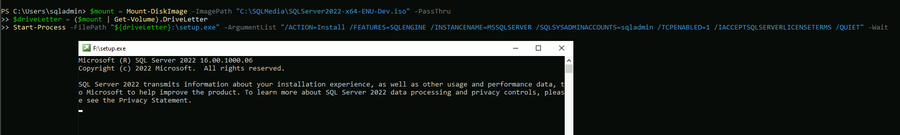
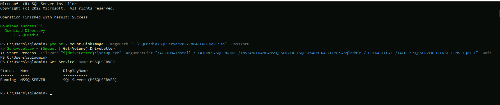

**SQL Server Developer 2022** installed on vm-sql01. Developer edition is free for non-production use and provides full SQL Server functionality.

| Setting | Value |
|---|---|
| Edition | SQL Server Developer 2022 |
| Instance | vm-sql01\MSSQLSERVER (default) |
| Authentication | Mixed mode (SQL + Windows) |
| Service | Running — Automatic start |

### Login Mode Fixed

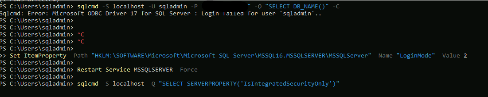

SQL Server authentication mode set to **Mixed** — required for the App Service to connect using a SQL login stored in Key Vault. Windows Authentication alone is insufficient for PaaS-to-IaaS connectivity.

### Connectivity Check

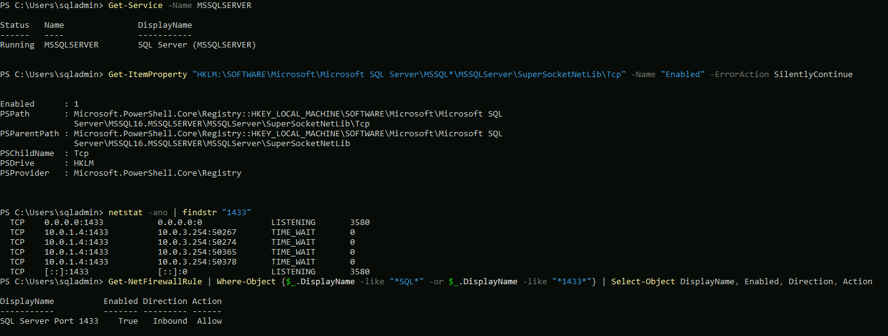

SQL Server confirmed reachable on port 1433 from within the VNet.

## Database Migration

### Attempted Approach — .bak Restore (Blocked)

The initial plan was to back up DanielDB on APP01 as a `.bak` file, transfer it via AzCopy to a Storage Account, download it to vm-sql01 and restore it.

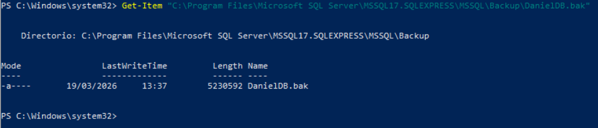

The `.bak` was created on APP01 successfully. However, the restore on vm-sql01 failed due to **SQL Server version incompatibility** — a backup from SQL Server Express cannot be reliably restored to a different SQL Server edition/version when internal page formats differ.

### Final Approach — JSON Export via AzCopy

Database schema and data exported to JSON from APP01, uploaded to Azure Storage via AzCopy, downloaded to vm-sql01 and imported via script.

#### Step 1 — Export DB to JSON on APP01

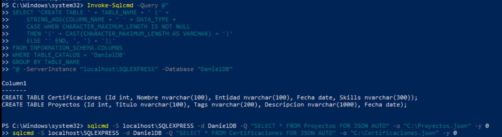
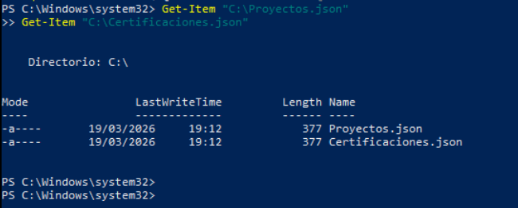

Tables exported individually to JSON files:
- `Proyectos.json`
- `Certificaciones.json`

#### Step 2 — AzCopy Download on vm-sql01

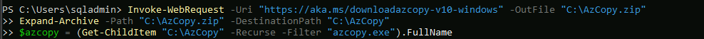

AzCopy installed on vm-sql01 to download the JSON files from the Storage Account.

#### Step 3 — Download JSON Files

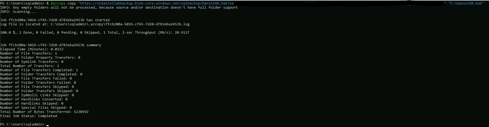
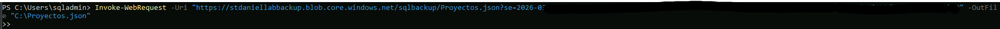
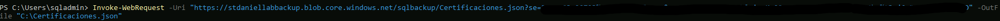

JSON files downloaded and content verified on vm-sql01.

#### Step 4 — Create Database and Import

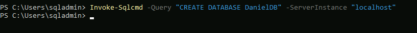
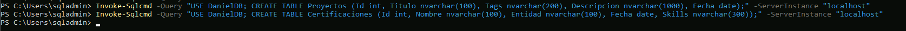
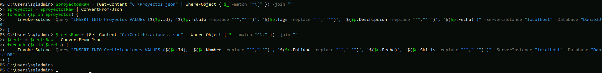

DanielDB recreated on vm-sql01:
1. Database created manually via SSMS
2. Tables created with the same schema as on APP01
3. Data imported from JSON files via SQL script

#### Step 5 — Cache and Smoke Test

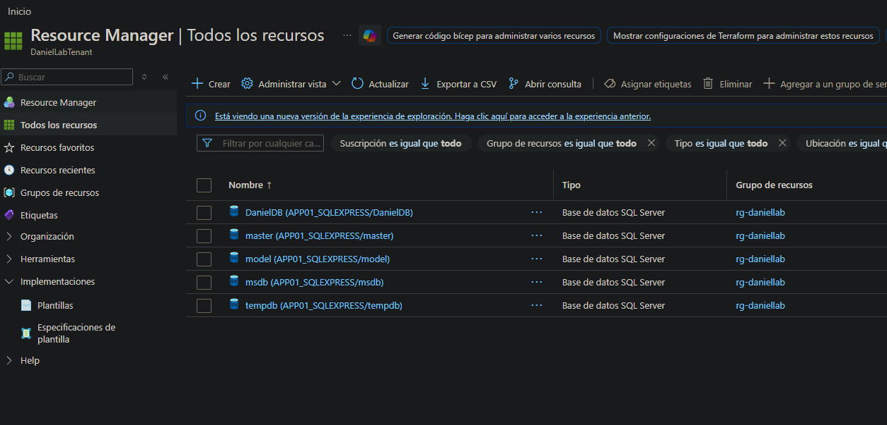
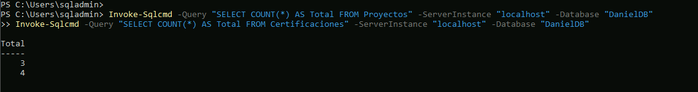

Database verified — both tables populated with the same data as on-premises. Application smoke test from App Service confirmed successful connection to DanielDB on vm-sql01.

## Database Structure

| Table | Rows | Content |
|---|---|---|
| Proyectos | 3 | Portfolio projects |
| Certificaciones | 4 | Certifications and education |

## Connection String

App Service connects to vm-sql01 via:
- **Host:** 10.0.1.10 (private IP — VNet Integration)
- **Port:** 1433
- **Database:** DanielDB
- **Auth:** SQL login — credentials stored in Key Vault (`03-azure/05-webapp`)

## Migration Summary

| Step | Tool | Result |
|---|---|---|
| .bak backup on APP01 | wbadmin / SSMS | ✅ Created |
| .bak restore on vm-sql01 | SSMS | ❌ Version incompatibility |
| JSON export on APP01 | SSMS + script | ✅ |
| Upload to Storage via AzCopy | AzCopy | ✅ |
| Download on vm-sql01 | AzCopy | ✅ |
| DB recreate + import | SSMS + SQL script | ✅ |
| App Service connectivity | VNet Integration + Key Vault | ✅ |
