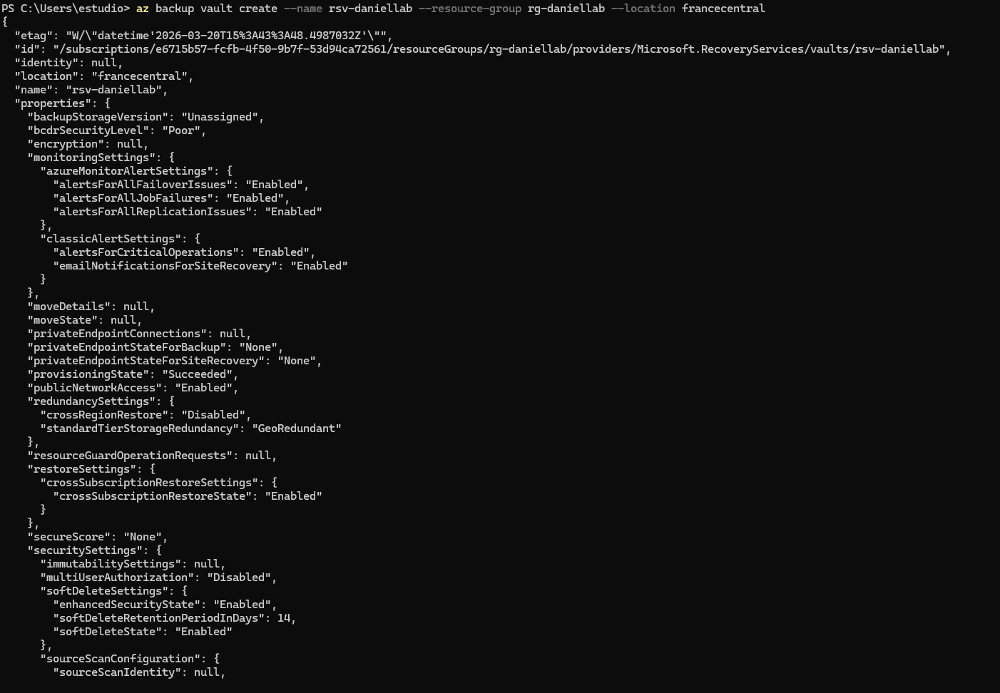
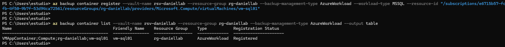
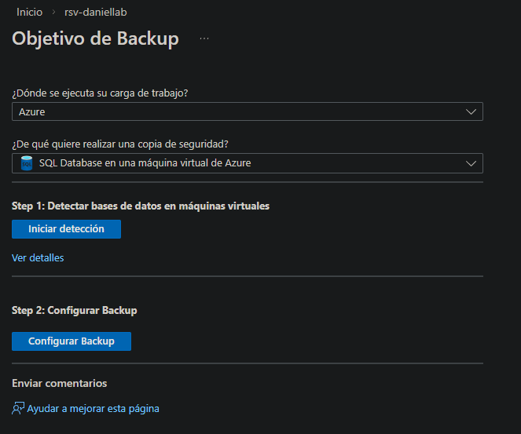
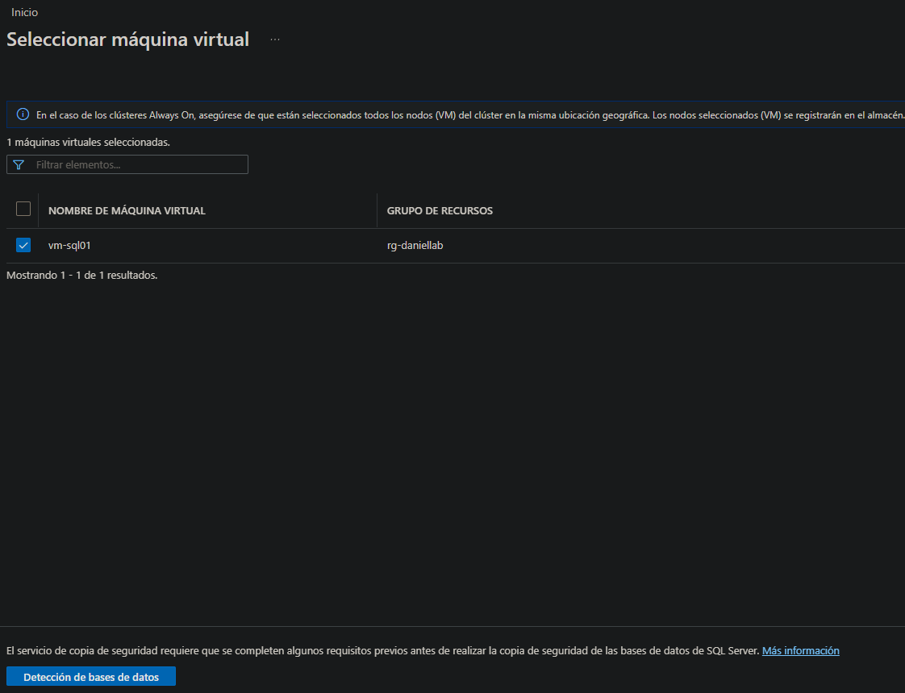
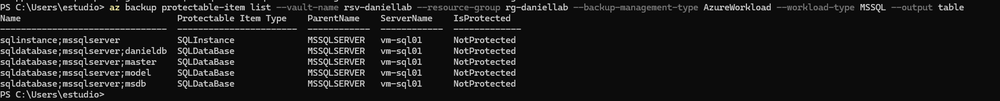
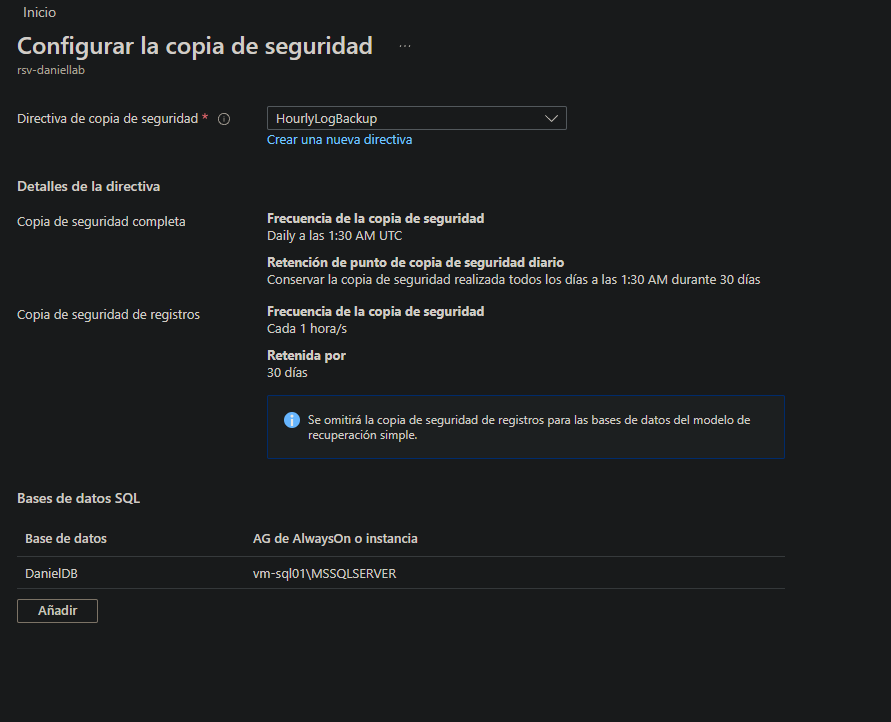
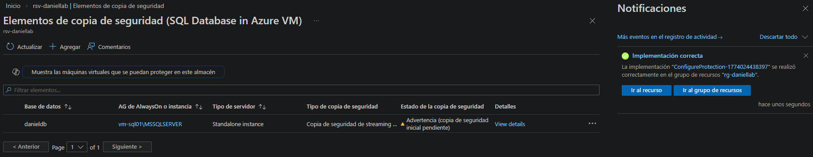
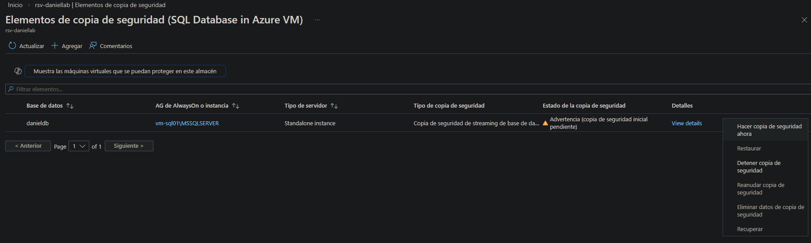
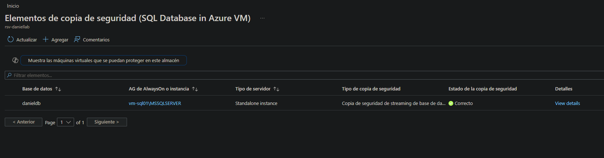
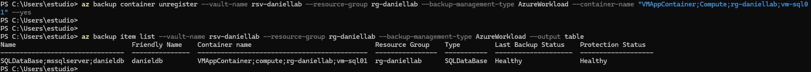

# 06-backup — Recovery Services Vault

## Overview

This section covers the Azure backup configuration for the lab using a **Recovery Services Vault**. The VM is registered first to establish the vault connection, but the actual backup target is the **SQL Server DanielDB database** running on vm-sql01 — not a full VM backup.

**Migration source:** Windows Server Backup on APP01 (wbadmin — daily to DC01 file share)
**Migration target:** Recovery Services Vault — SQL workload backup

## Recovery Services Vault

| Parameter | Value |
|---|---|
| Name | rsv-daniellab |
| SKU | RS0 Standard |
| Region | francecentral |
| Resource Group | rg-daniellab |
| Redundancy | GRS (Geo-Redundant Storage) |

## VM Registration

vm-sql01 is registered with the Recovery Services Vault as the host machine. This step is required before configuring SQL workload backup — the RSV needs to discover the SQL Server instance running on the VM.

## SQL Server Discovery

After VM registration, the RSV discovers the SQL Server instance on vm-sql01. The **DanielDB** database is identified as a backup target.

| Discovered Item | Value |
|---|---|
| Instance | MSSQLSERVER (default) |
| Database | DanielDB |
| Host VM | vm-sql01 |

## Backup Policy

A custom backup policy configured for the SQL workload:

| Setting | Value |
|---|---|
| Backup type | SQL Server in Azure VM |
| Full backup frequency | Weekly |
| Log backup frequency | Every 2 hours |
| Retention | 30 days |

## Backup Configuration

Backup protection enabled on **DanielDB** with the custom policy applied.

## First Backup Run

First on-demand backup triggered to verify the configuration. Backup job completed successfully.

| Field | Value |
|---|---|
| Job type | Full backup (on-demand) |
| Database | DanielDB |
| Status | Completed |
| Duration | ~2 min |

## Design Decisions

**Why SQL workload backup instead of VM backup?**
A full VM backup captures the entire OS disk — including the Windows Server OS, SQL Server binaries and the database. For this lab the only data that matters is DanielDB. SQL workload backup is more granular, faster, and uses less storage than a full VM snapshot.

**Why register the VM first?**
The RSV SQL workload backup requires the Azure VM Backup extension to be installed on vm-sql01. Registering the VM installs the extension and establishes the communication channel between the vault and the SQL Server instance.

**Why GRS redundancy?**
Geo-Redundant Storage replicates backups to a secondary Azure region — protecting against a full region failure. For a production database this is the minimum recommended redundancy level.

## Comparison with On-Premises Backup

| Aspect | WSB on APP01 | RSV SQL Backup |
|---|---|---|
| Target | DC01 file share (network) | Azure Storage (GRS) |
| Granularity | Full application folder | Database only |
| Schedule | Daily at 02:00 | Weekly full + 2h log |
| Recovery | File-level from share | Point-in-time DB restore |
| Offsite copy | No | Yes (GRS) |
