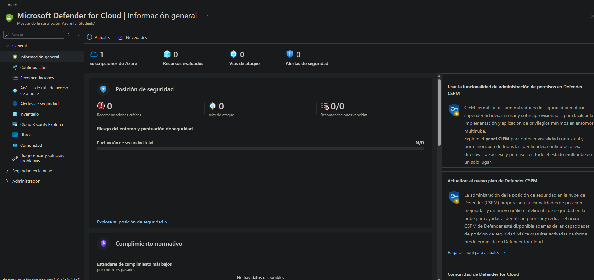
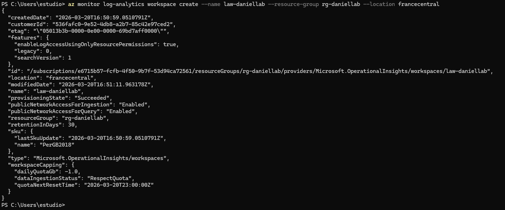
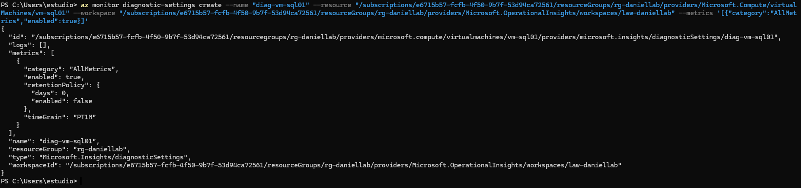
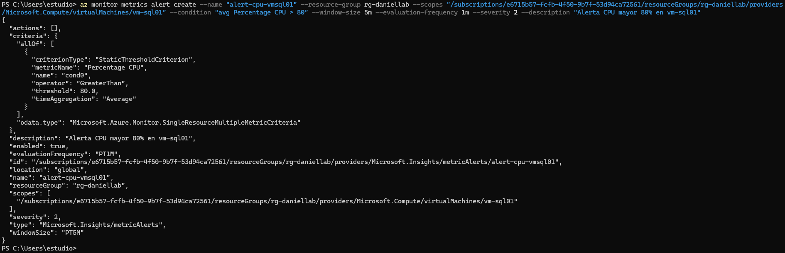
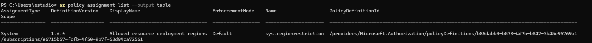
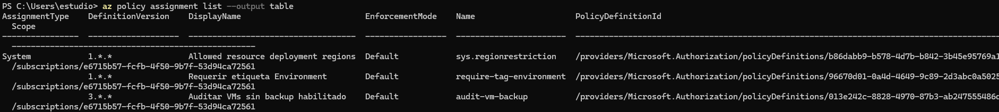
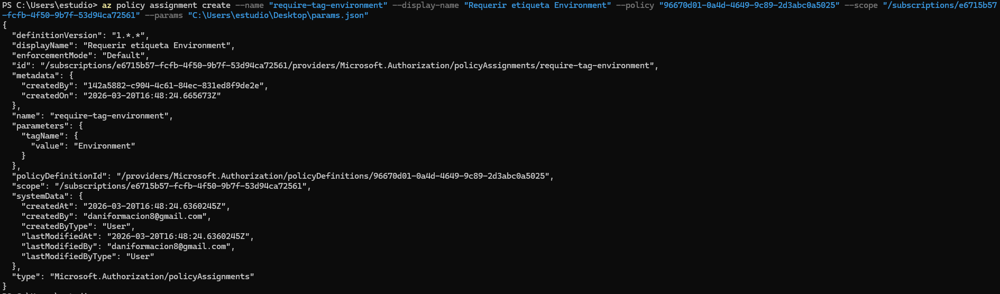
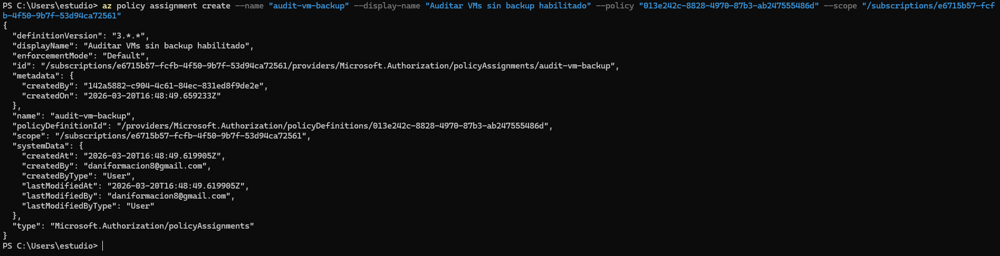

# 07-security — Security, Monitoring & Governance

## Overview

This section covers the security posture, monitoring and governance configuration for the Azure environment — including Defender for Cloud, Azure Policy, Log Analytics Workspace connected to vm-sql01, Application Insights connected to App Service, and a CPU alert on the SQL VM.

## Defender for Cloud

Defender for Cloud enabled on the subscription — Free tier provides:
- Secure Score assessment
- Security recommendations for all resources
- Coverage of Arc-enabled servers (DC01, APP01) via the Arc agent

| Metric | Value |
|---|---|
| Plan | Defender for Cloud Free |
| Secure Score | Initial assessment (baseline) |
| Coverage | vm-sql01, App Service, Arc servers |

## Log Analytics Workspace

A Log Analytics Workspace collects logs and performance metrics from **vm-sql01**.

| Parameter | Value |
|---|---|
| Name | law-daniellab |
| SKU | PerGB2018 |
| Region | francecentral |
| Connected to | vm-sql01 |
| Retention | 30 days |

The **Log Analytics Agent (MMA)** is installed on vm-sql01 via the VM extension, sending Windows Event Logs and performance counters to the workspace.

## Application Insights

Application Insights is connected to **App Service (app-daniellab)** for live metrics and failure detection. It uses the same Log Analytics Workspace as its backend store.

Documented in detail in `03-azure/05-webapp` — screenshots in `05-webapp/screenshots/`.

| Parameter | Value |
|---|---|
| Name | ai-daniellab |
| Connected to | app-daniellab (App Service) |
| Backend | law-daniellab (Log Analytics) |
| Mode | Workspace-based |

## CPU Alert — vm-sql01

A metric alert configured on vm-sql01 to detect CPU saturation:

| Parameter | Value |
|---|---|
| Alert name | alert-cpu-vm-sql01 |
| Metric | Percentage CPU |
| Condition | Greater than 80% |
| Window | 1 minute |
| Frequency | 1 minute |
| Severity | 2 (Warning) |
| Action Group | Application Insights Smart Detection |

The alert fires the **SmartDetect** Action Group — the same group used by Application Insights Failure Anomalies — keeping all alerts centralised under one notification target.

## Azure Policy

Azure Policy enforces governance rules at the Resource Group scope (`rg-daniellab`), replacing on-premises GPO for cloud resources.

| Policy | Assignment Scope | Purpose |
|---|---|---|
| Require tag: Environment | rg-daniellab | Enforce tagging on all resources |
| Azure Backup should be enabled for VMs | rg-daniellab | Ensure vm-sql01 has backup configured |

### Tag Policy

The `Environment` tag is enforced across the resource group. All resources must carry `Environment=Lab` — non-compliant resources are flagged in the compliance dashboard.

**Replaces on-prem GPO:** Registry-based policies enforced via GPO on Windows machines. Azure Policy provides equivalent governance for cloud resources.

### VM Backup Policy

Policy audits whether vm-sql01 has backup enabled in a Recovery Services Vault. Non-compliant state triggers a compliance alert before backup is configured — verified compliant after `06-backup` setup.

## Governance Design

| On-Premises | Azure Equivalent | Implemented |
|---|---|---|
| GPO — Windows Update (Servers) | Azure Update Manager | ✅ (02-azure-migrate/02-update-manager) |
| GPO — Windows Update (Workstations) | Azure Update Manager | ✅ |
| Group Policy Objects | Azure Policy | ✅ |
| Manual tagging | Tag enforcement policy | ✅ |
| No cloud monitoring | Log Analytics + App Insights | ✅ |
| No cloud alerting | Azure Monitor metric alerts | ✅ |
