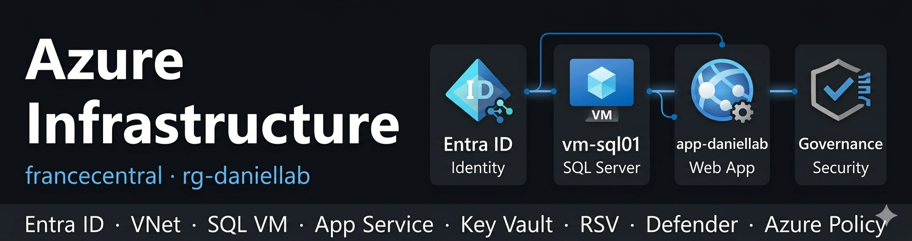
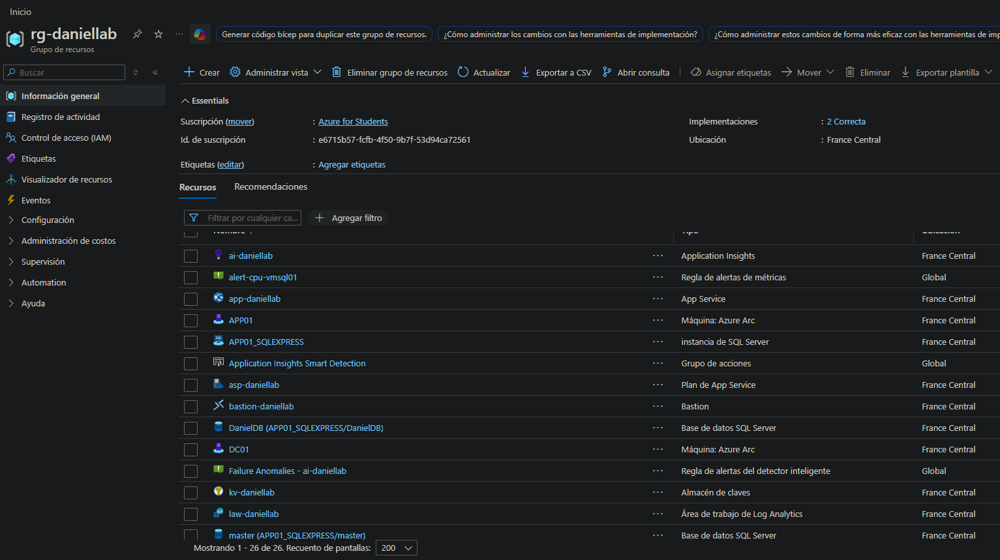
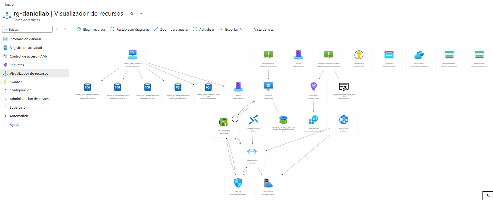

# 03 — Infraestructura Azure

## Visión general

Infraestructura completa de Azure desplegada en **francecentral**, alojando las cargas de trabajo migradas desde el entorno on-premises **daniel.local**. Esta fase cubre sincronización de identidad, redes, SQL Server en IaaS, aplicación web en PaaS, backup, seguridad y almacenamiento de archivos — todo desplegado y gestionado bajo el Grupo de Recursos **rg-daniellab**.

El entorno es completamente reproducible mediante la plantilla ARM en `04-iac/arm/template.json`.

## Grupo de Recursos

| Parámetro | Valor                             |
| --------- | --------------------------------- |
| Nombre    | rg-daniellab                      |
| Región    | francecentral                     |
| Tags      | Environment=Lab · Proyecto=Fase10 |




## Recursos de Azure Desplegados

| Recurso                 | Nombre                    | SKU / Tier       | Propósito                                      |
| ----------------------- | ------------------------- | ---------------- | ---------------------------------------------- |
| Entra ID                | daniellab.onmicrosoft.com | Free             | Sincronización de identidad desde daniel.local |
| Virtual Network         | vnet-daniellab            | Standard         | Red principal — 10.0.0.0/16                    |
| Network Security Group  | nsg-sql                   | —                | Control de tráfico para vm-sql01               |
| Azure Bastion           | bastion-daniellab         | Developer        | RDP seguro a vm-sql01                          |
| Virtual Machine         | vm-sql01                  | Standard_D2s_v3  | Host de SQL Server                             |
| SQL Server              | MSSQLSERVER               | Developer 2022   | DanielDB — migrada desde APP01                 |
| App Service Plan        | asp-daniellab             | B1 Linux         | Computación para la aplicación web             |
| App Service             | app-daniellab             | B1 Linux         | App de portafolio ASP.NET Core 8               |
| Key Vault               | kv-daniellab              | Standard         | Secreto de cadena de conexión SQL              |
| Application Insights    | ai-daniellab              | Workspace-based  | Monitorización del App Service                 |
| Log Analytics Workspace | law-daniellab             | PerGB2018        | Logs y métricas de la VM                       |
| Storage Account         | stfilesdaniellab          | Standard LRS     | Azure Files + transferencia de app             |
| Storage Account         | stbkpdaniellab            | Standard LRS     | Backup del App Service                         |
| Azure Files Share       | danielfiles               | Standard         | Migrado desde servidor de archivos DC01        |
| Recovery Services Vault | rsv-daniellab             | RS0 Standard GRS | Backup de carga de trabajo SQL                 |
| Azure Policy            | —                         | Free             | Aplicación de etiquetas + auditoría de backup  |
| Defender for Cloud      | —                         | Free             | Postura de seguridad                           |
| Azure Monitor Alert     | alert-cpu-vm-sql01        | —                | CPU > 80% en vm-sql01                          |

## Mapa de Migración

| Servicio On-Premises          | Origen | Servicio Azure            | Sección                            |
| ----------------------------- | ------ | ------------------------- | ---------------------------------- |
| AD DS (daniel.local)          | DC01   | Entra ID                  | [01-identity](./01-identity/)      |
| DNS                           | DC01   | Entra ID + DNS de VNet    | [01-identity](./01-identity/)      |
| GPO                           | DC01   | Azure Policy              | [07-security](./07-security/)      |
| File Server (SharedFiles)     | DC01   | Azure Files               | [03-fileshare](./03-fileshare/)    |
| WSUS                          | DC01   | Azure Update Manager      | 02-azure-migrate/02-update-manager |
| IIS + ASP.NET Core 8          | APP01  | App Service (B1)          | [05-webapp](./05-webapp/)          |
| SQL Server Express — DanielDB | APP01  | Azure VM + SQL Server Dev | [04-sql-vm](./04-sql-vm/)          |
| Windows Server Backup         | APP01  | Recovery Services Vault   | [06-backup](./06-backup/)          |

## Arquitectura de Red

```
10.0.0.0/16 — vnet-daniellab (francecentral)
│
├── snet-default      10.0.1.0/24   → vm-sql01 (10.0.1.10)
├── AzureBastionSubnet 10.0.2.0/26  → Azure Bastion Developer
└── snet-webapp       10.0.3.0/24   → Integración VNet App Service
```

Flujo de tráfico — aplicación web:

```
Navegador (HTTPS)
    │
    ▼
App Service (app-daniellab)
    ├── Key Vault → cadena de conexión SQL (Managed Identity)
    └── Integración VNet (snet-webapp)
            │
            ▼
        vm-sql01:1433 (IP privada — nunca expuesta públicamente)
            │
            ▼
        SQL Server — DanielDB
```

## Decisiones de Diseño de Seguridad

**Managed Identity en lugar de cadena de conexión en configuración**
El App Service utiliza una Managed Identity asignada por el sistema para obtener la cadena de conexión SQL desde Key Vault en tiempo de ejecución. No se almacenan credenciales en variables de entorno, código fuente ni configuración de despliegue.

**Sin IP pública en vm-sql01**
La VM de SQL no tiene dirección IP pública. El acceso es exclusivamente mediante Azure Bastion (administrativo) y la integración VNet del App Service (aplicación). Los puertos 3389 y 1433 nunca están expuestos a internet.

**Puerto SQL 1433 limitado solo a snet-webapp**
La regla NSG que permite tráfico SQL restringe el origen a la subred de integración del App Service — no a toda la VNet ni a internet.

**Modelo por niveles preservado en identidad cloud**
Los usuarios de la OU Admin_NoSync están excluidos de la sincronización de Entra Connect — las cuentas privilegiadas on-premises no tienen identidad en la nube, evitando movimiento lateral desde un compromiso en la nube hacia on-premises.

**Azure Policy aplica la base de gobernanza**
Las políticas de etiquetado y auditoría de backup de VM aseguran que todos los recursos cumplen desde el primer día — reemplazando el modelo de gobernanza GPO on-premises.

## Documentación

| Carpeta                           | Contenido                                                                   |
| --------------------------------- | --------------------------------------------------------------------------- |
| [01-identity](./01-identity/)     | Entra Connect, filtrado de OU, sincronización de usuarios/grupos, RBAC, MFA |
| [02-networking](./02-networking/) | VNet, NSG, subredes, reglas de seguridad                                    |
| [03-fileshare](./03-fileshare/)   | Azure Files — migración del servidor DC01 vía AzCopy                        |
| [04-sql-vm](./04-sql-vm/)         | Despliegue de VM, instalación de SQL Server, migración de DanielDB          |
| [05-webapp](./05-webapp/)         | App Service, Key Vault, Managed Identity, despliegue ZIP                    |
| [06-backup](./06-backup/)         | Recovery Services Vault, backup de SQL                                      |
| [07-security](./07-security/)     | Defender for Cloud, Policy, LAW, App Insights, alertas                      |

## Estado

* [x] 01-identity — sincronización Entra Connect, asignaciones RBAC, MFA
* [x] 02-networking — VNet, NSG, subredes configuradas
* [x] 03-fileshare — SharedFiles de DC01 migrado a Azure Files
* [x] 04-sql-vm — vm-sql01 desplegada, SQL instalado, DanielDB migrada
* [x] 05-webapp — App Service activo, Key Vault integrado, ZIP desplegado
* [x] 06-backup — RSV configurado, backup SQL de DanielDB en ejecución
* [x] 07-security — Defender, Policy, LAW, alertas configuradas
* [x] ARM Template — entorno completo exportado a IaC (`04-iac`)
