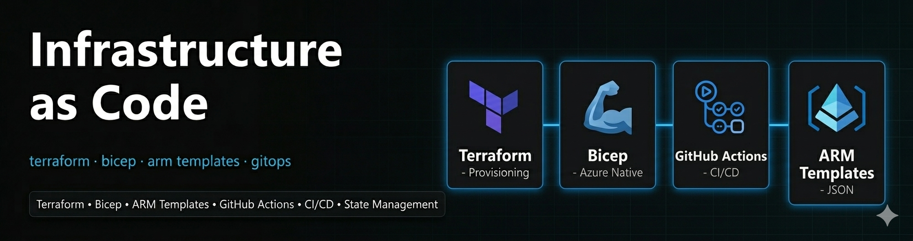

# 04-iac — Infrastructure as Code

## Overview

This section covers the full **Infrastructure as Code** implementation for the daniellab project. The entire Azure infrastructure is defined, versioned, and deployable from code — eliminating manual portal clicks and enabling repeatable, auditable deployments.

## Structure
```
04-iac/
├── arm/          # ARM Templates — export, modify, redeploy
└── terraform/    # Terraform — full IaC from scratch with HCL
```

## Approaches Covered

| Tool | Approach | Use Case |
|---|---|---|
| ARM Templates | Export existing infra → modify → redeploy | Azure-native IaC, quick iterations |
| Terraform | Write HCL from scratch → plan → apply → destroy | Multi-cloud IaC, state management |

## What This Enables

| Capability | Result |
|---|---|
| Full infra reproducible from code | ✅ |
| Version controlled infrastructure | ✅ |
| Destroy and recreate in minutes | ✅ |
| Auditable change history via git | ✅ |
| Multi-cloud portability (Terraform) | ✅ |
