# Plantillas ARM

## Visión general

Las Plantillas de Azure Resource Manager (ARM) son archivos de Infraestructura como Código basados en JSON y nativos de Azure. Esta fase cubre la exportación de la infraestructura existente `rg-daniellab`, la modificación de la plantilla para corregir artefactos de exportación, y su redepliegue en un nuevo grupo de recursos.

## Flujo

```id="1b2j3k"
rg-daniellab (existente)
    │
    │  Exportar plantilla
    ▼
template.json + parameters.json
    │
    │  Modificar + corregir
    ▼
template_v2.json + parameters_v2.json
    │
    │  az deployment group create
    ▼
rg-daniellab-v2 (nuevo grupo de recursos)
    │
    │  Validar + verificar
    ▼
Todos los recursos redeplegados ✅
```

## Pasos

### 1 — Exportar plantilla ARM

La infraestructura existente en `rg-daniellab` se exporta desde el Portal de Azure como una plantilla ARM completa.

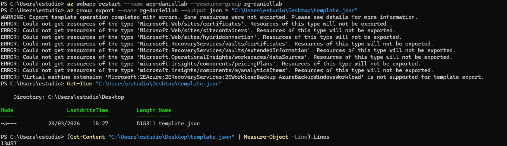
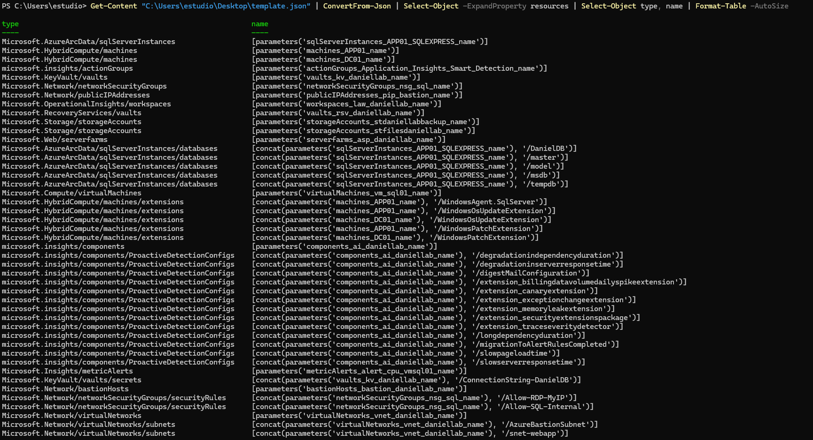

La exportación genera `template.json` (515KB) que contiene todas las definiciones de recursos y su configuración actual.

### 2 — Modificar plantilla

La plantilla exportada requiere modificaciones antes de su redepliegue — las plantillas exportadas suelen contener valores hardcodeados, IDs específicos de recursos y propiedades que provocan errores de validación al volver a desplegar.

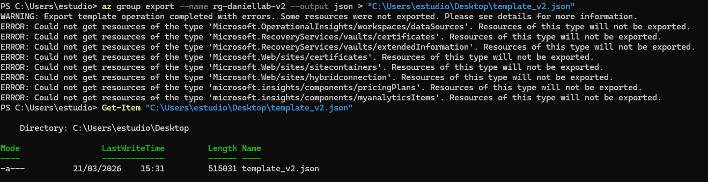
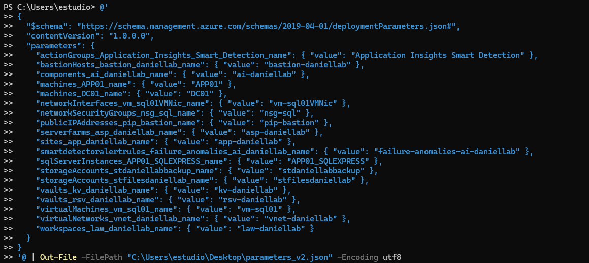
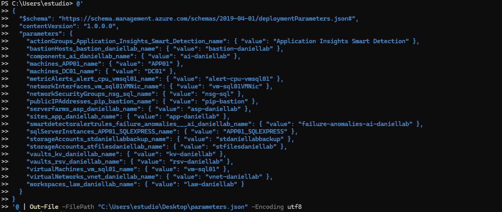

Modificaciones clave aplicadas:

* Eliminación de propiedades de recursos no redeplegables
* Parametrización de valores específicos del entorno
* Corrección de referencias de discos y de imágenes de máquinas virtuales
* Limpieza de políticas de acceso de Key Vault

### 3 — Validación

Antes de desplegar, la plantilla se valida contra la API de Azure para detectar errores sin crear recursos.

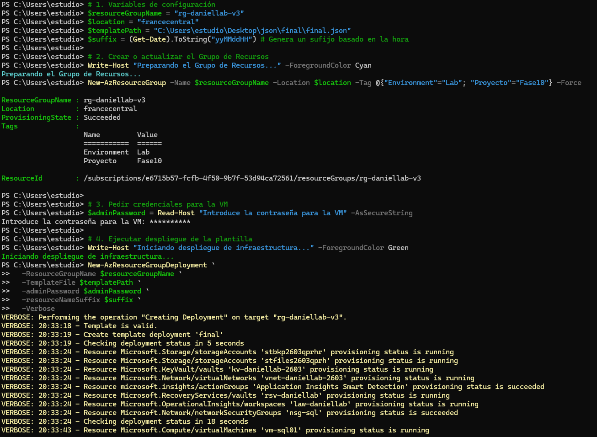
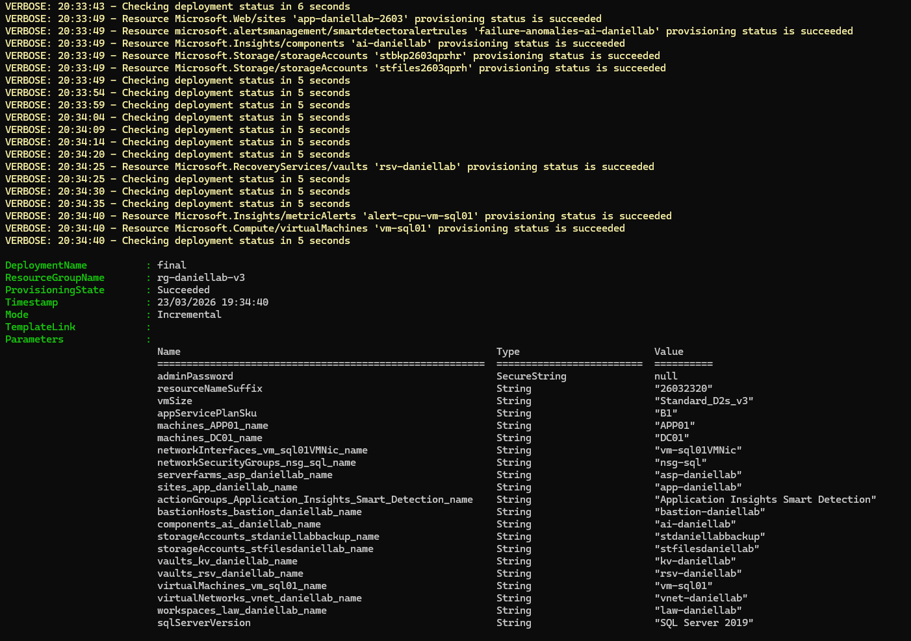
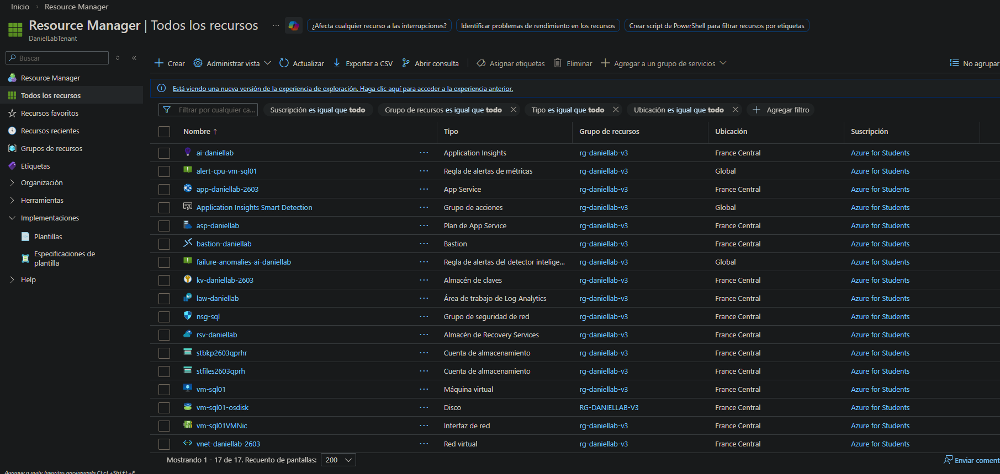

```bash
az deployment group validate \
  --resource-group rg-daniellab-v2 \
  --template-file template_v2.json \
  --parameters parameters_v2.json
```

### 4 — Redepliegue

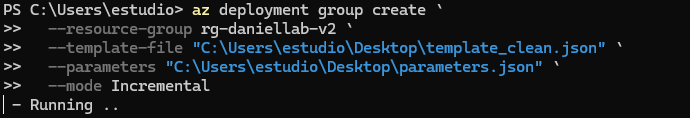
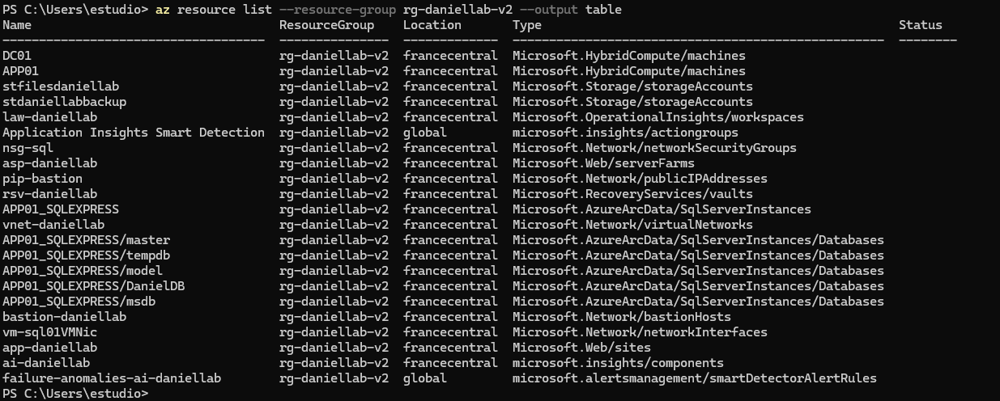
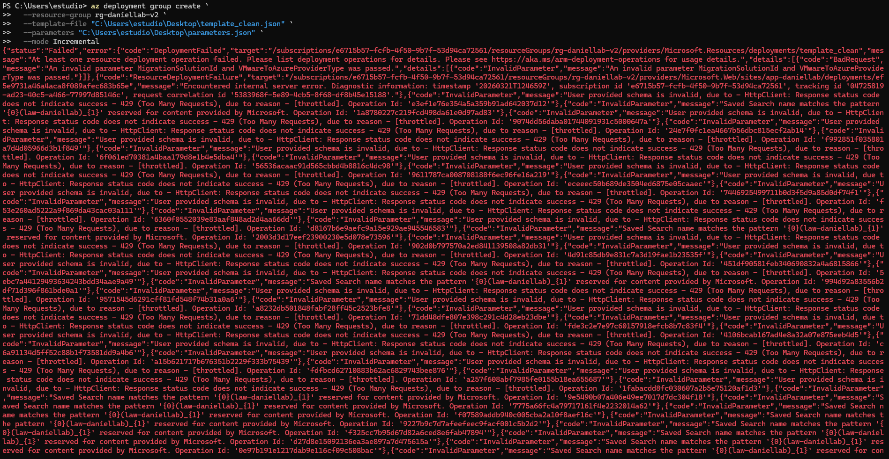
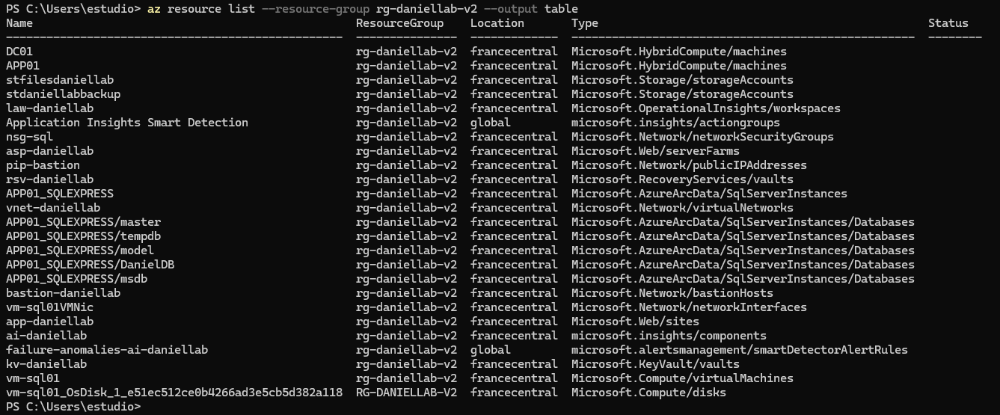

Los recursos se redepliegan en `rg-daniellab-v2` usando la plantilla modificada.

### 5 — Verificación de recursos

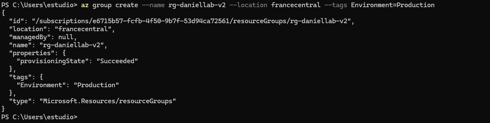
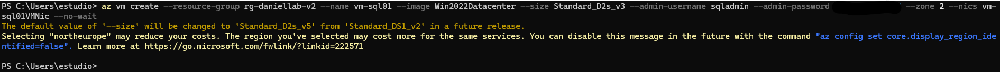
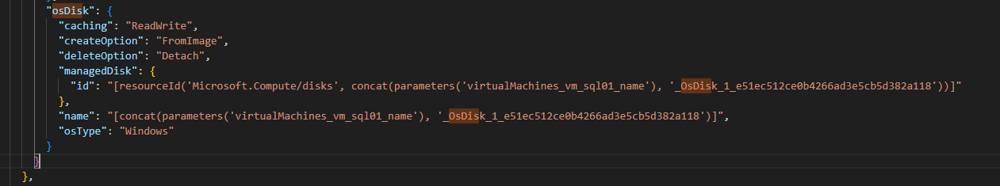
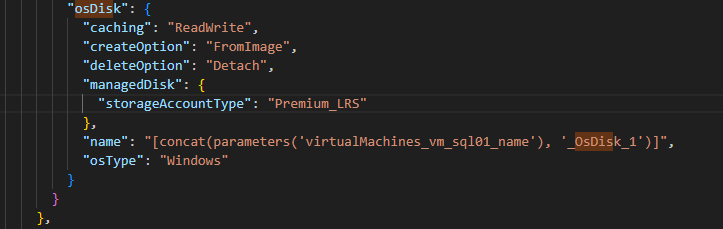

### 6 — Key Vault

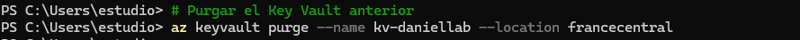
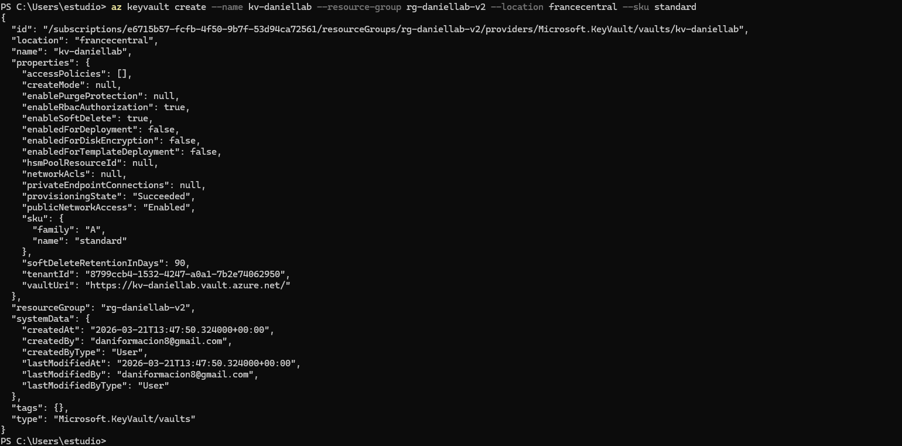
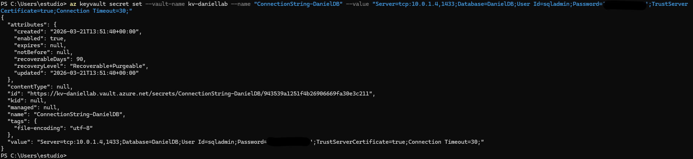
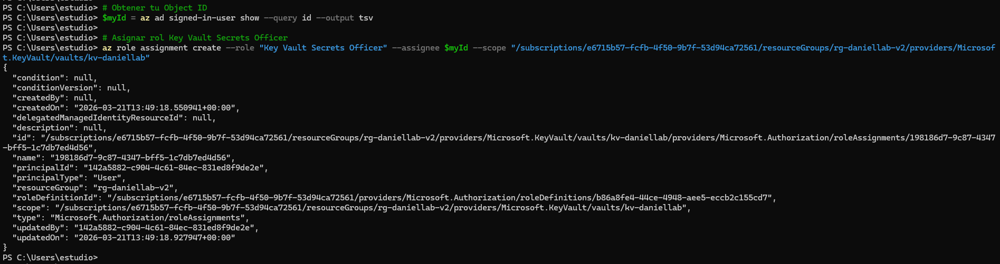

Key Vault requiere un tratamiento especial — el soft-delete implica que el vault anterior debe ser purgado antes de poder redeplegar uno con el mismo nombre.

### 7 — Limpieza: Eliminar RG original

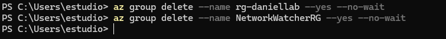
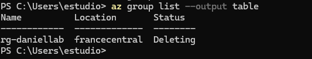

El `rg-daniellab` original se elimina tras validar correctamente el entorno redeplegado.

### 8 — Verificación de políticas

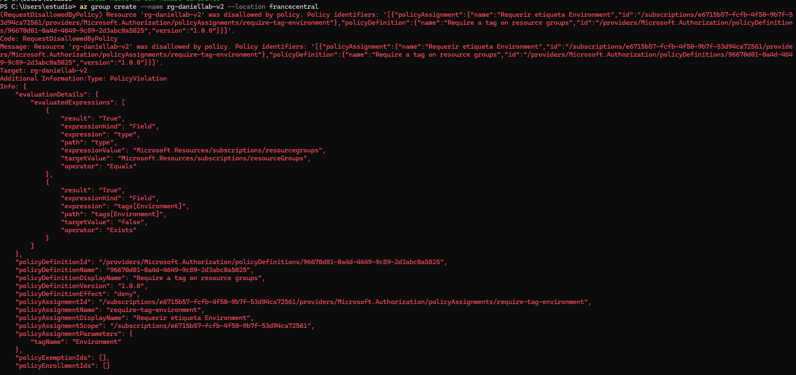

Se verifica que las asignaciones de Azure Policy siguen activas tras el redepliegue.

## Verificación

| Comprobación                                       | Resultado |
| -------------------------------------------------- | --------- |
| Validación de la plantilla superada                | ✅         |
| Todos los recursos redeplegados en rg-daniellab-v2 | ✅         |
| Key Vault purgado y recreado                       | ✅         |
| RG original eliminado                              | ✅         |
| Azure Policy sigue aplicándose                     | ✅         |
