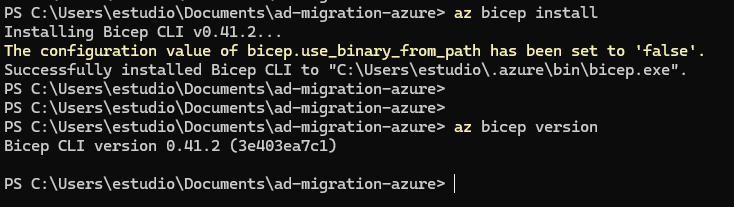
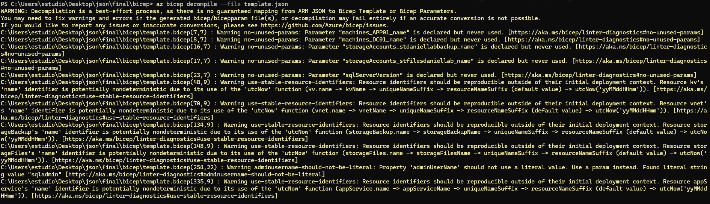
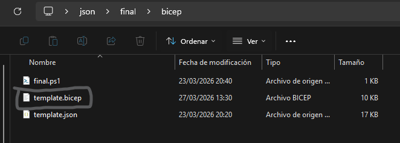
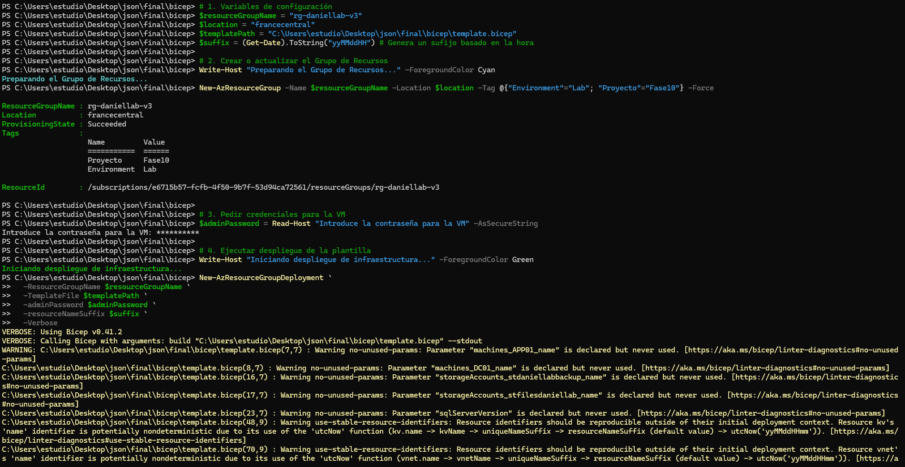
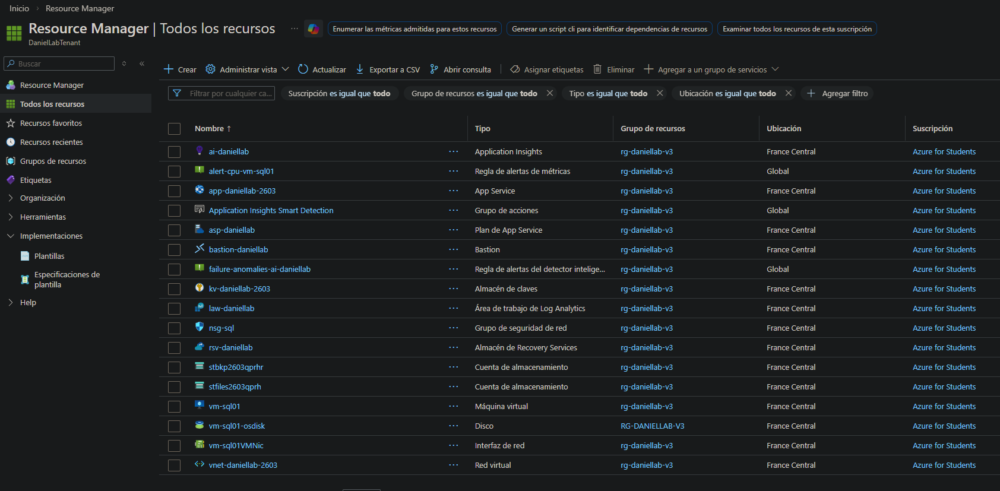
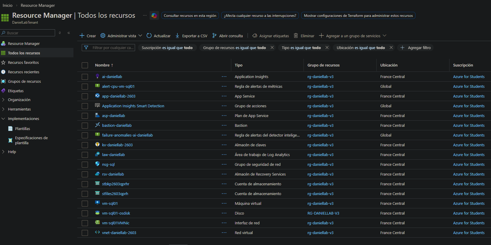

# Bicep

## Overview

Bicep is a domain-specific language (DSL) for deploying Azure resources declaratively. It is the official Azure-native alternative to ARM JSON templates — compiling down to ARM JSON before deployment, but with significantly cleaner syntax, better modularity and native VS Code tooling.

This phase covers converting the existing `template.json` (ARM) into a Bicep file using `az bicep decompile`, fixing decompilation warnings, and deploying the full daniellab infrastructure from the resulting `.bicep` file.

## Bicep vs ARM vs Terraform

| Feature | ARM JSON | Bicep | Terraform |
|---|---|---|---|
| Syntax | Verbose JSON | Clean DSL | HCL |
| Azure-native | ✅ | ✅ | ❌ (provider) |
| Multi-cloud | ❌ | ❌ | ✅ |
| State file | ❌ | ❌ | ✅ |
| Decompile from ARM | N/A | ✅ | ❌ |
| Maturity | High | High | High |

## Flow
```
template.json (ARM)
    │
    │  az bicep decompile
    ▼
main.bicep
    │
    │  Fix warnings + unused parameters
    ▼
main.bicep (clean)
    │
    │  az deployment group create
    ▼
Full infrastructure deployed ✅
```

## Environment

| Tool | Version |
|---|---|
| Azure CLI | latest |
| Bicep CLI | latest |
| Region | francecentral |

---

## Step 1 — Verify Bicep Installation


```bash
az bicep version
```

Bicep CLI confirmed installed and up to date.

---

## Step 2 — Decompile ARM Template to Bicep


```bash
az bicep decompile --file template.json
```

The decompiler converts `template.json` into `template.bicep` automatically. The process generates warnings for:
- Unused parameters
- Resources that could not be fully typed
- Expressions that required manual review

These warnings do not block deployment but indicate areas where the Bicep file can be further optimized.

---

## Step 3 — Review Generated Bicep File



The generated `template.bicep` contains all resource definitions from the original ARM template translated into Bicep syntax. Key differences from ARM JSON:

- No `"$schema"` or `"contentVersion"` headers required
- Resource declarations use `resource` keyword instead of nested JSON
- `dependsOn` is inferred automatically in most cases
- Parameters and variables use cleaner assignment syntax

---

## Step 4 — First Deployment



```bash
$resourceGroupName = "rg-daniellab-v3"
$location = "francecentral"
$templatePath = "C:\Users\estudio\Desktop\json\final\bicep\template.bicep"
$suffix = (Get-Date).ToString("yyMMddHH") # Genera un sufijo basado en la hora

Write-Host "Preparando el Grupo de Recursos..." -ForegroundColor Cyan
New-AzResourceGroup -Name $resourceGroupName -Location $location -Tag @{"Environment"="Lab"; "Proyecto"="Fase10"} -Force

$adminPassword = Read-Host "Introduce la contraseña para la VM" -AsSecureString

New-AzResourceGroupDeployment `
  -ResourceGroupName $resourceGroupName `
  -TemplateFile $templatePath `
  -adminPassword $adminPassword `
  -resourceNameSuffix $suffix `
  -Verbose
```

First deployment completed successfully. Portal confirms all resources created. Warnings about unused parameters were present in the output but did not affect the deployment result.

---

## Step 5 — Final Deployment (Clean)




Final deployment confirmed with all resources provisioned correctly and the infrastructure matching the ARM and Terraform deployments from previous phases.

---

## Warnings Encountered

| Warning | Cause | Impact |
|---|---|---|
| Unused parameters | Decompiler generates all params from ARM; not all are referenced in Bicep | None — deployment succeeds |
| Resource type inference | Some resources could not be fully typed by decompiler | None — falls back to generic type |
| Expressions requiring review | Complex ARM expressions translated literally | None — functionally equivalent |

---

## Verification

| Check | Result |
|---|---|
| Bicep decompile completed | ✅ |
| main.bicep generated from template.json | ✅ |
| Deployment completed without errors | ✅ |
| All resources visible in portal | ✅ |
| Infrastructure matches ARM deployment | ✅ |
