# CI/CD — GitHub Actions + Azure App Service

## Overview

This phase implements a full CI/CD pipeline using GitHub Actions to automatically deploy a .NET 8 portfolio web application to Azure App Service on every `git push` to `main`.

The application connects to a SQL Server 2025 Express instance running on an Azure VM within the same VNet, retrieving project and certification data to render the portfolio dynamically.

## Architecture

```
Developer (local)
    │
    │  git push → main
    ▼
GitHub Repository
    │
    │  GitHub Actions triggered
    ▼
Build & Publish (.NET 8)
    │
    │  Deploy ZIP via Publish Profile
    ▼
Azure App Service (Linux)
    │
    │  VNet Integration (snet-appservice)
    ▼
VM vm-sql01 — SQL Server 2025 Express
    │
    │  TCP 1433
    ▼
DanielDB (Proyectos + Certificaciones)
```

## Stack

| Component | Technology |
|---|---|
| Web App | ASP.NET Core 8 Minimal API |
| Database | SQL Server 2025 Express on Azure VM |
| Hosting | Azure App Service (Linux, .NET 8) |
| CI/CD | GitHub Actions |
| Networking | Azure VNet Integration |
| Secrets | App Service Connection Strings |

---

## Step 1 — Push Code to GitHub

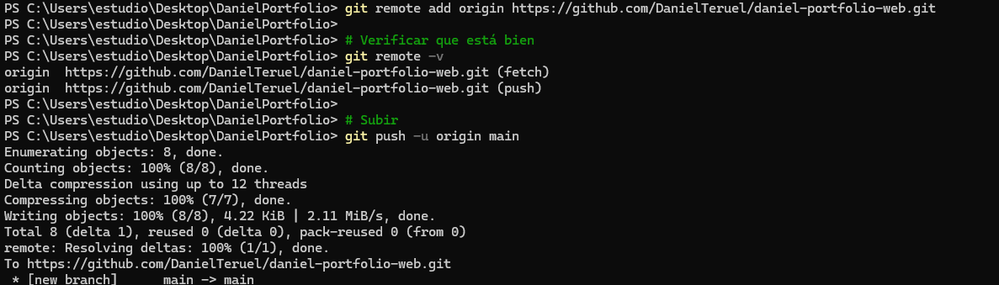

```powershell
git init
git add .
git commit -m "feat: initial portfolio upload"
git branch -M main
git remote add origin https://github.com/DanielTeruel/daniel-portfolio-web.git
git push -u origin main
```

Public repository created at `github.com/DanielTeruel/daniel-portfolio-web`. No secrets or credentials in the codebase — connection string is read from App Service environment variable `SQLCONNSTR_DanielDB` at runtime.

---

## Step 2 — Obtain Publish Profile

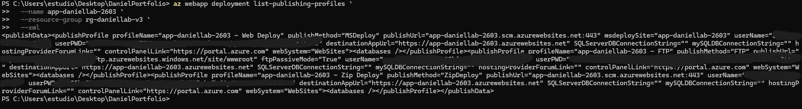

```powershell
az webapp deployment list-publishing-profiles `
  --name app-daniellab-2603 `
  --resource-group rg-daniellab-v3 `
  --xml
```

The XML output contains the deployment credentials for the App Service. This is used by GitHub Actions to authenticate and deploy the application.

---

## Step 3 — Configure GitHub Secret

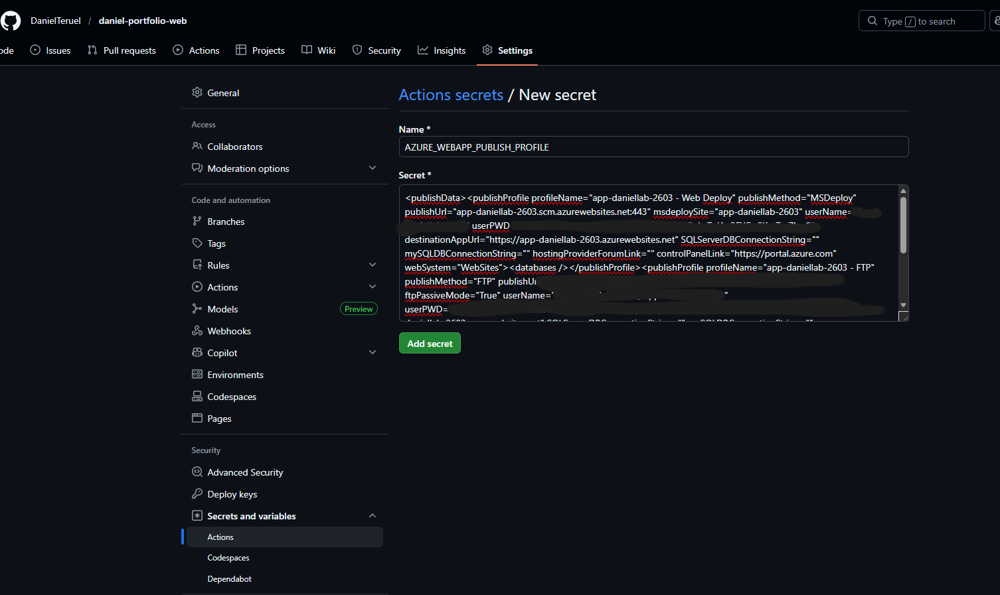

```
Repository → Settings → Secrets and variables → Actions → New repository secret

Name:  AZURE_WEBAPP_PUBLISH_PROFILE
Value: <XML from previous step>
```

The XML value is masked in the screenshot for security. The secret name must match exactly what is referenced in the workflow file.

---

## Step 4 — VNet Integration

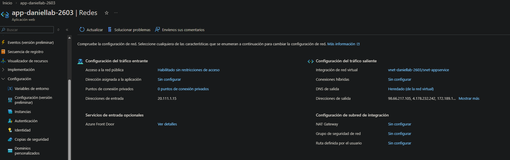

```powershell
# Create dedicated subnet for App Service
az network vnet subnet create `
  --resource-group rg-daniellab-v3 `
  --vnet-name vnet-daniellab-2603 `
  --name snet-appservice `
  --address-prefix 10.0.3.0/24

# Integrate App Service with VNet
az webapp vnet-integration add `
  --name app-daniellab-2603 `
  --resource-group rg-daniellab-v3 `
  --vnet vnet-daniellab-2603 `
  --subnet snet-appservice
```

A dedicated subnet (`snet-appservice 10.0.3.0/24`) was created for the App Service — it cannot share the same subnet as the VM. VNet Integration allows the App Service to reach the VM's private IP (`10.0.1.10`) over port 1433.

---

## Step 5 — SQL Server 2025 on VM

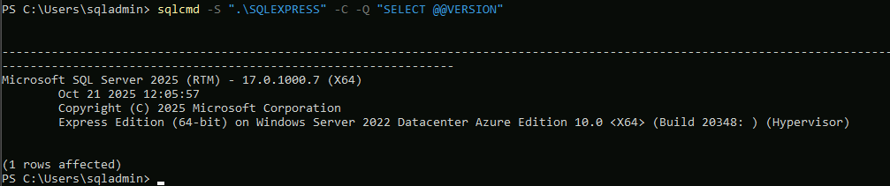

```powershell
# Download SQL Server 2025 Express
Invoke-WebRequest `
  -Uri "https://download.microsoft.com/download/7ab8f535-7eb8-4b16-82eb-eca0fa2d38f3/SQL2025-SSEI-Expr.exe" `
  -OutFile "C:\sql2025.exe"

C:\sql2025.exe /ACTION=Download /MEDIAPATH=C:\SQLMedia2025 /MEDIATYPE=Core /QUIET

C:\SQLMedia2025\SQLEXPR_x64_ENU.exe /ACTION=Install `
  /FEATURES=SQLEngine `
  /INSTANCENAME=MSSQLSERVER `
  /SQLSYSADMINACCOUNTS="BUILTIN\Administrators" `
  /TCPENABLED=1 `
  /NPENABLED=1 `
  /IACCEPTSQLSERVERLICENSETERMS `
  /QUIET

# Enable fixed port 1433
Set-ItemProperty -Path "HKLM:\SOFTWARE\Microsoft\Microsoft SQL Server\MSSQL17.SQLEXPRESS\MSSQLServer\SuperSocketNetLib\Tcp\IPAll" -Name "TcpPort" -Value "1433"
Set-ItemProperty -Path "HKLM:\SOFTWARE\Microsoft\Microsoft SQL Server\MSSQL17.SQLEXPRESS\MSSQLServer\SuperSocketNetLib\Tcp\IPAll" -Name "TcpDynamicPorts" -Value ""

Restart-Service -Name "MSSQL`$SQLEXPRESS" -Force
```

SQL Server 2025 Express (v17.0.1000.7) installed on the VM. Mixed Mode authentication enabled during installation to allow SQL login from the App Service. Port 1433 fixed (SQLEXPRESS uses dynamic ports by default).

---

## Step 6 — GitHub Actions Workflow

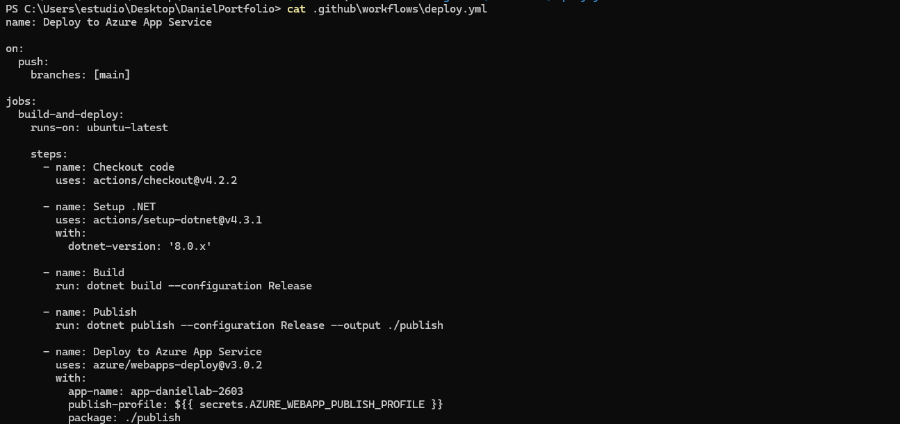

```yaml
name: Deploy to Azure App Service

on:
  push:
    branches: [main]

jobs:
  build-and-deploy:
    runs-on: ubuntu-latest

    steps:
      - name: Checkout code
        uses: actions/checkout@v4.2.2

      - name: Setup .NET
        uses: actions/setup-dotnet@v4.3.1
        with:
          dotnet-version: '8.0.x'

      - name: Build
        run: dotnet build --configuration Release

      - name: Publish
        run: dotnet publish --configuration Release --output ./publish

      - name: Deploy to Azure App Service
        uses: azure/webapps-deploy@v3.0.2
        with:
          app-name: app-daniellab-2603
          publish-profile: ${{ secrets.AZURE_WEBAPP_PUBLISH_PROFILE }}
          package: ./publish
```

The workflow builds and publishes the .NET app on a Linux runner, then deploys the output ZIP to the App Service using the Publish Profile secret.

---

## Step 7 — Git Push Fix

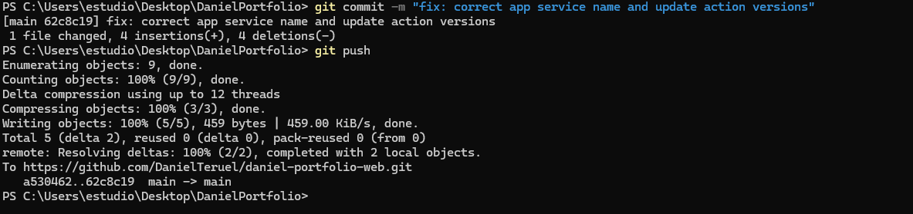

```powershell
git add .
git commit -m "fix: correct app service name and update action versions"
git push
```

Initial deployment failed due to incorrect App Service name in the workflow (`app-daniellab` instead of `app-daniellab-2603`). Fixed by updating the `app-name` field and upgrading action versions to Node.js 24 compatible releases.

---

## Step 8 — Database Restored

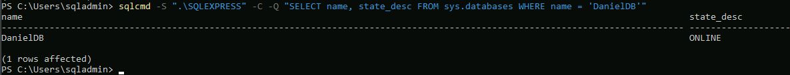

```powershell
# Upload BAK to Storage Account (from local PC)
$ctx = New-AzStorageContext -StorageAccountName "stbkp2603qprhr" -StorageAccountKey $storageKey
Set-AzStorageBlobContent -File "C:\Users\estudio\Desktop\DanielDB.bak" -Container "backups" -Blob "DanielDB.bak" -Context $ctx

# Download BAK on VM and restore
sqlcmd -S ".\SQLEXPRESS" -C -Q "
RESTORE DATABASE DanielDB
FROM DISK = 'C:\SQLBackups\DanielDB.bak'
WITH MOVE 'DanielDB' TO 'C:\Program Files\Microsoft SQL Server\MSSQL17.SQLEXPRESS\MSSQL\DATA\DanielDB.mdf',
     MOVE 'DanielDB_log' TO 'C:\Program Files\Microsoft SQL Server\MSSQL17.SQLEXPRESS\MSSQL\DATA\DanielDB_log.ldf',
     REPLACE, STATS=10
"
```

`DanielDB.bak` (SQL Server 2025 format) uploaded to Azure Blob Storage, downloaded to the VM via SAS URL, and restored successfully. Database contains tables `Proyectos` and `Certificaciones` with portfolio data.

---

## Step 9 — GitHub Actions Success

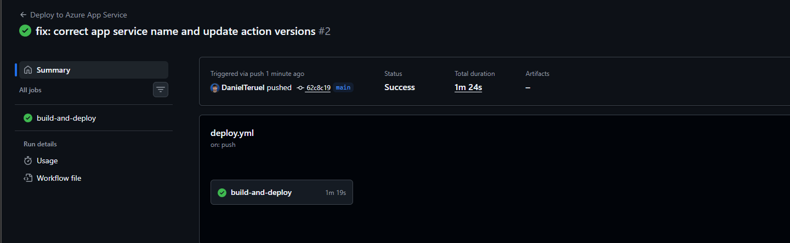

Pipeline running end-to-end in under 2 minutes:

| Stage | Duration |
|---|---|
| Checkout | ~5s |
| Setup .NET | ~15s |
| Build | ~20s |
| Publish | ~15s |
| Deploy | ~60s |
| **Total** | **~2 min** |

---

## Step 10 — Connection String

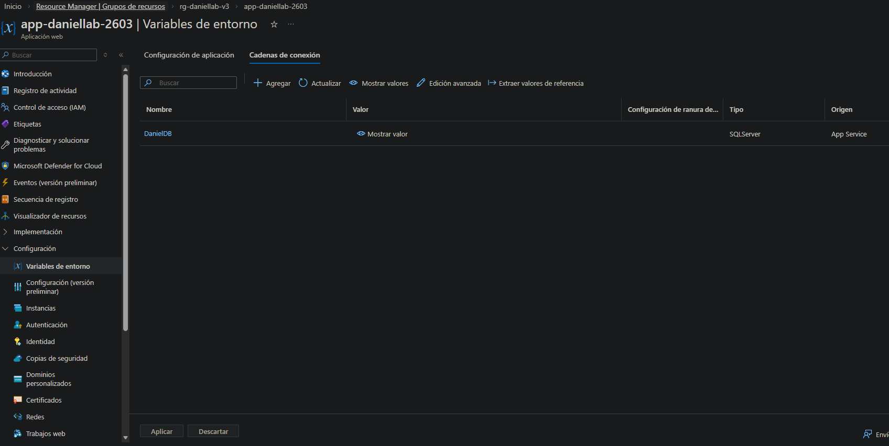

```powershell
az webapp config connection-string set `
  --name app-daniellab-2603 `
  --resource-group rg-daniellab-v3 `
  --connection-string-type SQLServer `
  --settings "DanielDB=Server=10.0.1.10\SQLEXPRESS,1433;Database=DanielDB;User Id=sqladmin;Password=***;TrustServerCertificate=True;"
```

Connection string stored as App Service Connection String (type: SQLServer). Azure automatically exposes it as environment variable `SQLCONNSTR_DanielDB`, read in `Program.cs` at runtime.

---

## Step 11 — Portfolio Live

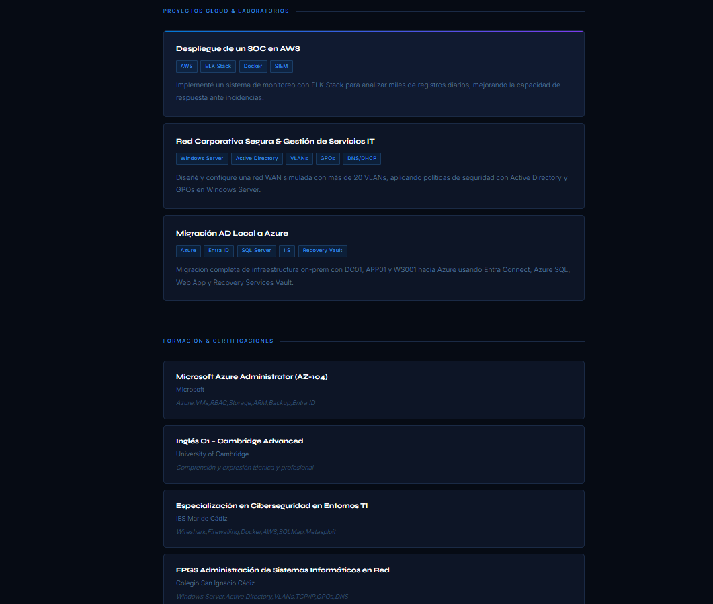


Portfolio successfully deployed and serving dynamic content from SQL Server:

- **URL:** https://app-daniellab-2603.azurewebsites.net
- **Runtime:** DOTNETCORE 8.0.23
- **Data source:** DanielDB via VNet (private IP 10.0.1.10)

---

## Step 12 — GitHub Actions History

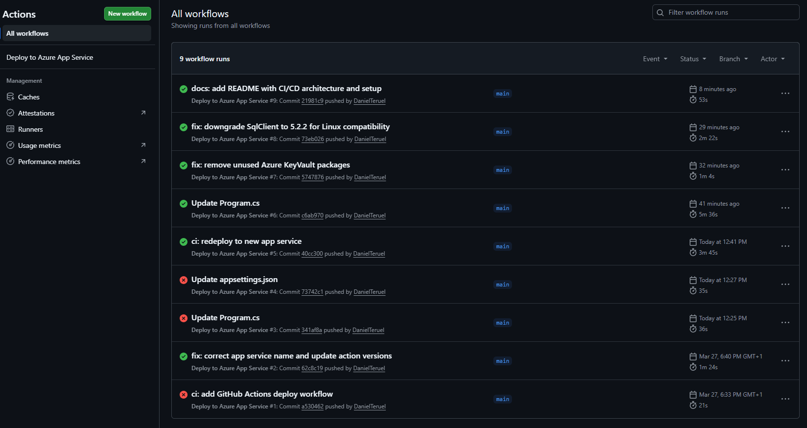

Full pipeline run history showing the real iteration process — first failures, fixes and final success. This is the expected workflow when setting up CI/CD for the first time:

| Run | Commit | Result |
|---|---|---|
| #1 | ci: add GitHub Actions deploy workflow | ❌ Wrong publish profile |
| #2 | fix: correct app service name and update action versions | ✅ |
| #3 | Update Program.cs | ❌ Container timeout |
| #4 | Update appsettings.json | ❌ Container timeout |
| #5 | ci: redeploy to new app service | ✅ |
| #6 | Update Program.cs | ✅ Lazy SQL connection |
| #7 | fix: remove unused Azure KeyVault packages | ✅ |
| #8 | fix: downgrade SqlClient to 5.2.2 for Linux compatibility | ✅ |
| #9 | docs: add README with CI/CD architecture and setup | ✅ |

---

## Issues & Fixes

| Issue | Cause | Fix |
|---|---|---|
| Wrong app-name in workflow | Bicep adds suffix to resource names | Updated to `app-daniellab-2603` |
| Container timeout on startup | SQL connection blocking app startup | Moved connection inside endpoint handler (lazy init) |
| SQL login failed | `sqladmin` existed only as Windows login | Created SQL login with password + db_owner role |
| SQLEXPRESS dynamic port | Express uses random port by default | Fixed port to 1433 via registry + service restart |
| BAK incompatible (v998 vs v957) | BAK from SQL 2025, VM had SQL 2022 | Reinstalled SQL 2025 Express on VM |
| SqlClient crash on Linux | v6.x incompatible with some Linux configs | Downgraded to v5.2.2 |

---

## Key Decisions

**Why env var instead of Key Vault?**
For lab/demo purposes the connection string is stored directly as an App Service Connection String. In production, Key Vault with Managed Identity would be the correct approach — the infrastructure already has both Key Vault and Managed Identity configured in the Bicep template.

**Why SQL Server on VM instead of Azure SQL?**
Cost optimization for lab environment. Azure SQL Database would be the production-ready alternative with built-in HA, backups and no VM management overhead.

**Why a dedicated subnet for App Service?**
Azure VNet Integration requires a delegated subnet exclusively for the App Service — it cannot share the subnet with other resources like the VM.
