# Terraform

## Overview

Terraform is a multi-cloud Infrastructure as Code tool that uses **HCL (HashiCorp Configuration Language)** to define infrastructure declaratively. Unlike ARM templates, Terraform maintains a **state file** that tracks the real infrastructure and detects drift between code and reality.

This phase covers writing `main.tf` from scratch for the full daniellab Azure infrastructure, importing existing resources into state, resolving provider-specific issues, and completing a full apply → destroy cycle.

## Flow
```
main.tf (HCL)
    │
    │  terraform init
    ▼
Provider downloaded (azurerm v4.58.0)
    │
    │  terraform import (existing resources)
    ▼
terraform.tfstate populated
    │
    │  terraform plan
    ▼
Execution plan (no changes expected)
    │
    │  terraform apply
    ▼
Infrastructure deployed ✅
    │
    │  terraform destroy
    ▼
All resources removed ✅
```

## Environment

| Tool | Version |
|---|---|
| Terraform | v1.14.7 |
| AzureRM Provider | v4.58.0 |
| OS | Windows (PowerShell) |

## Steps

### 1 — Install Terraform

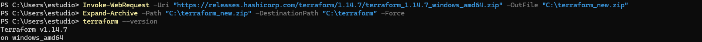

Terraform installed on Windows and added to PATH.

### 2 — Import Existing Resources

Since the infrastructure already existed in Azure from previous phases, resources are imported into Terraform state rather than created from scratch.


```powershell
terraform import azurerm_resource_group.res-0 /subscriptions/.../resourceGroups/rg-daniellab-v3
```

### 3 — Terraform Plan (No Changes)

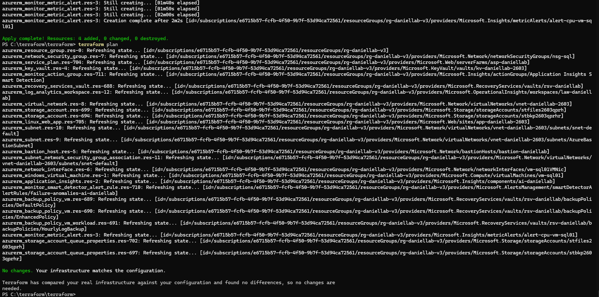

After resolving all issues, `terraform plan` confirms the state matches the real infrastructure.
```
No changes. Your infrastructure matches the configuration.
```

### 4 — Terraform Apply

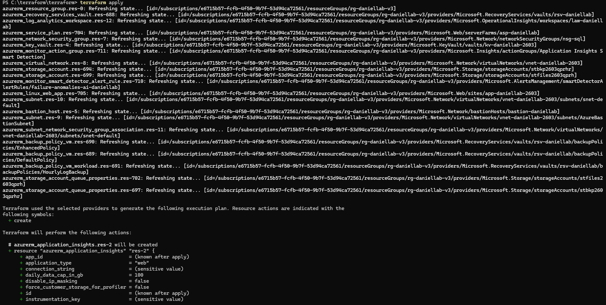
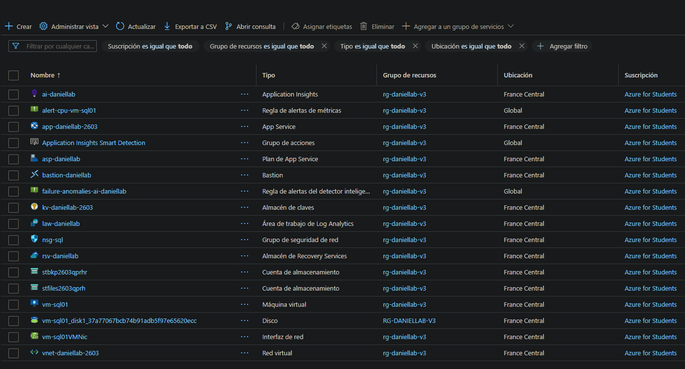

Full infrastructure deployed from code. All resources created successfully.

### 5 — Terraform Destroy

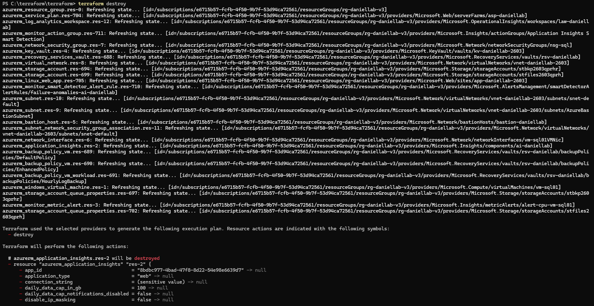
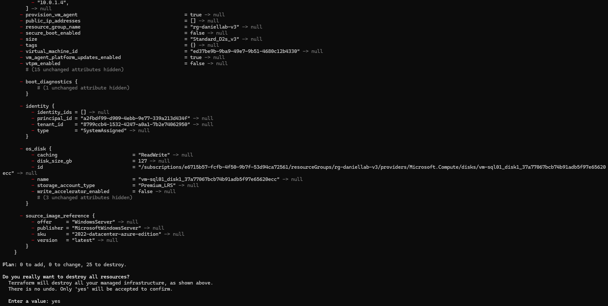
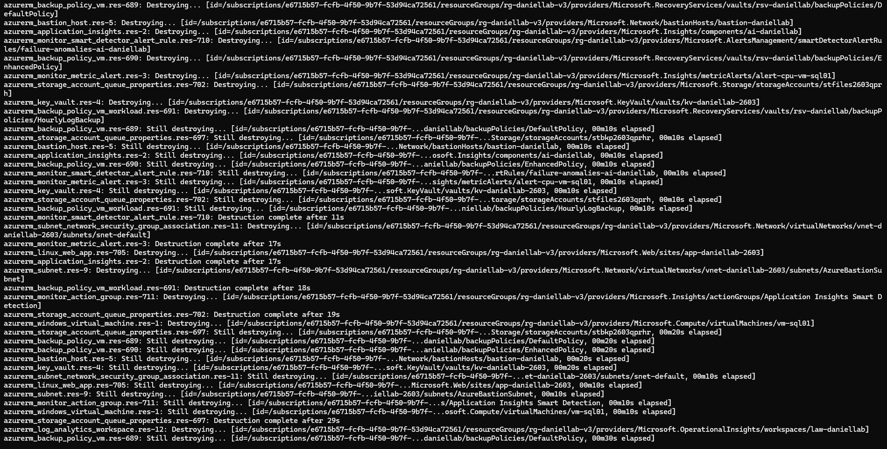
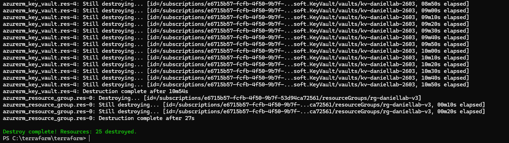

Full infrastructure destroyed cleanly with `terraform destroy`, confirming complete lifecycle management.

---

## Troubleshooting

All issues encountered and resolved during this phase are documented with screenshots.

### os_managed_disk_id incompatible

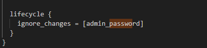

`os_managed_disk_id` generated by the auto-import conflicts with `source_image_reference`, `admin_password` and `os_disk`. Removed from the resource block.

### admin_password policy violation


Value `"ignored-as-imported"` does not meet Azure password policy. Fixed with a compliant value and `lifecycle { ignore_changes = [admin_password] }` to prevent Terraform from modifying the real password.

### Application Insights context canceled

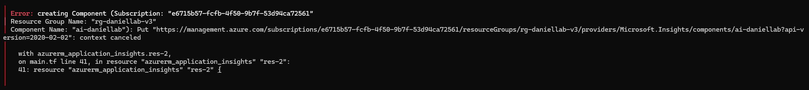
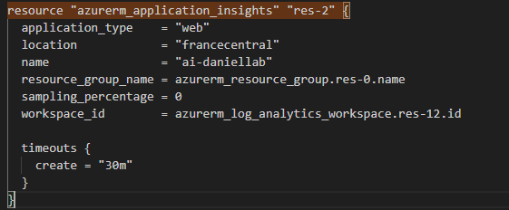

AzureRM provider v4.x requires `workspace_id` for Application Insights. Without it, the API call hangs indefinitely. Fixed by adding `workspace_id = azurerm_log_analytics_workspace.res-12.id`.

### Log Analytics tables contaminating state

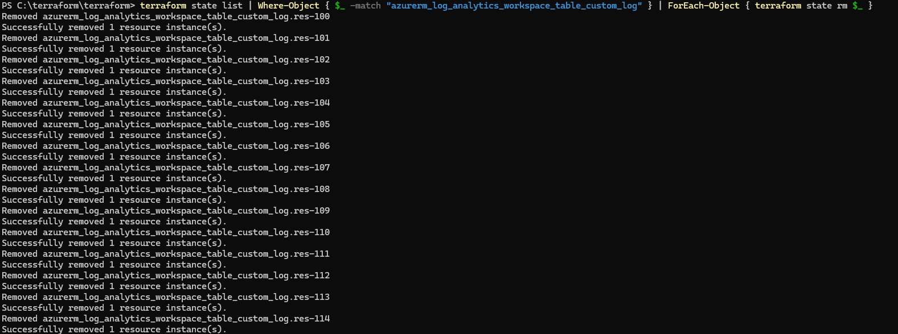

Auto-import captured hundreds of default Log Analytics system tables. Removed from state and code:
```powershell
terraform state list | Where-Object {
  $_ -match "azurerm_log_analytics_workspace_table_custom_log"
} | ForEach-Object { terraform state rm $_ }
```

### NIC private IP missing

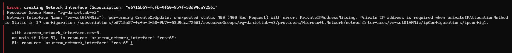
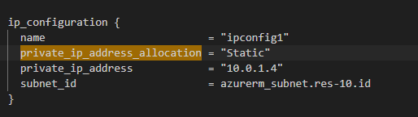

Static IP allocation requires an explicit `private_ip_address` value. Fixed by adding `private_ip_address = "10.0.1.4"`.

### Backup policies already exist

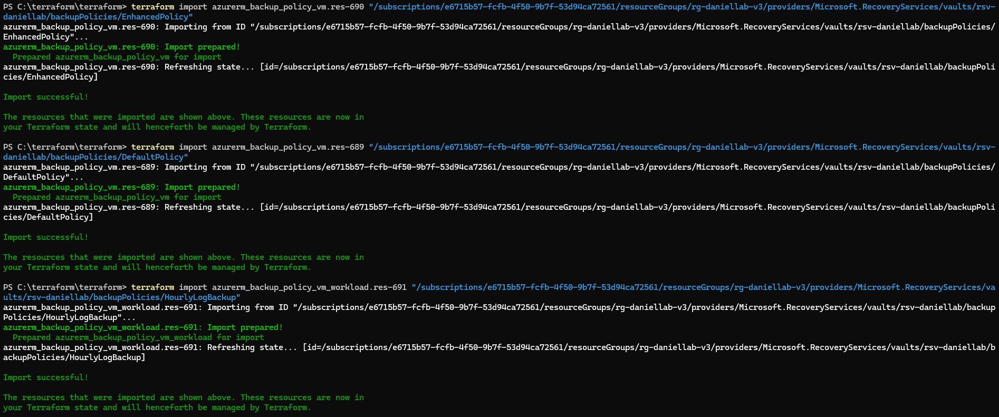

Azure automatically creates default backup policies when a Recovery Services Vault is created. These already existed in Azure but were not in Terraform state — imported with `terraform import`.

## Verification

| Check | Result |
|---|---|
| terraform plan → No changes | ✅ |
| terraform apply → All resources created | ✅ |
| terraform destroy → All resources removed | ✅ |
| Full lifecycle managed from code | ✅ |
