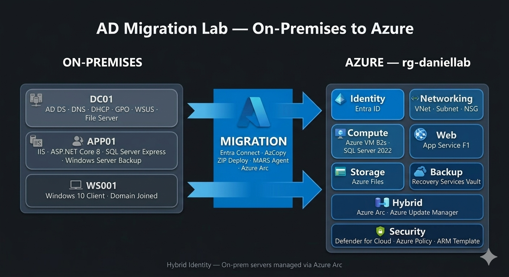

# AD Migration Lab — On-Premises Active Directory to Azure

End-to-end migration of a Windows Server Active Directory environment to Microsoft Azure, built as a hands-on portfolio project aligned with real enterprise migration scenarios.

## Overview



In this lab, I designed and built a complete on-premises infrastructure using **VMware Workstation Pro 17**, including a Domain Controller with AD DS, DNS, DHCP, WSUS and GPOs, an application server running IIS, ASP.NET Core and SQL Server, and a Windows 10 client joined to the domain.

Once the on-premises environment was fully operational, I migrated all services to Azure using the appropriate tools and services for each workload, demonstrating both **IaaS and PaaS** migration approaches, hybrid identity with **Entra Connect**, server management with **Azure Arc**, and cloud backup with **Recovery Services Vault**.

## Architecture Diagram
```
ON-PREM (VMware Workstation Pro 17)
─────────────────────────────────────────────────────
  DC01 · Windows Server 2019 · 2GB RAM
  ├─ AD DS (daniel.local) · DNS · DHCP · GPO
  ├─ File Server → E:\SharedFiles\
  └─ WSUS → manages APP01 + WS001

  APP01 · Windows Server 2019 · 2GB RAM
  ├─ IIS (HTTPS:443) + ASP.NET Core 8
  ├─ SQL Server Express → DanielDB
  └─ Windows Server Backup → DC01 File Share

  WS001 · Windows 10 · 2GB RAM
  └─ Domain Joined · GPO-WSUS · Hybrid Joined

AZURE (rg-daniellab)
─────────────────────────────────────────────────────
  Identity      → Entra ID (Entra Connect sync)
  Networking    → VNet + Subnet + NSG
  Arc           → DC01 + APP01 as Arc-enabled servers
  Update Mgmt   → Azure Update Manager (replaces WSUS)
  Web           → App Service F1 (migrated from IIS)
  Database      → Azure VM B2s + SQL Server (IaaS)
  File Storage  → Azure Files (migrated from File Server)
  Backup        → Recovery Services Vault + MARS Agent
  Security      → Defender for Cloud + Azure Policy
  IaC           → ARM Template export
```

## Business Scenario

The organization runs a traditional on-premises Windows Server environment with Active Directory, internal web applications and file shares. The goal is to migrate all workloads to Azure while maintaining hybrid identity, improving update management, and ensuring backup and disaster recovery in the cloud.

This lab simulates the full migration lifecycle: assessment, identity sync, workload migration, and post-migration security and compliance.

## Migration Map

| On-Premises | Tool | Azure |
|---|---|---|
| AD DS (daniel.local) | Entra Connect | Entra ID |
| DNS | Included | Entra ID Private DNS |
| File Server | AzCopy | Azure Files |
| WSUS | Azure Arc | Azure Update Manager |
| IIS + ASP.NET | ZIP Deploy | App Service (F1 Free) |
| SQL Server Express | Backup/Restore .bak | Azure VM + SQL Server |
| Windows Server Backup | MARS Agent | Recovery Services Vault |

## What I Learned

- How to build a full on-premises AD DS environment with DNS, DHCP, GPO and WSUS
- How to implement a 3-tier web application with IIS, ASP.NET Core and SQL Server
- How to automate backups with Windows Server Backup and PowerShell scheduled tasks
- How to sync on-premises identities to Azure using Entra Connect
- How to register on-premises servers in Azure Arc for hybrid management
- How to migrate a web app to Azure App Service using ZIP Deploy
- How to migrate SQL Server on-premises to an Azure VM (IaaS lift & shift)
- How to configure cloud backup with Recovery Services Vault and MARS Agent
- How to apply security and compliance policies with Defender for Cloud and Azure Policy
- How to export an ARM Template as IaC awareness
- The difference between IaaS and PaaS migration approaches and when to use each

## Technologies

**On-Premises:** Windows Server 2019, Active Directory DS, DNS, DHCP, WSUS, Group Policy, IIS, ASP.NET Core 8, SQL Server Express, Windows Server Backup

**Azure:** Entra ID, Entra Connect, Azure Arc, Azure Update Manager, App Service, Azure VM, Azure Files, Recovery Services Vault, MARS Agent, Defender for Cloud, Azure Policy, ARM Templates, VNet, NSG

## Project Structure

| Folder | Contents |
|---|---|
| [00-architecture](./00-architecture/) | Infrastructure diagrams and migration decisions |
| [01-onprem](./01-onprem/) | On-premises setup: DC01, APP01, WS001 |
| [02-azure-migrate](./02-azure-migrate/) | Pre-migration assessment with Azure Migrate |
| [03-azure](./03-azure/) | Azure deployment: identity, networking, Arc, SQL, backup, security |
| [04-iac](./04-iac/) | ARM Template export — IaC awareness |

## Full Documentation

For step-by-step instructions with screenshots in **English**, see each folder's `Full_Documentation.md`  
For the **Spanish version**, see each folder's `Documentacion_Completa.md`

## Lab Specs

- **Hypervisor:** VMware Workstation Pro 17
- **DC01:** Windows Server 2019 · 2GB RAM
- **APP01:** Windows Server 2019 · 2GB RAM
- **WS001:** Windows 10 · 2GB RAM
- **Network:** 192.168.75.x

## Status

- [x] On-premises infrastructure
- [ ] Azure Migrate assessment
- [ ] Azure deployment
- [ ] Documentation complete
