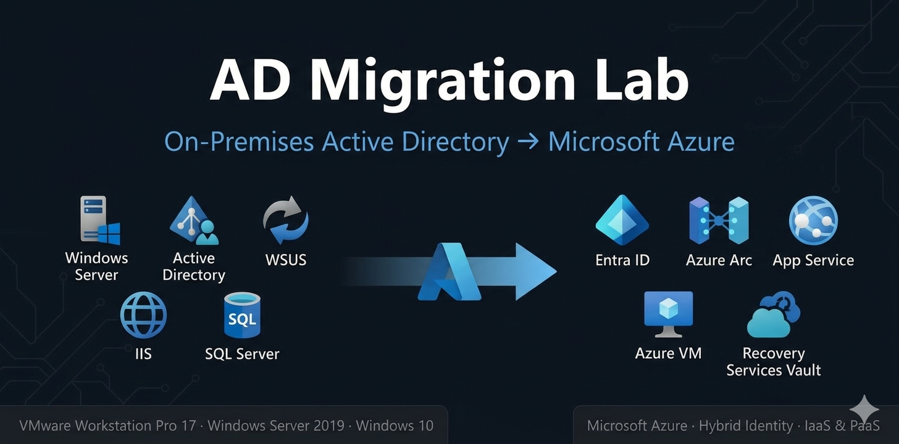

# AD Migration Lab — On-Premises Active Directory to Azure

End-to-end migration of a Windows Server Active Directory environment to Microsoft Azure, built as a hands-on portfolio project aligned with real enterprise migration scenarios.

## Overview

In this lab, I designed and built a complete on-premises infrastructure using **VMware Workstation Pro 17**, including a Domain Controller with AD DS, DNS, DHCP, WSUS and GPOs, an application server running IIS, ASP.NET Core and SQL Server, and a Windows 10 client joined to the domain.

Once the on-premises environment was fully operational, I migrated all services to Azure using the appropriate tools and services for each workload, demonstrating both **IaaS and PaaS** migration approaches, hybrid identity with **Entra Connect**, server management with **Azure Arc**, and cloud backup with **Recovery Services Vault**.

## Overview Diagram

## Business Scenario

The organization runs a traditional on-premises Windows Server environment with Active Directory, internal web applications and file shares. The goal is to migrate all workloads to Azure while maintaining hybrid identity, improving update management, and ensuring backup and disaster recovery in the cloud.

This lab simulates the full migration lifecycle — following the **Microsoft Cloud Adoption Framework (CAF)**:

| CAF Phase | Content |
|---|---|
| Strategy | Migration justification and goals |
| Plan | On-premises inventory and migration phases |
| Ready | Azure Migrate assessment |
| Migrate | Phases 1–8 (identity, networking, workloads, backup) |
| Govern | Phases 9–10 (Defender for Cloud, Azure Policy, ARM) |

## Migration Map

| On-Premises | Tool | Azure |
|---|---|---|
| AD DS (daniel.local) | Entra Connect | Entra ID |
| DNS | Included | Entra ID Private DNS |
| File Server | AzCopy | Azure Files |
| WSUS | Azure Arc | Azure Update Manager |
| IIS + ASP.NET | ZIP Deploy | App Service (F1 Free) |
| SQL Server Express | Backup/Restore .bak | Azure VM + SQL Server |
| Windows Server Backup | MARS Agent | Recovery Services Vault |

## What I Learned

- How to build a full on-premises AD DS environment with DNS, DHCP, GPO and WSUS
- How to implement a 3-tier web application with IIS, ASP.NET Core and SQL Server
- How to automate backups with Windows Server Backup and PowerShell scheduled tasks
- How to apply the Tier Model — isolating privileged accounts from cloud sync
- How to sync on-premises identities to Azure using Entra Connect
- How to register on-premises servers in Azure Arc for hybrid management
- How to migrate a web app to Azure App Service using ZIP Deploy
- How to migrate SQL Server on-premises to an Azure VM (IaaS lift & shift)
- How to configure cloud backup with Recovery Services Vault and MARS Agent
- How to apply security and compliance policies with Defender for Cloud and Azure Policy
- How to export an ARM Template as IaC awareness
- The difference between IaaS and PaaS migration approaches and when to use each

## Technologies

**On-Premises:** Windows Server 2019, Active Directory DS, DNS, DHCP, WSUS, Group Policy, IIS, ASP.NET Core 8, SQL Server Express, Windows Server Backup, VMware Workstation Pro 17

**Azure:** Entra ID, Entra Connect, Azure Arc, Azure Update Manager, App Service, Azure VM, Azure Files, Recovery Services Vault, MARS Agent, Defender for Cloud, Azure Policy, ARM Templates, VNet, NSG

## Project Structure

| Folder | Contents |
|---|---|
| [00-architecture](./00-architecture/) | Infrastructure diagrams and migration decisions |
| [01-onprem](./01-onprem/) | On-premises setup: DC01, APP01, WS001 |
| [02-azure-migrate](./02-azure-migrate/) | Pre-migration assessment with Azure Migrate |
| [03-azure](./03-azure/) | Azure deployment: identity, networking, Arc, SQL, backup, security |
| [04-iac](./04-iac/) | ARM Template + Policy as Code |

## Lab Specs

- **Hypervisor:** VMware Workstation Pro 17
- **DC01:** Windows Server 2019 · 2GB RAM · 192.168.75.4
- **APP01:** Windows Server 2019 · 2GB RAM · 192.168.75.5
- **WS001:** Windows 10 · 2GB RAM · 192.168.75.7

## Status

- [x] On-premises infrastructure
- [x] On-premises documentation
- [ ] Azure Migrate assessment
- [ ] Azure deployment
- [ ] Azure documentation
- [ ] ARM Template + Policy as Code