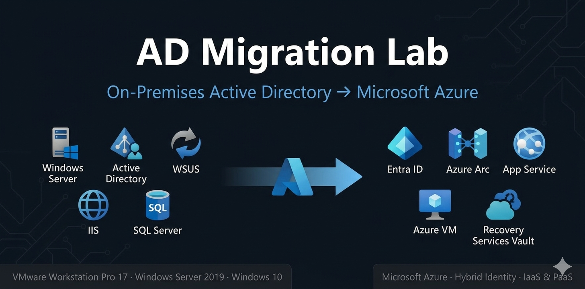
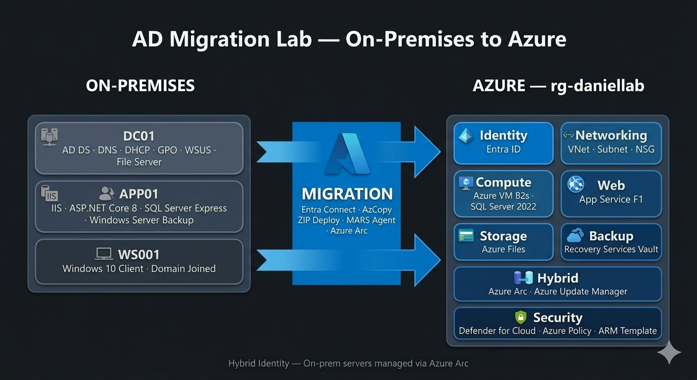

# AD Migration Lab — On-Premises Active Directory to Azure

End-to-end migration of a Windows Server Active Directory environment to Microsoft Azure, built as a hands-on portfolio project aligned with real enterprise migration scenarios.

## Overview

I designed and built a complete on-premises infrastructure using **VMware Workstation Pro 17** — a Domain Controller with AD DS, DNS, DHCP, WSUS and GPOs, an application server running IIS, ASP.NET Core 8 and SQL Server, and a Windows 10 client joined to the domain.

Once the on-premises environment was fully operational, I migrated all workloads to Azure using the appropriate tool for each service — demonstrating IaaS and PaaS migration approaches, hybrid identity with **Entra Connect**, modern device management with **Intune**, server management with **Azure Arc**, infrastructure as code with **Bicep and Terraform**, and automated deployments with **GitHub Actions**.

## Architecture

For detailed diagrams and architecture decisions, see [00-architecture](./00-architecture/).

## Business Scenario

A traditional on-premises Windows Server environment with Active Directory, internal web applications, and file shares needs to migrate all workloads to Azure — maintaining hybrid identity, improving update management, and ensuring backup and disaster recovery in the cloud.

This lab simulates the full migration lifecycle following the **Microsoft Cloud Adoption Framework (CAF)**:

| CAF Phase | Content |
|---|---|
| Strategy | Migration justification and goals |
| Plan | On-premises inventory and migration phases |
| Ready | Hybrid onboarding via Azure Arc |
| Migrate | Phases 1–8 — identity, networking, workloads, backup |
| Govern | Phase 9 — Azure Policy, Log Analytics, alerts |
| Automate | Phase 10 — Bicep, Terraform, GitHub Actions CI/CD |

## Migration Map

| On-Premises | Tool | Azure |
|---|---|---|
| AD DS (daniel.local) | Entra Connect | Entra ID + RBAC |
| DNS | Included in Entra Connect | Entra ID Private DNS |
| File Server (SharedFiles) | AzCopy | Azure Files |
| WSUS | Azure Arc | Azure Update Manager |
| IIS + ASP.NET Core 8 | ZIP Deploy → GitHub Actions | App Service (B1) |
| SQL Server Express | JSON export/import | Azure VM D2s_v3 + SQL Server 2022 |
| Windows Server Backup | Azure Backup | Recovery Services Vault |
| DC01 + APP01 | Azure Arc | Arc-enabled Servers |
| WS001 | Entra Connect + GPO | Hybrid Azure AD Join + Intune |
| Infra (all) | Bicep / Terraform | IaC — reproducible from code |

## Project Structure

| Folder | Contents |
|---|---|
| [00-architecture](./00-architecture/) | Infrastructure diagrams and architecture decisions |
| [01-onprem](./01-onprem/) | On-premises setup: DC01, APP01, WS001 |
| [02-azure-migrate](./02-azure-migrate/) | Hybrid onboarding: Azure Arc, Update Manager, Bastion, Intune |
| [03-azure](./03-azure/) | Azure deployment: identity, networking, SQL VM, App Service, backup, security |
| [04-iac](./04-iac/) | ARM Template, Bicep, Terraform, GitHub Actions CI/CD |
| [05-troubleshooting](./05-troubleshooting/) | Root cause analysis and lessons learned |

## Key Design Decisions

**Why Azure VM for SQL and not Azure SQL Database?**
Intentional IaaS lift & shift to demonstrate a realistic migration scenario. In production with a small database, Azure SQL Database (PaaS) would be the preferred option.

**Why Managed Identity instead of connection strings?**
The App Service retrieves the SQL connection string from Key Vault using its System-assigned Managed Identity — no secrets in code, no manual rotation.

**Why Bicep and Terraform?**
Bicep for Azure-native IaC (no state file, native ARM integration). Terraform alongside it to demonstrate multi-cloud portability. Both tools recreate the full environment from scratch.

**Why JSON export for the SQL migration?**
SQL Server 2025 Express (on-prem) is not backward compatible with SQL Server 2022 (Azure VM) via `.bak`. JSON export is version-agnostic and sufficient for lab data volumes. In production: BACPAC or Azure Database Migration Service.

For the full list of decisions, see [00-architecture/README.md](./00-architecture/README.md).

## What I Built

- Full on-premises AD DS environment with DNS, DHCP, GPO and WSUS
- 3-tier web application: IIS + ASP.NET Core 8 + SQL Server
- Hybrid identity sync (Entra Connect) with OU filtering and RBAC mapping
- Hybrid Azure AD Join and Intune MDM enrollment with compliance policies
- Azure Arc onboarding for on-premises servers with Update Manager
- Secure SQL VM with no public IP — access via Bastion and VNet Integration only
- App Service with Managed Identity, Key Vault, and VNet Integration
- Automated CI/CD pipeline with GitHub Actions (git push → deploy in ~3 minutes)
- Infrastructure as Code with Bicep and Terraform — full environment from a single command
- Cloud backup for SQL workloads via Recovery Services Vault
- Monitoring with Log Analytics, Application Insights, and CPU alerts

## Technologies

**On-Premises:** VMware Workstation Pro 17, Windows Server 2019, Active Directory DS, DNS, DHCP, WSUS, Group Policy, IIS, ASP.NET Core 8, SQL Server 2025 Express, Windows Server Backup, Windows 10

**Azure:** Entra ID, Entra Connect, Azure Arc, Azure Update Manager, Intune, App Service, Azure VM, Key Vault, Managed Identity, Azure Files, Recovery Services Vault, Azure Bastion, VNet, NSG, Azure Policy, Log Analytics, Application Insights, Azure Monitor

**IaC & Automation:** Bicep, Terraform, ARM Templates, GitHub Actions, AzCopy, Azure CLI

**Certification:** Microsoft Certified: Azure Administrator Associate (AZ-104)

## Lab Specs

| Machine | OS | IP | RAM | Role |
|---|---|---|---|---|
| DC01 | Windows Server 2019 | 192.168.75.4 | 2GB | Domain Controller |
| APP01 | Windows Server 2019 | 192.168.75.5 | 2GB | Application Server |
| WS001 | Windows 10 | 192.168.75.7 | 2GB | Client Machine |

**Hypervisor:** VMware Workstation Pro 17  
**Azure Region:** francecentral

## Status

- [x] On-premises infrastructure — DC01, APP01, WS001
- [x] Hybrid onboarding — Azure Arc, Update Manager, Bastion, Intune
- [x] Azure identity — Entra Connect, RBAC, MFA, Hybrid Join
- [x] Azure networking — VNet, NSG, subnets
- [x] Azure SQL VM — vm-sql01, DanielDB migrated
- [x] Azure App Service — live, Key Vault, Managed Identity, VNet Integration
- [x] Azure Files — DC01 SharedFiles migrated via AzCopy
- [x] Azure Backup — Recovery Services Vault, SQL workload backup
- [x] Security & monitoring — Azure Policy, Log Analytics, App Insights, alerts
- [x] IaC — ARM Template, Bicep, Terraform
- [x] CI/CD — GitHub Actions, automated deploy on git push
- [x] Documentation — all phases documented with screenshots

---

## Contact

